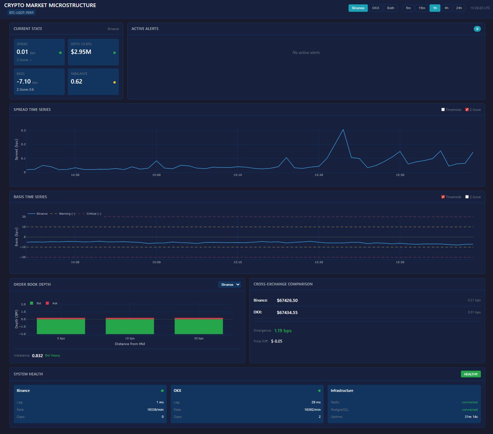

# Crypto Market Microstructure Surveillance System

Real-time surveillance system for monitoring market quality and pricing integrity across crypto spot and derivatives markets.

> **Perspective**: This system is designed for **exchange market operations**, not trading. The goal is market stability, pricing correctness, and liquidity quality - not PnL.

## Features

- **Real-time Market Quality Monitoring** - Tracks spreads, depth, and order book health in real-time
- **Derivatives Pricing Surveillance** - Ensures perp prices stay aligned with spot, index, and mark prices
- **Dual-Condition Anomaly Detection** - Alerts fire only when threshold AND z-score conditions are met
- **Z-Score Warmup Guards** - Prevents false positives during startup or after data gaps
- **Multi-Exchange Support** - Currently supports Binance and OKX (Phase 1)
- **Configurable Alert Thresholds** - Asset-specific thresholds via YAML configuration
- **Real-time Dashboard** - Web visualization for operations teams




## Documentation

- [System Architecture](docs/ARCHITECTURE.md) - Understand the project 0 -> 100
- [Product Requirements (PRD)](docs/PRD.md) - Full system requirements
- [Operations Runbook](docs/runbook.md) - Operational procedures and troubleshooting

## Quick Start

### Prerequisites

- Docker and Docker Compose
- Python 3.11+ (for local development)
- Git

### Run with Docker (Recommended)

```bash
# Clone the repository
git clone https://github.com/yourusername/crypto-market-microstructure.git
cd crypto-market-microstructure

# Copy environment file
cp .env.example .env

# Start all services
docker-compose up -d

# View dashboard
open http://localhost:8050

# Check service status
docker-compose ps

# View logs
docker-compose logs -f dashboard
```

### Stop Services

```bash
docker-compose down
```

### Local Development

```bash
# Create virtual environment
python -m venv venv
source venv/bin/activate  # or `venv\Scripts\activate` on Windows

# Install dependencies
pip install -e ".[dev]"

# Start infrastructure (Redis + TimescaleDB)
docker-compose up -d redis timescaledb

# Run data ingestion
python -m services.data_ingestion.main

# Run metrics engine
python -m services.metrics_engine.main

# Run anomaly detector
python -m services.anomaly_detector.main

# Run dashboard
python -m services.dashboard.main
```

## Architecture

```
                         CRYPTO MARKET MICROSTRUCTURE
+-----------------------------------------------------------------------------+
|                                                                             |
|  +-------------+    +-------------+    +-------------+    +-------------+   |
|  |   Binance   |    |     OKX     |    |   [Future]  |    |   [Future]  |   |
|  |   Adapter   |    |   Adapter   |    |   Exchange  |    |   Exchange  |   |
|  +------+------+    +------+------+    +------+------+    +------+------+   |
|         |                  |                  |                  |          |
|         +------------------+------------------+------------------+          |
|                            |                                                |
|                  +---------v---------+                                      |
|                  | Data Ingestion    |  WebSocket streaming                 |
|                  | Service           |  Normalization, gap detection        |
|                  +--------+----------+                                      |
|                           |                                                 |
|                           v                                                 |
|                  +--------+----------+                                      |
|                  |   Metrics Engine  |  Spread, Depth, Basis, Z-Score       |
|                  +--------+----------+                                      |
|                           |                                                 |
|                           v                                                 |
|                  +--------+----------+                                      |
|                  | Anomaly Detector  |  Dual-condition alerts               |
|                  +--------+----------+  Persistence tracking                |
|                           |                                                 |
|         +-----------------+------------------+                              |
|         v                 v                  v                              |
|  +------+------+   +------+------+   +------+------+                        |
|  |    Redis    |   | TimescaleDB |   |  Dashboard  |                        |
|  |  (Realtime) |   | (Historical)|   |  (Plotly)   |                        |
|  +-------------+   +-------------+   +-------------+                        |
|                                                                             |
+-----------------------------------------------------------------------------+
```

### Services

| Service | Description | Port |
|---------|-------------|------|
| **data-ingestion** | WebSocket streaming from exchanges | - |
| **metrics-engine** | Metric calculations (spread, depth, basis, z-score) | - |
| **anomaly-detector** | Alert evaluation and notification | - |
| **dashboard** | Plotly Dash web UI | 8050 |
| **redis** | Real-time state storage | 6379 |
| **timescaledb** | Historical time-series storage | 5432 |

## Key Concepts

### Dual-Condition Alerts

Alerts fire only when **both** threshold AND statistical conditions are met:

```
Spread Warning Alert fires when:
  1. spread_bps > 3.0 bps (threshold condition)
  2. spread_zscore > 2.0 sigma (statistical anomaly)

This prevents false positives during expected volatility.
```

### Z-Score Warmup Guards

The system does not fire alerts during startup or after data gaps:

```
System Start -> Warmup (collecting 30 samples) -> Active

During warmup:
  - Z-score returns None
  - Alerts requiring z-score are skipped with reason="zscore_warmup"
  - Dashboard shows "Z-Score: warming up (15/30)"

After warmup:
  - Z-score calculation begins
  - Alerts can fire normally
```

### Alert Thresholds (BTC-USDT-PERP)

| Metric | Warning | Critical |
|--------|---------|----------|
| Spread | > 3 bps AND z > 2 sigma | > 5 bps AND z > 3 sigma |
| Basis | > 10 bps AND z > 2 sigma (persist 2m) | > 20 bps AND z > 3 sigma (persist 1m) |
| Depth (10bps) | < $500K | < $200K |

## Configuration

All configuration is in YAML files under `config/`:

### Exchange Configuration (config/exchanges.yaml)

```yaml
binance:
  enabled: true
  websocket:
    futures: wss://fstream.binance.com/ws
    spot: wss://stream.binance.com:9443/ws
  connection:
    rate_limit_per_second: 10
    reconnect_delay_seconds: 5
    max_reconnect_attempts: 10
```

### Instrument Configuration (config/instruments.yaml)

```yaml
instruments:
  - id: BTC-USDT-PERP
    name: "BTC/USDT Perpetual"
    type: perpetual
    base: BTC
    quote: USDT
    enabled: true
    exchange_symbols:
      binance:
        symbol: BTCUSDT
        stream: btcusdt@depth20@100ms
```

### Alert Configuration (config/alerts.yaml)

```yaml
thresholds:
  BTC-USDT-PERP:
    spread_warning:
      threshold: 3.0    # bps
      zscore: 2.0       # sigma
    spread_critical:
      threshold: 5.0
      zscore: 3.0
```

### Feature Configuration (config/features.yaml)

```yaml
zscore:
  enabled: true
  window_size: 300      # samples
  min_samples: 30       # warmup threshold
  reset_on_gap: true    # reset on data gaps
```


## Project Structure

```
crypto-market-microstructure/
├── config/                 # YAML configuration files
│   ├── exchanges.yaml      # Exchange endpoints and settings
│   ├── instruments.yaml    # Trading pair definitions
│   ├── alerts.yaml         # Alert thresholds
│   └── features.yaml       # Feature flags
├── src/
│   ├── models/            # Pydantic data models
│   ├── interfaces/        # Abstract base classes
│   ├── adapters/          # Exchange WebSocket clients
│   │   ├── binance/       # Binance adapter
│   │   └── okx/           # OKX adapter
│   ├── metrics/           # Metric calculators
│   │   ├── spread.py      # Spread calculation
│   │   ├── depth.py       # Depth calculation
│   │   ├── basis.py       # Basis calculation
│   │   ├── zscore.py      # Z-score with warmup
│   │   └── aggregator.py  # Combined metrics
│   ├── detection/         # Alert logic
│   │   ├── evaluator.py   # Dual-condition evaluation
│   │   ├── persistence.py # Persistence tracking
│   │   └── manager.py     # Alert lifecycle
│   └── storage/           # Storage clients
│       ├── redis_client.py    # Real-time state
│       └── postgres_client.py # Historical data
├── services/              # Docker service entry points
│   ├── data-ingestion/
│   ├── metrics-engine/
│   ├── anomaly-detector/
│   └── dashboard/
├── tests/
│   ├── unit/             # Unit tests
│   └── integration/      # Integration tests
├── docs/
│   ├── PRD.md            # Product requirements
│   └── runbook.md        # Operations runbook
├── docker-compose.yml    # Container orchestration
└── pyproject.toml        # Python project config
```

## Testing

### Run All Tests

```bash
pytest
```

### Run with Coverage

```bash
pytest --cov=src --cov-report=html
```

### Run Unit Tests Only

```bash
pytest tests/unit/
```

### Run Integration Tests

```bash
# Start infrastructure first
docker-compose up -d redis timescaledb

# Run integration tests
pytest tests/integration/ -m integration
```

### Skip Infrastructure-Dependent Tests

```bash
pytest -m "not requires_redis and not requires_postgres"
```


## Development


## Troubleshooting

### Services Not Starting

```bash
# Check logs
docker-compose logs -f [service-name]

# Check service health
docker-compose ps

# Restart a specific service
docker-compose restart [service-name]
```

### Z-Score Alerts Not Firing

This is likely due to z-score warmup. The system requires 30 samples before z-score becomes available. Wait approximately 30 seconds after startup.

### High Message Lag

Check the metrics-engine logs for processing bottlenecks:

```bash
docker-compose logs -f metrics-engine
```

### Data Gaps

Check for WebSocket disconnections in data-ingestion logs:

```bash
docker-compose logs -f data-ingestion | grep -i "gap\|disconnect"
```

See [Operations Runbook](docs/runbook.md) for detailed troubleshooting.


## Acknowledgments

Built as a demonstration of exchange-side market surveillance systems, showcasing:
- Market microstructure knowledge
- Real-time data processing
- Statistical anomaly detection
- Production-grade Python architecture
