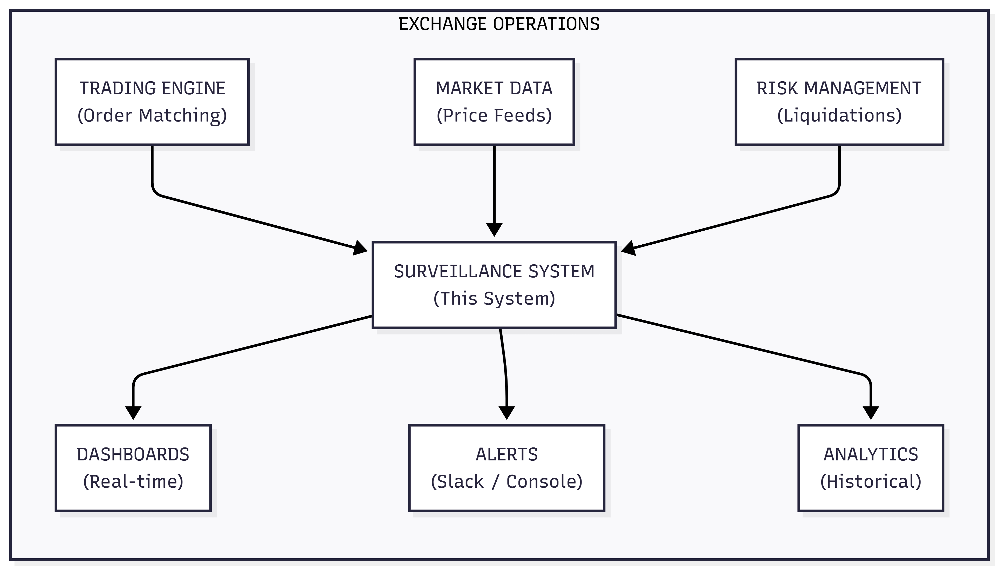
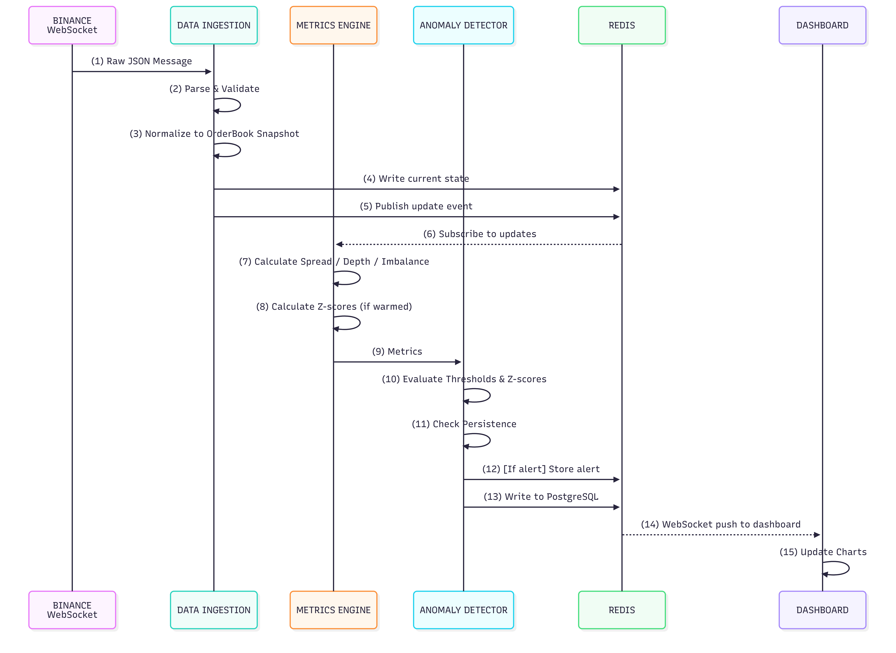

# Crypto Market Microstructure Surveillance System

## System Architecture Documentation

**Version**: 1.0
**Last Updated**: February 2025
**Status**: Production Ready

---

# Table of Contents

1. [Executive Overview](#section-1-executive-overview)
2. [Domain Knowledge](#section-2-domain-knowledge)
3. [System Architecture](#section-3-system-architecture)
4. [Technology Stack](#section-4-technology-stack)
5. [Metrics Specification](#section-5-metrics-specification)
6. [Configuration Reference](#section-6-configuration-reference)
7. [Operational Runbook](#section-7-operational-runbook)
8. [API Reference](#section-8-api-reference)
9. [Database Schema Reference](#section-9-database-schema-reference)
10. [Security Considerations](#section-10-security-considerations)
11. [Testing Strategy](#section-11-testing-strategy)
12. [Future Roadmap](#section-12-future-roadmap)
13. [Decision Log](#section-13-decision-log)
14. [Glossary](#section-14-glossary)
15. [Appendices](#section-15-appendices)

---

# SECTION 1: EXECUTIVE OVERVIEW

## 1.1 What This System Does (Plain English)

### The Problem We Solve

Imagine you run a major cryptocurrency exchange. Every second, thousands of traders are buying and selling Bitcoin, Ethereum, and other assets. Your exchange needs to ensure:

1. **Fair pricing** - The prices shown to traders accurately reflect the market
2. **Adequate liquidity** - There are enough buy and sell orders so traders can execute without massive price impact
3. **Stability** - The market operates smoothly without wild swings caused by technical issues or manipulation

Without systematic monitoring, problems can go unnoticed until they become incidents. A market maker might withdraw liquidity, causing spreads to widen. A bug might cause prices to diverge from other exchanges. A flash crash might occur, triggering liquidations.

### Our Solution

The Crypto Market Microstructure Surveillance System is like a **smoke detector for financial markets**. Just as a smoke detector continuously monitors air quality and alerts you before a small problem becomes a fire, our system:

1. **Continuously monitors** market quality metrics every 100 milliseconds
2. **Calculates key indicators** like bid-ask spreads, market depth, and price divergences
3. **Detects anomalies** using statistical methods that distinguish normal volatility from genuine problems
4. **Alerts operators** before small issues become major incidents
5. **Provides dashboards** for real-time visibility into market health

### Who Uses This System

| User Role | How They Use It |
|-----------|-----------------|
| **Market Operations** | Monitor dashboards, respond to alerts, ensure market stability |
| **Quantitative Analysts** | Analyze historical data, tune alert thresholds, investigate incidents |
| **Market Making Team** | Benchmark their performance, understand liquidity dynamics |
| **Engineering** | Monitor system health, ensure data pipelines are working |

### The Value Proposition

| Without This System | With This System |
|---------------------|------------------|
| Manual spot-checking of prices | 24/7 automated monitoring |
| Discover problems after user complaints | Detect anomalies in seconds |
| React to incidents | Prevent incidents |
| No historical audit trail | Complete data for post-mortems |
| Subjective "looks wrong" assessment | Statistical, objective thresholds |

### How It Fits Into Exchange Operations




The surveillance system sits alongside other exchange infrastructure, consuming market data and providing visibility into market quality. It does NOT:
- Execute trades
- Modify orders
- Control the trading engine

It is purely an **observability and alerting** system.

## 1.2 System at a Glance

```
+-----------------------------------------------------------------------------------+
|                     CRYPTO MARKET SURVEILLANCE SYSTEM                             |
+-----------------------------------------------------------------------------------+
|                                                                                   |
|  EXCHANGES           METRICS              STORAGE           PRESENTATION          |
|  +----------+       +----------+         +----------+       +----------+          |
|  | Binance  |------>|  Spread  |-------->|  Redis   |------>| Dashboard|          |
|  +----------+       +----------+         | (Real-   |       | (FastAPI)|          |
|  +----------+       +----------+         |  time)   |       +----------+          |
|  |   OKX    |------>|  Depth   |-------->+----------+                             |
|  +----------+       +----------+         +----------+       +----------+          |
|                     +----------+         |Timescale |------>|  Alerts  |          |
|                     |  Basis   |-------->|   DB     |       | (Slack)  |          |
|                     +----------+         |(History) |       +----------+          |
|                     +----------+         +----------+                             |
|                     | Z-Score  |                                                  |
|                     +----------+                                                  |
|                                                                                   |
+-----------------------------------------------------------------------------------+
|                                                                                   |
|  KEY STATISTICS                                                                   |
|  +-----------+  +-----------+  +-----------+  +-----------+  +-----------+        |
|  | 2         |  | 4         |  | 100ms     |  | <500ms    |  | 5         |        |
|  | Exchanges |  | Instruments|  | Updates  |  | Alert     |  | Metric    |        |
|  | Supported |  | Monitored |  | Frequency |  | Latency   |  | Types     |        |
|  +-----------+  +-----------+  +-----------+  +-----------+  +-----------+        |
|                                                                                   |
+-----------------------------------------------------------------------------------+
```

### Capabilities Summary

| Capability | Description |
|------------|-------------|
| **Real-time Monitoring** | Process order book updates every 100ms |
| **Statistical Alerts** | Dual-condition alerts (threshold + z-score) |
| **Historical Analysis** | 90-day metric retention, 30-day raw data |
| **Cross-Exchange** | Compare prices between Binance and OKX |
| **Gap Detection** | Detect and mark data gaps, never fabricate data |
| **Modular Design** | Add exchanges/instruments via configuration |

## 1.3 Key Design Principles

### 1. Async-Native Architecture

**Principle**: Use ASGI (Asynchronous Server Gateway Interface) everywhere, never WSGI.

**Why**: Financial data arrives continuously from multiple WebSocket connections. A synchronous architecture would block on I/O, creating bottlenecks. Our async-native approach allows:
- Concurrent WebSocket connections to multiple exchanges
- Non-blocking database writes
- Real-time dashboard updates via WebSocket
- Efficient resource utilization

**Implementation**:
- FastAPI (ASGI) instead of Flask/Dash (WSGI)
- `redis.asyncio` instead of synchronous redis-py
- `asyncpg` instead of psycopg2
- Native async/await throughout the codebase

### 2. Dual-Condition Alerts

**Principle**: Alerts fire only when BOTH absolute threshold AND statistical threshold are exceeded.

**Why**: Markets have different "normal" behaviors at different times:
- During high volatility, spreads naturally widen
- During low volatility, even small spread changes are significant
- A fixed threshold causes either false positives (volatile times) or missed alerts (quiet times)

**Implementation**:
```
Alert fires IF:
  1. metric > absolute_threshold  (e.g., spread > 3 bps)
  AND
  2. z-score > statistical_threshold  (e.g., z > 2 sigma)
  AND
  3. persistence met (if required)  (e.g., condition persists > 2 minutes)
```

### 3. No Data Fabrication

**Principle**: When data is missing, mark it as missing. Never interpolate or estimate.

**Why**: Interpolated data could mask real problems or create false signals. For surveillance purposes, knowing that data is missing is more valuable than having fake data.

**Implementation**:
- WebSocket disconnections create `GapMarker` records
- Z-score buffers reset after significant gaps (>5 seconds)
- Dashboard shows "Data unavailable" rather than stale values
- Historical queries exclude gap periods

### 4. Configuration-Driven Design

**Principle**: All thresholds, endpoints, and parameters come from YAML configuration files. Zero hardcoded values in code.

**Why**:
- Different instruments need different thresholds (BTC vs ETH)
- Thresholds may need tuning without code deployment
- New exchanges/instruments can be added without code changes
- Configuration is auditable and version-controlled

**Implementation**:
```yaml
# config/alerts.yaml
thresholds:
  BTC-USDT-PERP:
    spread_warning:
      threshold: 3.0    # bps
      zscore: 2.0       # sigma
```

### 5. Modular by Design

**Principle**: The system is composed of pluggable components with well-defined interfaces.

**Why**: Extensibility is crucial:
- New exchanges can be added by implementing `ExchangeAdapter` interface
- New instruments require only configuration changes
- Future features (regime detection, backfill) are feature-flagged
- Each component can be developed and tested independently

**Implementation**:
```
+------------------+   +------------------+   +-----------------+
|  ExchangeAdapter |   |  MetricCalculator|   |  AlertEvaluator |
|  (Interface)     |   |  (Interface)     |   |  (Interface)    |
+--------+---------+   +--------+---------+   +--------+--------+
         |                      |                      |
    +----+----+            +----+----+            +----+----+
    |         |            |         |            |         |
+---+---+ +---+---+   +----+---+ +---+----+  +----+---+ +---+----+
|Binance| |  OKX  |   | Spread | | Depth  |  |Threshold| |Z-Score |
+-------+ +-------+   +--------+ +--------+  +---------+ +--------+
```

---

# SECTION 2: DOMAIN KNOWLEDGE

## 2.1 Crypto Derivatives 101

### What is a Perpetual Futures Contract?

A **perpetual futures contract** (commonly called a "perp") is a derivative product unique to cryptocurrency markets. Unlike traditional futures that expire on a specific date, perpetual contracts have no expiration.

```
TRADITIONAL FUTURES                    PERPETUAL FUTURES
+------------------------+             +------------------------+
| Contract: BTC-DEC-2025 |             | Contract: BTC-PERP     |
| Expires: Dec 31, 2025  |             | Expires: NEVER         |
| Settlement: Physical   |             | Settlement: Continuous |
|   or Cash              |             |   via Funding Rate     |
+------------------------+             +------------------------+
```

### How Perpetuals Work

1. **Leverage**: Traders can control large positions with small margin (e.g., 10x leverage means $1,000 controls $10,000 position)

2. **Funding Rate**: Every 8 hours, a payment flows between long and short traders to keep the perp price close to spot:
   - If perp > spot: Longs pay shorts (encourages selling perp)
   - If perp < spot: Shorts pay longs (encourages buying perp)

3. **Mark Price**: Used for liquidations, calculated from index price plus premium to prevent manipulation

4. **Liquidation**: If a position's losses exceed its margin, it's automatically closed

### Why Perpetuals Exist

| Use Case | Description |
|----------|-------------|
| **Leverage** | Trade with more capital than you have |
| **Hedging** | Miners/holders can short to lock in prices |
| **Speculation** | Bet on price movements without owning the asset |
| **Arbitrage** | Exploit price differences between spot and perp |

### Spot vs Perpetual

```
SPOT MARKET                           PERPETUAL MARKET
+---------------------------+         +---------------------------+
| Buy 1 BTC at $50,000      |         | Open 1 BTC LONG at $50,000|
| You OWN 1 BTC             |         | You own a CONTRACT        |
| No leverage               |         | Up to 125x leverage       |
| No funding payments       |         | Pay/receive funding q8h   |
| No liquidation risk       |         | Can be liquidated         |
| Withdraw to wallet        |         | Cannot withdraw           |
+---------------------------+         +---------------------------+
```

## 2.2 Market Microstructure Concepts

### Order Book Anatomy

An order book is the core data structure of any exchange, showing all outstanding buy and sell orders.

```
                    ORDER BOOK: BTC-USDT-PERP

    ASKS (Sell Orders)                 BIDS (Buy Orders)
    Price      Quantity  Notional      Price      Quantity  Notional
    +-------+  +------+  +-------+     +-------+  +------+  +-------+
    |50,010 |  | 2.5  |  |125,025|     |49,995 |  | 3.0  |  |149,985|  <- Best Bid
    +-------+  +------+  +-------+     +-------+  +------+  +-------+
    |50,008 |  | 1.2  |  | 60,010|     |49,993 |  | 1.5  |  | 74,990|
    +-------+  +------+  +-------+     +-------+  +------+  +-------+
    |50,005 |  | 0.8  |  | 40,004|     |49,990 |  | 2.0  |  | 99,980|
    +-------+  +------+  +-------+     +-------+  +------+  +-------+
    |50,002 |  | 5.0  |  |250,010|  <- Best Ask  |49,988 |  | 4.5  |  |224,946|
    +-------+  +------+  +-------+     +-------+  +------+  +-------+

    Mid Price = (50,002 + 49,995) / 2 = 49,998.50
    Spread = 50,002 - 49,995 = $7.00 (1.4 bps)
```

**Key Terms**:
- **Best Bid**: Highest price someone will pay to buy
- **Best Ask**: Lowest price someone will sell at
- **Mid Price**: Average of best bid and best ask
- **Spread**: Difference between best ask and best bid
- **Depth**: Total quantity available at various price levels

### Why Spread Matters

The **bid-ask spread** is the cost of immediacy. If you want to buy NOW, you pay the ask. If you want to sell NOW, you get the bid.

```
NARROW SPREAD (GOOD)                  WIDE SPREAD (BAD)
Spread: 1 bps ($5 on $50,000)         Spread: 10 bps ($50 on $50,000)

+---+---+---+---+---+---+---+         +---+       +---+
|   |   |Bid|Ask|   |   |   |         |Bid|       |Ask|
+---+---+---+---+---+---+---+         +---+       +---+
      49,998  50,003                   49,975     50,025

Cost to trade $100,000:               Cost to trade $100,000:
  ~$5 in spread                         ~$50 in spread
```

**What Causes Wide Spreads**:
- Low liquidity (not enough market makers)
- High volatility (market makers increase spreads for risk)
- Exchange issues (technical problems)
- Market manipulation (spoofing/layering)

**Alert Thresholds** (BTC-USDT-PERP):
- Warning: > 3 bps AND z-score > 2
- Critical: > 5 bps AND z-score > 3

### Why Depth Matters

**Depth** measures how much can be traded before significantly moving the price.

```
DEEP MARKET (GOOD)                    SHALLOW MARKET (BAD)
$2M available within 10 bps           $200K available within 10 bps

Price Impact of $500K trade:          Price Impact of $500K trade:
  ~2-3 bps slippage                     ~20-30 bps slippage

     +--+                                  +--+
     |  |                                  |  |
   +-+  +-+                              +-+  +-+
   |      |                              |      |
+--+      +--+                        +--+      +--+
|            |                        |            |
+---+----+---+                        +---+----+---+
   Bid  Ask                              Bid  Ask
```

**Depth Calculation**:
```
Depth at 10 bps = Sum of all order notional within 10 bps of mid price

Example:
  Mid Price = $50,000
  10 bps = 0.1% = $50

  Bid depth (10 bps): All bids >= $49,950
  Ask depth (10 bps): All asks <= $50,050
  Total depth (10 bps): Bid depth + Ask depth
```

**Alert Thresholds** (BTC-USDT-PERP):
- Warning: < $500,000 total depth within 10 bps
- Critical: < $200,000 total depth within 10 bps

### Why Basis Matters

**Basis** is the difference between perpetual and spot prices.

```
POSITIVE BASIS (CONTANGO)             NEGATIVE BASIS (BACKWARDATION)
Perp > Spot                           Perp < Spot

Perp:  $50,100                        Perp:  $49,900
Spot:  $50,000                        Spot:  $50,000
Basis: +$100 (+20 bps)                Basis: -$100 (-20 bps)

Meaning: Market is bullish            Meaning: Market is bearish
         Longs pay funding                     Shorts pay funding
```

**Why Basis Spikes Are Concerning**:
1. **Liquidation Risk**: Large basis can cause mark price divergence
2. **Arbitrage Opportunity**: Should be arbitraged away quickly
3. **Market Stress**: Extreme basis indicates market dysfunction
4. **Funding Rate Impact**: Affects holding costs

**Alert Thresholds** (BTC-USDT-PERP):
- Warning: |basis| > 10 bps AND z-score > 2, persists > 2 minutes
- Critical: |basis| > 20 bps AND z-score > 3, persists > 1 minute

### Why Imbalance Matters

**Order book imbalance** measures the relative size of bids vs asks.

```
Formula: Imbalance = (Bid_Depth - Ask_Depth) / (Bid_Depth + Ask_Depth)

Range: [-1, +1]
  +1 = All bids, no asks (extremely bullish)
   0 = Equal bids and asks (balanced)
  -1 = All asks, no bids (extremely bearish)
```

**Interpretation**:
```
BALANCED (0.0)           BID HEAVY (+0.3)          ASK HEAVY (-0.3)

   +--+--+                  +----+--+                 +--+----+
   |  |  |                  |    |  |                 |  |    |
   |  |  |                  |    |  |                 |  |    |
+--+  +--+               +--+    +--+              +--+  +----+
|        |               |          |              |          |
|  Bid   |               |   Bid    |              |    Bid   |
|        |               |          |              |          |
+--------+               +----------+              +----------+
|  Ask   |               |  Ask     |              |   Ask    |
+--------+               +----------+              +----------+

Neutral signal           Bullish signal            Bearish signal
```

## 2.3 Why Surveillance Matters

### Real-World Scenarios

| Scenario | What Happens | Detection Method | System Response |
|----------|--------------|------------------|-----------------|
| **Flash Crash** | Price drops 10% in seconds, triggering cascading liquidations | Spread spike + depth collapse + basis divergence | P1 Critical alerts on multiple metrics |
| **Spoofing** | Trader places large orders with no intent to execute, manipulating prices | Depth changes without corresponding trades, rapid order cancellations | Depth drop alerts, imbalance shifts |
| **Liquidation Cascade** | Large position liquidated, causing more liquidations | Basis spike + sustained imbalance + price momentum | Basis persistence alerts, cross-exchange divergence |
| **Exchange Technical Issue** | One exchange's prices desync from the market | Cross-exchange divergence exceeds threshold | Cross-exchange divergence alert |
| **Market Manipulation** | Coordinated pump and dump across multiple venues | Z-score anomalies across multiple metrics simultaneously | Multiple P2/P1 alerts correlating |
| **Liquidity Withdrawal** | Market makers pull orders during uncertainty | Depth drops significantly while spread widens | Depth warning + spread warning |

### Example: Detecting a Flash Crash

```
TIME      SPREAD    DEPTH     BASIS     IMBALANCE   ALERTS
-------   ------    -----     -----     ---------   ------
12:00:00  2.1 bps   $1.2M     5 bps     +0.05       None
12:00:01  2.3 bps   $1.1M     6 bps     +0.02       None
12:00:02  3.5 bps   $800K     8 bps     -0.10       None (z-score normal)
12:00:03  5.2 bps   $400K     15 bps    -0.25       P2: Spread Warning
12:00:04  8.1 bps   $180K     25 bps    -0.40       P1: Spread Critical
                                                     P1: Depth Critical
                                                     P1: Basis Critical
12:00:05  12.3 bps  $95K      40 bps    -0.55       Multiple P1 alerts
          ^^^^^^^   ^^^^      ^^^^^^
          CRITICAL  CRITICAL  CRITICAL
```

## 2.4 Regulatory Context

Cryptocurrency exchanges face increasing regulatory scrutiny regarding market integrity:

| Region | Regulation | Relevance |
|--------|------------|-----------|
| **USA** | SEC/CFTC oversight | Market manipulation detection required |
| **EU** | MiCA (Markets in Crypto-Assets) | Market abuse monitoring mandated |
| **Singapore** | MAS Guidelines | Fair and orderly markets required |
| **Hong Kong** | SFC Virtual Asset Rules | Surveillance systems required |
| **Japan** | FSA Guidelines | Market manipulation prevention |

**Key Requirements**:
1. **Surveillance Systems**: Exchanges must monitor for market manipulation
2. **Record Keeping**: Historical data must be retained for audits
3. **Alerting**: Suspicious activity must be flagged and investigated
4. **Reporting**: Regular reports to regulators on market quality

This system provides the technical foundation for meeting these requirements.

---

# SECTION 3: SYSTEM ARCHITECTURE

## 3.1 High-Level Architecture Diagram

```
+====================================================================================+
|                           CRYPTO SURVEILLANCE SYSTEM                                |
+====================================================================================+
|                                                                                     |
|  +-----------------------------------------------------------------------------+   |
|  |                              DATA LAYER                                       |   |
|  |                                                                               |   |
|  |   +----------------+        +----------------+        +----------------+      |   |
|  |   |    BINANCE     |        |      OKX       |        |    [FUTURE]    |      |   |
|  |   |    ADAPTER     |        |    ADAPTER     |        |    EXCHANGES   |      |   |
|  |   |                |        |                |        |                |      |   |
|  |   | - WebSocket    |        | - WebSocket    |        | - Bybit        |      |   |
|  |   | - REST Fallback|        | - REST Fallback|        | - Deribit      |      |   |
|  |   | - Normalizer   |        | - Normalizer   |        | - etc.         |      |   |
|  |   +-------+--------+        +-------+--------+        +----------------+      |   |
|  |           |                         |                                         |   |
|  |           +------------+------------+                                         |   |
|  |                        |                                                      |   |
|  |                        v                                                      |   |
|  |           +-------------------------+                                         |   |
|  |           |    DATA NORMALIZER      |                                         |   |
|  |           |                         |                                         |   |
|  |           | Raw Exchange Data       |                                         |   |
|  |           |        |                |                                         |   |
|  |           |        v                |                                         |   |
|  |           | OrderBookSnapshot       |                                         |   |
|  |           | TickerSnapshot          |                                         |   |
|  |           | GapMarker               |                                         |   |
|  |           +------------+------------+                                         |   |
|  |                        |                                                      |   |
|  +------------------------+------------------------------------------------------+   |
|                           |                                                          |
|                           v                                                          |
|  +-----------------------------------------------------------------------------+   |
|  |                           PROCESSING LAYER                                    |   |
|  |                                                                               |   |
|  |   +---------------------------+     +---------------------------+            |   |
|  |   |      METRICS ENGINE       |     |    ANOMALY DETECTOR       |            |   |
|  |   |                           |     |                           |            |   |
|  |   | +--------+ +--------+     |     | +--------+ +--------+     |            |   |
|  |   | | Spread | | Depth  |     |     | |Threshold| |Z-Score |    |            |   |
|  |   | | Calc   | | Calc   |     |     | |Evaluator| |Evaluator|   |            |   |
|  |   | +--------+ +--------+     |     | +--------+ +--------+     |            |   |
|  |   |                           |     |                           |            |   |
|  |   | +--------+ +--------+     |     | +--------+ +--------+     |            |   |
|  |   | | Basis  | |Z-Score |     |     | |Persist-| |  Alert |     |            |   |
|  |   | | Calc   | | Calc   |     |     | | ence   | | Manager|     |            |   |
|  |   | +--------+ +--------+     |     | +--------+ +--------+     |            |   |
|  |   +-------------+-------------+     +-------------+-------------+            |   |
|  |                 |                                 |                          |   |
|  +-----------------|--------------------------------|---------------------------+   |
|                    |                                |                               |
|                    v                                v                               |
|  +-----------------------------------------------------------------------------+   |
|  |                            STORAGE LAYER                                      |   |
|  |                                                                               |   |
|  |   +---------------------------+     +---------------------------+            |   |
|  |   |          REDIS            |     |       TIMESCALEDB         |            |   |
|  |   |      (Real-time)          |     |       (Historical)        |            |   |
|  |   |                           |     |                           |            |   |
|  |   | - Current order book      |     | - order_book_snapshots    |            |   |
|  |   | - Z-score buffers         |     | - metrics                 |            |   |
|  |   | - Active alerts           |     | - alerts                  |            |   |
|  |   | - Health status           |     | - data_gaps               |            |   |
|  |   | - Pub/Sub channels        |     | - ticker_snapshots        |            |   |
|  |   +-------------+-------------+     +-------------+-------------+            |   |
|  |                 |                                 |                          |   |
|  +-----------------|--------------------------------|---------------------------+   |
|                    |                                |                               |
|                    +----------------+---------------+                               |
|                                     |                                               |
|                                     v                                               |
|  +-----------------------------------------------------------------------------+   |
|  |                         PRESENTATION LAYER                                    |   |
|  |                                                                               |   |
|  |   +---------------------------+     +---------------------------+            |   |
|  |   |    FASTAPI DASHBOARD      |     |     ALERT CHANNELS        |            |   |
|  |   |        (ASGI)             |     |                           |            |   |
|  |   |                           |     | +--------+ +--------+     |            |   |
|  |   | +--------+ +--------+     |     | |Console | | Slack  |     |            |   |
|  |   | |REST API| |WebSocket|    |     | |Output  | |Webhook |     |            |   |
|  |   | |/api/*  | |/ws/*   |     |     | +--------+ +--------+     |            |   |
|  |   | +--------+ +--------+     |     |                           |            |   |
|  |   |                           |     | +--------+ +--------+     |            |   |
|  |   | +--------+ +--------+     |     | |PagerDuty| | Email |     |            |   |
|  |   | |Static  | | Docs   |     |     | |(Future)| |(Future)|     |            |   |
|  |   | |Files   | |OpenAPI |     |     | +--------+ +--------+     |            |   |
|  |   | +--------+ +--------+     |     |                           |            |   |
|  |   +---------------------------+     +---------------------------+            |   |
|  |                                                                               |   |
|  +-----------------------------------------------------------------------------+   |
|                                                                                     |
+====================================================================================+
```

## 3.2 Data Flow Sequence Diagram

The journey of a single order book update from exchange to dashboard:


**Step-by-Step Explanation**:

| Step | Description | Latency Target |
|------|-------------|----------------|
| 1 | Binance sends WebSocket message | N/A (exchange) |
| 2 | Parse JSON, validate structure | < 1ms |
| 3 | Convert to normalized OrderBookSnapshot | < 1ms |
| 4 | Write current state to Redis | < 5ms |
| 5 | Publish update event on Redis channel | < 1ms |
| 6 | Metrics engine receives update notification | < 1ms |
| 7 | Calculate spread, depth, imbalance | < 5ms |
| 8 | Calculate z-scores (if enough samples) | < 2ms |
| 9 | Pass metrics to anomaly detector | < 1ms |
| 10 | Evaluate threshold conditions | < 1ms |
| 11 | Check persistence requirements | < 1ms |
| 12 | Store alert in Redis (if triggered) | < 5ms |
| 13 | Write metrics/alert to PostgreSQL | < 50ms |
| 14 | WebSocket broadcast to dashboard | < 10ms |
| 15 | Dashboard renders updated charts | < 100ms |

**Total End-to-End Latency**: < 500ms from exchange to dashboard

## 3.3 Component Interaction Matrix

| Component | Reads From | Writes To | Protocol |
|-----------|------------|-----------|----------|
| **Data Ingestion** | Exchange WebSocket | Redis | WebSocket (in), Redis client (out) |
| **Metrics Engine** | Redis | Redis, PostgreSQL | Redis pub/sub, Direct write |
| **Anomaly Detector** | Redis | Redis, PostgreSQL | Redis read, Direct write |
| **Dashboard API** | Redis, PostgreSQL | None | HTTP REST |
| **Dashboard WebSocket** | Redis | Client browsers | WebSocket |
| **Alert Channels** | Anomaly Detector | Console, Slack | Direct call, HTTP webhook |

## 3.4 Failure Modes and Recovery

| Failure Mode | Detection | Impact | Recovery |
|--------------|-----------|--------|----------|
| **Exchange WebSocket Disconnect** | Connection closed event | No new data | Auto-reconnect with exponential backoff (5s, 10s, 20s...), create GapMarker |
| **Exchange WebSocket Timeout** | No message for > ping_timeout | Stale data | Reconnect, switch to REST polling |
| **Redis Unavailable** | Connection refused | No real-time state | In-memory buffer, retry with backoff |
| **PostgreSQL Unavailable** | Connection refused | No historical writes | Buffer writes, retry, alert P2 |
| **Metrics Engine Crash** | Process exit | No metric calculation | Docker restart policy, state recovery from Redis |
| **Dashboard Crash** | Health check fail | No UI | Docker restart, stateless recovery |
| **Sequence Gap Detected** | Sequence ID jump | Possible missed data | Create GapMarker, reset z-score buffers, fetch REST snapshot |

**Recovery Flow for WebSocket Disconnect**:

```
     DISCONNECT DETECTED
            |
            v
    +-------+-------+
    | Log warning   |
    | Create GapMarker |
    +-------+-------+
            |
            v
    +-------+-------+
    | Wait reconnect|
    | delay (5s)    |
    +-------+-------+
            |
            v
    +-------+-------+
    | Attempt       |
    | reconnect     |
    +-------+-------+
            |
     +------+------+
     |             |
  SUCCESS       FAILURE
     |             |
     v             v
+----+----+   +----+----+
| Resume  |   | Increment |
| stream  |   | attempt   |
| Reset   |   | count     |
| z-scores|   +----+----+
+---------+        |
                   v
            +------+------+
            | attempts <  |
            | max (10)?   |
            +------+------+
                   |
            +------+------+
            |             |
           YES            NO
            |             |
            v             v
     [Back to         +----+----+
      Wait]           | Switch  |
                      | to REST |
                      | polling |
                      +---------+
```

---

# SECTION 4: TECHNOLOGY STACK

## 4.1 Technology Selection Matrix

| Technology | Category | Why Chosen | Alternatives Considered | Why Not Alternatives |
|------------|----------|------------|------------------------|---------------------|
| **Python 3.11+** | Language | Async support, data science ecosystem, team expertise | Go, Rust | Python sufficient for sub-second latency, better library support |
| **FastAPI** | Web Framework | Async-native, auto OpenAPI, WebSocket support | Flask, Django, Dash | Flask/Django are WSGI (sync), Dash has event loop conflicts |
| **Uvicorn** | ASGI Server | High performance, production ready | Hypercorn, Daphne | Uvicorn most mature, best performance benchmarks |
| **redis.asyncio** | Redis Client | Native async, no event loop conflicts | redis-py (sync), aioredis | redis-py blocks event loop, aioredis deprecated |
| **asyncpg** | PostgreSQL Client | Fastest async PostgreSQL driver | psycopg2, psycopg3 | psycopg2 is sync, psycopg3 async is newer/less tested |
| **TimescaleDB** | Time-Series DB | PostgreSQL compatible, automatic partitioning, compression | InfluxDB, QuestDB | PostgreSQL compatibility critical, team expertise |
| **Redis 7** | Real-time Store | Sub-ms latency, pub/sub, perfect for hot data | Memcached, KeyDB | Redis has richer data structures, pub/sub |
| **Plotly.js** | Charting | Interactive, financial chart support, no server rendering | D3.js, Chart.js | Plotly purpose-built for financial data |
| **Pydantic v2** | Validation | Type safety, fast validation, JSON schema generation | dataclasses, attrs | Pydantic has best validation features, v2 is 5-50x faster |
| **Docker Compose** | Orchestration | Simple, reproducible, development-friendly | Kubernetes | K8s overkill for single-node deployment |

## 4.2 Backend Architecture Details

### Why FastAPI over Dash?

The original design considered Plotly Dash for the dashboard. We migrated to FastAPI for several critical reasons:

**The Problem with Dash**:

```
DASH ARCHITECTURE (WSGI)
+-----------------------------------+
|           DASH APP                |
|  +---------------------------+    |
|  |   Flask (WSGI - Sync)     |    |
|  |   +-------------------+   |    |
|  |   | Callback System   |   |    |
|  |   | (Server-side)     |   |    |
|  |   +-------------------+   |    |
|  +---------------------------+    |
|                                   |
|  Problem: Running async code      |
|  (redis.asyncio, asyncpg)         |
|  inside sync Flask callbacks      |
|  causes event loop conflicts!     |
|                                   |
|  RuntimeError: This event loop    |
|  is already running               |
+-----------------------------------+
```

**The FastAPI Solution**:

```
FASTAPI ARCHITECTURE (ASGI)
+-----------------------------------+
|          FASTAPI APP              |
|  +---------------------------+    |
|  |   Starlette (ASGI-Async)  |    |
|  |   +-------------------+   |    |
|  |   | Async Endpoints   |   |    |
|  |   | async def ...     |   |    |
|  |   +-------------------+   |    |
|  +---------------------------+    |
|                                   |
|  Native async/await support!      |
|  redis.asyncio works perfectly    |
|  asyncpg works perfectly          |
|                                   |
|  No event loop conflicts          |
+-----------------------------------+
```

**Comparison Table**:

| Feature | Dash | FastAPI |
|---------|------|---------|
| Server Type | WSGI (synchronous) | ASGI (asynchronous) |
| Async Database Clients | Problematic | Native support |
| WebSocket Support | Limited | Native |
| API Documentation | Manual | Auto-generated OpenAPI |
| Real-time Updates | Polling callbacks | True WebSocket push |
| Charting | Built-in (server-rendered) | Client-side Plotly.js |
| Complexity | Higher (callback system) | Lower (standard API) |

### Python Package Dependencies

| Package | Version | Purpose |
|---------|---------|---------|
| `fastapi` | >=0.109.0 | ASGI web framework |
| `uvicorn[standard]` | >=0.27.0 | ASGI server |
| `pydantic` | >=2.5.0 | Data validation and settings |
| `redis` | >=5.0.0 | Redis client with async support |
| `asyncpg` | >=0.29.0 | Async PostgreSQL driver |
| `aiohttp` | >=3.9.0 | Async HTTP client for WebSocket |
| `structlog` | >=24.1.0 | Structured JSON logging |
| `pyyaml` | >=6.0.0 | YAML configuration parsing |
| `orjson` | >=3.9.0 | Fast JSON parsing |
| `tenacity` | >=8.2.0 | Retry logic with backoff |

## 4.3 Frontend Architecture Details

### Why Vanilla JS + Plotly.js?

We chose a lightweight frontend approach rather than a heavy framework:

**Architecture**:

```
FRONTEND ARCHITECTURE
+---------------------------------------------------+
|                 BROWSER                            |
|  +---------------------------------------------+  |
|  |               index.html                     |  |
|  |  +----------------+  +------------------+   |  |
|  |  |    app.js      |  |    charts.js     |   |  |
|  |  | (Controller)   |  |  (Plotly.js)     |   |  |
|  |  +-------+--------+  +--------+---------+   |  |
|  |          |                    |              |  |
|  |          v                    v              |  |
|  |  +----------------+  +------------------+   |  |
|  |  | websocket.js   |  |     api.js       |   |  |
|  |  | (Real-time)    |  |   (REST calls)   |   |  |
|  |  +-------+--------+  +--------+---------+   |  |
|  +----------|-------------------|---------------+  |
|             |                   |                  |
+-------------|-------------------|------------------+
              |                   |
              v                   v
       WebSocket /ws/updates   REST /api/*
```

**Why Not React/Vue/Angular?**:

| Factor | React/Vue | Vanilla JS |
|--------|-----------|------------|
| Bundle Size | 100KB+ | ~10KB |
| Build Complexity | Webpack, Babel, etc. | None |
| Learning Curve | Framework knowledge required | Standard JS |
| Debugging | DevTools + framework tools | Standard DevTools |
| Maintenance | Framework updates | Stable browser APIs |
| Our Use Case | Overkill | Perfect fit |

**Key Frontend Files**:

```
services/dashboard/static/
├── index.html          # Main dashboard HTML
├── css/
│   └── dashboard.css   # Dark theme styles
└── js/
    ├── app.js          # Main controller, initialization
    ├── websocket.js    # WebSocket connection management
    ├── charts.js       # Plotly.js chart creation/updates
    └── api.js          # REST API client functions
```

## 4.4 Database Architecture Details

### Why TimescaleDB?

TimescaleDB is PostgreSQL with time-series superpowers:

```
TIMESCALEDB = PostgreSQL + Time-Series Extension

Standard PostgreSQL Table:
+----+------------+-------+--------+
| id | timestamp  | value | metric |
+----+------------+-------+--------+
| 1  | 2025-01-01 | 2.5   | spread |
| 2  | 2025-01-01 | 2.6   | spread |
| ...millions of rows...           |
+----+------------+-------+--------+
Problem: Queries slow as table grows

TimescaleDB Hypertable:
+--------------------------------------------+
|              HYPERTABLE                     |
|  +----------+  +----------+  +----------+  |
|  | Chunk    |  | Chunk    |  | Chunk    |  |
|  | Jan 1-7  |  | Jan 8-14 |  | Jan 15-21|  |
|  +----------+  +----------+  +----------+  |
|                                            |
|  Automatic partitioning by time!           |
|  Queries only scan relevant chunks         |
|  Old chunks can be compressed/dropped      |
+--------------------------------------------+
```

**Key Features Used**:

| Feature | How We Use It |
|---------|---------------|
| **Hypertables** | `order_book_snapshots`, `metrics`, `ticker_snapshots` |
| **Automatic Chunking** | 1-day chunks for all time-series tables |
| **Compression** | Compress data older than 7 days (90%+ savings) |
| **Retention Policies** | Auto-delete data older than 30/90 days |
| **time_bucket()** | Efficient time-based aggregations |

**Example Query**:

```sql
-- Average spread by minute for last hour
SELECT
    time_bucket('1 minute', timestamp) AS bucket,
    AVG(value) AS avg_spread
FROM metrics
WHERE metric_name = 'spread_bps'
  AND instrument = 'BTC-USDT-PERP'
  AND timestamp > NOW() - INTERVAL '1 hour'
GROUP BY bucket
ORDER BY bucket;
```

### Redis Data Model

Every Redis key follows a consistent naming pattern:

| Key Pattern | Type | Purpose | TTL | Update Frequency |
|-------------|------|---------|-----|------------------|
| `orderbook:{exchange}:{instrument}` | Hash | Current order book state | 60s | ~100ms |
| `zscore:{exchange}:{instrument}:{metric}` | List | Rolling z-score buffer | 600s | ~1s |
| `zscore:current:{exchange}:{instrument}` | Hash | Current z-score values | 60s | ~1s |
| `alerts:active:{alert_id}` | Hash | Active alert details | None | On change |
| `alerts:by_instrument:{instrument}` | Set | Alert IDs by instrument | None | On change |
| `alerts:by_priority:{P1\|P2\|P3}` | Set | Alert IDs by priority | None | On change |
| `alerts:dedup:{type}:{exchange}:{instrument}` | String | Deduplication marker | 60s | On alert |
| `health:{exchange}` | Hash | Connection health status | None | 1s |
| `gaps:{exchange}:{instrument}` | List | Recent gap markers | 3600s | On gap |

**Example: Order Book Hash**:

```
Key: orderbook:binance:BTC-USDT-PERP

Fields:
  timestamp: "2025-01-26T12:34:56.789Z"
  best_bid: "50000.00"
  best_ask: "50005.00"
  mid_price: "50002.50"
  spread_bps: "1.00"
  depth_5bps_total: "450000.00"
  depth_10bps_total: "1200000.00"
  depth_25bps_total: "3500000.00"
  imbalance: "0.05"
  sequence_id: "12345678"
```

---

# SECTION 5: METRICS SPECIFICATION

## 5.1 Complete Metrics Reference

### 5.1.1 Spread Metrics

#### Spread (Absolute)

- **ID**: `spread_abs`
- **Formula**: `best_ask - best_bid`
- **Unit**: USD
- **Example Calculation**:
  ```
  Best Ask = $50,005.00
  Best Bid = $50,000.00
  Spread (Absolute) = $50,005.00 - $50,000.00 = $5.00
  ```
- **Why This Metric Matters**: The absolute spread shows the raw cost of crossing the spread. Important for large traders who care about absolute dollar costs.
- **Interpretation Guide**:
  - $0-5: Excellent liquidity
  - $5-20: Normal for BTC
  - $20+: Poor liquidity or volatile conditions
- **Alert Thresholds**: Not directly alerted (use bps instead)
- **Data Sources**: OrderBookSnapshot.best_ask, OrderBookSnapshot.best_bid
- **Calculation Frequency**: Every order book update (~100ms)

#### Spread (Basis Points)

- **ID**: `spread_bps`
- **Formula**: `(best_ask - best_bid) / mid_price * 10000`
- **Unit**: Basis points (bps), where 1 bps = 0.01%
- **Example Calculation**:
  ```
  Best Ask = $50,005.00
  Best Bid = $50,000.00
  Mid Price = ($50,005.00 + $50,000.00) / 2 = $50,002.50
  Spread (bps) = ($5.00 / $50,002.50) * 10000 = 0.9999 bps
  ```
- **Why This Metric Matters**: Basis points normalize the spread across different price levels. A $5 spread is very different when BTC is at $20,000 vs $100,000.
- **Interpretation Guide**:
  - 0-2 bps: Excellent, highly liquid market
  - 2-5 bps: Normal for BTC perpetuals
  - 5-10 bps: Elevated, possible market stress
  - 10+ bps: Critical, severe liquidity issues
- **Alert Thresholds**:
  | Instrument | Warning | Critical |
  |------------|---------|----------|
  | BTC-USDT-PERP | > 3 bps AND z > 2 | > 5 bps AND z > 3 |
  | BTC-USDT-SPOT | > 2 bps AND z > 2 | > 4 bps AND z > 3 |
- **Data Sources**: OrderBookSnapshot
- **Calculation Frequency**: Every order book update (~100ms)

### 5.1.2 Depth Metrics

#### Depth at N Basis Points

- **ID**: `depth_{N}bps_{side}` where N = 5, 10, 25 and side = bid, ask, total
- **Formula**:
  ```
  For bid side:
    threshold = mid_price * (1 - N/10000)
    depth = SUM(price * quantity) for all bids where price >= threshold

  For ask side:
    threshold = mid_price * (1 + N/10000)
    depth = SUM(price * quantity) for all asks where price <= threshold

  Total = bid_depth + ask_depth
  ```
- **Unit**: USD (notional value)
- **Example Calculation**:
  ```
  Mid Price = $50,000
  N = 10 bps = 0.1%

  Bid threshold = $50,000 * 0.999 = $49,950
  Ask threshold = $50,000 * 1.001 = $50,050

  Bids within 10 bps:
    $49,995 x 2.0 BTC = $99,990
    $49,980 x 1.5 BTC = $74,970
    $49,960 x 3.0 BTC = $149,880
    Total Bid Depth = $324,840

  Asks within 10 bps:
    $50,005 x 1.8 BTC = $90,009
    $50,020 x 2.2 BTC = $110,044
    $50,040 x 1.0 BTC = $50,040
    Total Ask Depth = $250,093

  Depth (10 bps Total) = $574,933
  ```
- **Why This Metric Matters**: Depth shows how much can be traded before significantly moving the price. Low depth means large orders will have high price impact.
- **Interpretation Guide**:
  | Depth Level | Excellent | Good | Warning | Critical |
  |-------------|-----------|------|---------|----------|
  | 5 bps | > $500K | $200-500K | $100-200K | < $100K |
  | 10 bps | > $1M | $500K-1M | $200-500K | < $200K |
  | 25 bps | > $3M | $1-3M | $500K-1M | < $500K |
- **Alert Thresholds** (BTC-USDT-PERP, 10 bps total):
  - Warning: < $500,000
  - Critical: < $200,000
- **Data Sources**: OrderBookSnapshot.bids, OrderBookSnapshot.asks
- **Calculation Frequency**: Every order book update (~100ms)

### 5.1.3 Imbalance Metrics

#### Order Book Imbalance

- **ID**: `imbalance`
- **Formula**: `(bid_depth - ask_depth) / (bid_depth + ask_depth)`
- **Unit**: Ratio [-1, +1]
- **Example Calculation**:
  ```
  Bid Depth (10 bps) = $700,000
  Ask Depth (10 bps) = $500,000

  Imbalance = ($700,000 - $500,000) / ($700,000 + $500,000)
           = $200,000 / $1,200,000
           = +0.167

  Interpretation: 16.7% more buying pressure than selling
  ```
- **Why This Metric Matters**: Imbalance indicates directional pressure. Strong imbalance often precedes price moves.
- **Interpretation Guide**:
  - +0.5 to +1.0: Extreme buy pressure
  - +0.2 to +0.5: Moderate buy pressure
  - -0.2 to +0.2: Balanced
  - -0.5 to -0.2: Moderate sell pressure
  - -1.0 to -0.5: Extreme sell pressure
- **Alert Thresholds**: Not directly alerted (informational metric)
- **Data Sources**: Depth calculations
- **Calculation Frequency**: Every order book update (~100ms)

### 5.1.4 Basis Metrics

#### Basis (Absolute)

- **ID**: `basis_abs`
- **Formula**: `perp_mid_price - spot_mid_price`
- **Unit**: USD
- **Example Calculation**:
  ```
  Perp Mid Price = $50,025.00
  Spot Mid Price = $50,000.00

  Basis (Absolute) = $50,025.00 - $50,000.00 = +$25.00

  Positive = Perp at premium (bullish sentiment)
  ```

#### Basis (Basis Points)

- **ID**: `basis_bps`
- **Formula**: `(perp_mid - spot_mid) / spot_mid * 10000`
- **Unit**: Basis points
- **Example Calculation**:
  ```
  Perp Mid = $50,025.00
  Spot Mid = $50,000.00

  Basis (bps) = ($25.00 / $50,000.00) * 10000 = +5.0 bps
  ```
- **Why This Metric Matters**: Basis shows the premium/discount of perpetual vs spot. Large persistent basis indicates:
  - Market inefficiency (arbitrage opportunity)
  - Funding pressure
  - Potential liquidation risk
- **Interpretation Guide**:
  - 0 to 5 bps: Normal range
  - 5 to 15 bps: Elevated, watch closely
  - 15 to 30 bps: Warning, potential stress
  - 30+ bps: Critical, market dysfunction
- **Alert Thresholds** (BTC-USDT-PERP):
  - Warning: |basis| > 10 bps AND z > 2, persist 2 minutes
  - Critical: |basis| > 20 bps AND z > 3, persist 1 minute
- **Data Sources**: Perp OrderBookSnapshot, Spot OrderBookSnapshot
- **Calculation Frequency**: Every matched perp+spot update (~100ms)

### 5.1.5 Mark Price Deviation

#### Mark-Index Deviation

- **ID**: `mark_index_deviation_bps`
- **Formula**: `(mark_price - index_price) / index_price × 10000`
- **Unit**: Basis points
- **Example Calculation**:
  ```
  Mark Price  = $50,030.00
  Index Price = $50,000.00

  Deviation = ($50,030.00 − $50,000.00) / $50,000.00 × 10000
            = $30.00 / $50,000.00 × 10000
            = +6.0 bps
  ```
- **Why This Metric Matters**: The mark price is the value exchanges use to calculate unrealised PnL and decide when to liquidate leveraged positions. If mark price drifts too far from the index (which is an aggregate of spot exchanges), traders get liquidated at prices that don't reflect true market value. This is a direct user-protection metric.
- **Interpretation Guide**:
  ```
  ┌──────────────────────────────────────────────────────────────┐
  │  BTC-USDT-PERP  Mark-Index Deviation Interpretation          │
  │                                                              │
  │  < 5 bps    │ Normal - expected from price feed latency      │
  │  5–15 bps   │ Elevated - monitor, could be transient         │
  │  15–30 bps  │ Warning  - investigate feed source              │
  │  > 30 bps   │ Critical - potential unfair liquidation risk    │
  └──────────────────────────────────────────────────────────────┘
  ```
- **Alert Thresholds** (BTC-USDT-PERP):
  - Warning:  |deviation| > 15 bps AND z > 2σ
  - Critical: |deviation| > 30 bps AND z > 3σ
- **Data Sources**: TickerSnapshot.mark_price, TickerSnapshot.index_price
- **Calculation Frequency**: Every ticker update (~1s)

---

### 5.1.6 Cross-Exchange Divergence

#### Cross-Exchange Price Spread

- **ID**: `cross_exchange_spread_bps`
- **Formula**:
  ```
  mid_A  = (best_bid_A + best_ask_A) / 2        # Exchange A
  mid_B  = (best_bid_B + best_ask_B) / 2        # Exchange B
  avg_mid = (mid_A + mid_B) / 2

  cross_exchange_spread_bps = |mid_A − mid_B| / avg_mid × 10000
  ```
- **Unit**: Basis points (absolute value — direction is also tracked)
- **Example Calculation**:
  ```
  Binance mid  = ($100,234.50 + $100,235.60) / 2 = $100,235.05
  OKX mid      = ($100,220.00 + $100,221.40) / 2 = $100,220.70

  avg_mid = ($100,235.05 + $100,220.70) / 2 = $100,227.88

  Divergence = |$100,235.05 − $100,220.70| / $100,227.88 × 10000
             = $14.35 / $100,227.88 × 10000
             = 1.43 bps
  ```
- **Why This Metric Matters**: Two exchanges listing the same asset should have nearly identical mid prices. Sustained divergence signals one of:
  - An exchange feed is stale or broken
  - A latency issue on one side (network partition)
  - An arbitrage opportunity so large that the system may be misprice one market
  - A potential manipulation on one exchange

  For surveillance operators this is one of the fastest signals that something has gone wrong with an exchange connection, even before a data-gap is officially recorded.

- **Interpretation Guide**:
  ```
  ┌──────────────────────────────────────────────────────────────┐
  │  BTC-USDT  Cross-Exchange Divergence Interpretation          │
  │                                                              │
  │  < 1 bps    │ Normal - both exchanges in sync                │
  │  1–3 bps    │ Minor   - within normal propagation delay      │
  │  3–5 bps    │ Elevated- check exchange health dashboards     │
  │  > 5 bps    │ Warning - investigate immediately              │
  └──────────────────────────────────────────────────────────────┘
  ```
- **Alert Thresholds** (BTC-USDT-PERP):
  - Warning: |divergence| > 5 bps, persists 10s
  - (No separate critical level — escalation path is via investigation)
- **Persistence Note**: A 10-second persistence window filters out sub-second price propagation delays that are normal during high-frequency trading.
- **Data Sources**: OrderBookSnapshot from both Binance and OKX for the same instrument
- **Calculation Frequency**: Whenever either exchange publishes an order book update (~100ms)

---

## 5.2 Z-Score Calculation Deep Dive

### What is a Z-Score?

A **z-score** measures how many standard deviations a value is from the mean:

```
z-score = (value - mean) / standard_deviation
```

**Interpretation**:
- z = 0: Value equals the mean
- z = 1: Value is 1 standard deviation above mean
- z = 2: Value is 2 standard deviations above mean (unusual)
- z = 3: Value is 3 standard deviations above mean (rare)

### Why Z-Score for Surveillance?

Consider two scenarios:

**Scenario A: Normal Volatility**
```
Last 5 minutes: spread = 2.0, 2.1, 2.2, 2.0, 2.1, 2.1, 2.0, ...
Mean = 2.05 bps, Std = 0.07 bps
Current spread = 3.0 bps
Z-score = (3.0 - 2.05) / 0.07 = 13.6 (EXTREMELY unusual!)
```

**Scenario B: High Volatility**
```
Last 5 minutes: spread = 2.0, 4.0, 3.5, 5.0, 2.5, 4.5, 3.0, ...
Mean = 3.5 bps, Std = 1.0 bps
Current spread = 5.0 bps
Z-score = (5.0 - 3.5) / 1.0 = 1.5 (elevated but not unusual)
```

In both scenarios, absolute threshold of 3 bps would trigger. But the z-score correctly identifies Scenario A as anomalous while recognizing Scenario B as within normal variation.

### Implementation Details

```python
class ZScoreCalculator:
    def __init__(
        self,
        metric_name: str,
        instrument: str,
        window_size: int = 300,      # 5 minutes of samples
        min_samples: int = 30,        # Minimum for valid z-score
        min_std: float = 0.0001,      # Avoid divide-by-zero
    ):
        self.buffer = deque(maxlen=window_size)
        self.is_warmed_up = False

    def add_sample(self, value: Decimal) -> Optional[Decimal]:
        self.buffer.append(float(value))

        # Warmup guard: Don't compute until enough samples
        if len(self.buffer) < self.min_samples:
            return None  # Signal: still warming up

        mean = statistics.mean(self.buffer)
        std = statistics.stdev(self.buffer)

        # Std guard: Avoid divide-by-zero in flat markets
        if std < self.min_std:
            return None  # Signal: insufficient variation

        self.is_warmed_up = True
        return Decimal(str((float(value) - mean) / std))
```

### Warmup Behavior

```
SYSTEM STARTUP TIMELINE
========================

Time 0s    |  Time 15s   |  Time 30s   |  Time 60s
   |            |             |             |
   v            v             v             v
+--------+  +--------+  +--------+  +--------+
| Sample |  | Sample |  | Sample |  | Sample |
|   1    |  |  15    |  |   30   |  |   60   |
+--------+  +--------+  +--------+  +--------+
                                        |
    WARMUP PHASE                        | ACTIVE PHASE
    (z-score = None)                    | (z-score computed)
    (alerts with requires_zscore skip)  | (normal alerting)
```

### Post-Gap Reset Behavior

When a data gap is detected (>5 seconds), z-score buffers must be reset:

```
BEFORE GAP          GAP          AFTER GAP

samples: 300        0 samples    samples: 0, 1, 2...
z-score: active     gap marker   z-score: warming up
                    created      (must re-warm)
```

**Why Reset?**: The market may have changed significantly during the gap. Old data is no longer representative of current market conditions.

## 5.3 Metric Relationships Diagram

```
                           ORDER BOOK SNAPSHOT
                                   |
           +----------+------------+------------+----------+
           |          |            |            |          |
           v          v            v            v          v
       +------+   +------+    +------+    +------+    +------+
       | Best |   | Best |    | All  |    | All  |    |Seq ID|
       | Bid  |   | Ask  |    | Bids |    | Asks |    |      |
       +--+---+   +--+---+    +--+---+    +--+---+    +--+---+
          |          |           |           |           |
          +----+-----+           +-----------+           |
               |                       |                 |
               v                       v                 v
          +--------+             +---------+        +---------+
          |  MID   |             |  DEPTH  |        |   GAP   |
          | PRICE  |             |  at N   |        |DETECTION|
          +---+----+             |  bps    |        +---------+
              |                  +----+----+
              |                       |
    +---------+---------+             |
    |         |         |             |
    v         v         v             v
+------+  +------+  +------+    +---------+
|SPREAD|  |SPREAD|  | BASIS|    |IMBALANCE|
| ABS  |  | BPS  |  | (w/  |    |         |
+--+---+  +--+---+  | spot)|    +----+----+
   |         |      +--+---+         |
   |         |         |             |
   |    +----+----+    |             |
   |    |         |    |             |
   |    v         v    v             |
   | +------+  +------+              |
   | |Z-SCORE| |Z-SCORE|             |
   | |SPREAD| | BASIS |              |
   | +--+---+  +--+---+              |
   |    |         |                  |
   +----+---------+------------------+
        |
        v
+-------------------+
|  ALERT EVALUATOR  |
|                   |
| 1. Check metric   |
|    vs threshold   |
|                   |
| 2. Check z-score  |
|    vs threshold   |
|    (if required)  |
|                   |
| 3. Check persist- |
|    ence (if req)  |
|                   |
| 4. Fire or skip   |
+-------------------+
```

---

# SECTION 6: CONFIGURATION REFERENCE

## 6.1 Configuration File Map

| File | Purpose | Owner |
|------|---------|-------|
| `config/exchanges.yaml` | Exchange endpoints, connection settings | ARCHITECT |
| `config/instruments.yaml` | Trading pairs, symbol mappings | ARCHITECT |
| `config/alerts.yaml` | Alert definitions, thresholds | ARCHITECT |
| `config/features.yaml` | Feature flags, z-score settings | ARCHITECT |

## 6.2 Detailed Configuration Documentation

### exchanges.yaml

```yaml
# =============================================================================
# EXCHANGE CONFIGURATION
# Defines connection details for each supported exchange
# =============================================================================

exchanges:
  binance:
    # Whether this exchange is active
    enabled: true                    # Set false to disable without removing config

    # WebSocket endpoints
    websocket:
      # Futures WebSocket (for perpetuals)
      futures: "wss://fstream.binance.com/stream"

      # Spot WebSocket
      spot: "wss://stream.binance.com:9443/stream"

    # REST endpoints (for fallback and metadata)
    rest:
      futures: "https://fapi.binance.com"
      spot: "https://api.binance.com"

    # Connection settings
    connection:
      # Max requests per second to avoid rate limits
      rate_limit_per_second: 10      # Range: 1-20, Binance limit is 20

      # Initial delay before reconnection attempt
      reconnect_delay_seconds: 5     # Range: 1-60

      # Max reconnection attempts before switching to REST polling
      max_reconnect_attempts: 10     # Range: 1-100

      # WebSocket ping interval to keep connection alive
      ping_interval_seconds: 30      # Binance requires < 60s

      # Timeout waiting for pong response
      ping_timeout_seconds: 10       # Range: 5-30

    # Stream configuration
    streams:
      # Number of order book levels to request
      orderbook_depth: 20            # Options: 5, 10, 20

      # Order book update speed
      orderbook_speed: "100ms"       # Options: "100ms", "1000ms"

  okx:
    enabled: true

    websocket:
      # OKX uses single endpoint for all public streams
      public: "wss://ws.okx.com:8443/ws/v5/public"

    rest:
      base: "https://www.okx.com"

    connection:
      rate_limit_per_second: 10
      reconnect_delay_seconds: 5
      max_reconnect_attempts: 10
      ping_interval_seconds: 25      # OKX recommends 25s
      ping_timeout_seconds: 10

    streams:
      # OKX order book channel
      # NOTE: OKX uses global seqId - gaps in seqId are NORMAL for books5
      # because we only receive updates affecting top 5 levels
      orderbook_channel: "books5"    # Options: "books5", "books", "books50-l2-tbt"
      ticker_channel: "tickers"

# Future exchanges (disabled)
# Uncomment and configure to enable
#
#   bybit:
#     enabled: false
#     websocket:
#       public: "wss://stream.bybit.com/v5/public/linear"
```

### instruments.yaml

```yaml
# =============================================================================
# INSTRUMENT CONFIGURATION
# Defines trading pairs and their exchange-specific symbols
# =============================================================================

instruments:
  # ---------------------------------------------------------------------------
  # BTC-USDT (Phase 1 - Active)
  # ---------------------------------------------------------------------------
  - id: "BTC-USDT-PERP"              # Normalized ID used throughout system
    name: "BTC/USDT Perpetual"        # Human-readable name
    type: "perpetual"                 # Type: "perpetual" or "spot"
    base: "BTC"                       # Base currency
    quote: "USDT"                     # Quote currency
    enabled: true                     # Set false to disable monitoring

    # Exchange-specific symbol mappings
    exchange_symbols:
      binance:
        symbol: "btcusdt"             # Binance uses lowercase
        stream: "btcusdt@depth20@100ms"  # Full stream name
        ticker_stream: "btcusdt@ticker"
        mark_price_stream: "btcusdt@markPrice"
      okx:
        symbol: "BTC-USDT-SWAP"       # OKX uses uppercase with dashes
        inst_type: "SWAP"             # OKX instrument type

    # Data capture settings
    depth_levels: 20                  # Number of levels to capture

  - id: "BTC-USDT-SPOT"
    name: "BTC/USDT Spot"
    type: "spot"
    base: "BTC"
    quote: "USDT"
    enabled: true

    exchange_symbols:
      binance:
        symbol: "btcusdt"
        stream: "btcusdt@depth20@100ms"
        ticker_stream: "btcusdt@ticker"
      okx:
        symbol: "BTC-USDT"
        inst_type: "SPOT"

    depth_levels: 20

  # ---------------------------------------------------------------------------
  # ETH-USDT (Phase 2 - Disabled)
  # ---------------------------------------------------------------------------
  - id: "ETH-USDT-PERP"
    name: "ETH/USDT Perpetual"
    type: "perpetual"
    base: "ETH"
    quote: "USDT"
    enabled: false                    # Enable in Phase 2

    exchange_symbols:
      binance:
        symbol: "ethusdt"
        stream: "ethusdt@depth20@100ms"
        ticker_stream: "ethusdt@ticker"
        mark_price_stream: "ethusdt@markPrice"
      okx:
        symbol: "ETH-USDT-SWAP"
        inst_type: "SWAP"

    depth_levels: 20

# Basis pairs for basis calculation
# Defines which spot instrument to use for each perpetual
basis_pairs:
  - perp: "BTC-USDT-PERP"
    spot: "BTC-USDT-SPOT"
  - perp: "ETH-USDT-PERP"
    spot: "ETH-USDT-SPOT"
```

### alerts.yaml

```yaml
# =============================================================================
# ALERT CONFIGURATION
# Defines alert types, thresholds, and behavior
# =============================================================================

# Global settings applied to all alerts
global:
  throttle_seconds: 60              # Min time between same alert type
  dedup_window_seconds: 300         # Group related alerts within window
  auto_resolve: true                # Auto-resolve when condition clears

# Priority definitions
priorities:
  P1:
    name: "Critical"
    description: "Immediate action required"
    channels:
      - console
      - slack
    color: "#dc3545"                # Red

  P2:
    name: "Warning"
    description: "Investigate soon"
    channels:
      - console
      - slack
    escalation:
      to: P1                        # Escalate to P1
      after_seconds: 300            # After 5 minutes unresolved
    color: "#ffc107"                # Yellow

  P3:
    name: "Info"
    description: "Awareness only"
    channels:
      - console
    color: "#17a2b8"                # Blue

# Alert type definitions
definitions:
  spread_warning:
    name: "Spread Warning"
    description: "Bid-ask spread exceeds warning threshold"
    metric: "spread_bps"            # Metric to monitor
    default_priority: P2
    default_severity: warning
    condition: gt                   # Greater than
    requires_zscore: true           # Must also exceed z-score threshold
    escalates_to: spread_critical   # Can escalate to this alert
    throttle_seconds: 60

  spread_critical:
    name: "Spread Critical"
    description: "Bid-ask spread exceeds critical threshold"
    metric: "spread_bps"
    default_priority: P1
    default_severity: critical
    condition: gt
    requires_zscore: true
    throttle_seconds: 30            # More frequent for critical

  basis_warning:
    name: "Basis Warning"
    description: "Perp-spot basis exceeds warning threshold"
    metric: "basis_bps"
    default_priority: P2
    default_severity: warning
    condition: abs_gt               # Absolute value greater than
    requires_zscore: true
    persistence_seconds: 120        # Must persist for 2 minutes
    escalates_to: basis_critical

  basis_critical:
    name: "Basis Critical"
    description: "Perp-spot basis exceeds critical threshold"
    metric: "basis_bps"
    default_priority: P1
    default_severity: critical
    condition: abs_gt
    requires_zscore: true
    persistence_seconds: 60         # Must persist for 1 minute

  depth_warning:
    name: "Depth Warning"
    description: "Order book depth below warning threshold"
    metric: "depth_10bps_total"
    default_priority: P2
    default_severity: warning
    condition: lt                   # Less than
    requires_zscore: false          # Absolute value matters for depth
    escalates_to: depth_critical

  depth_critical:
    name: "Depth Critical"
    description: "Order book depth below critical threshold"
    metric: "depth_10bps_total"
    default_priority: P1
    default_severity: critical
    condition: lt
    requires_zscore: false

# Per-instrument thresholds
thresholds:
  BTC-USDT-PERP:
    spread_warning:
      threshold: 3.0                # bps
      zscore: 2.0                   # sigma
    spread_critical:
      threshold: 5.0
      zscore: 3.0
    basis_warning:
      threshold: 10.0
      zscore: 2.0
    basis_critical:
      threshold: 20.0
      zscore: 3.0
    depth_warning:
      threshold: 500000             # USD
    depth_critical:
      threshold: 200000

  BTC-USDT-SPOT:
    spread_warning:
      threshold: 2.0                # Spot typically tighter
      zscore: 2.0
    spread_critical:
      threshold: 4.0
      zscore: 3.0
    depth_warning:
      threshold: 300000
    depth_critical:
      threshold: 100000

  # Default fallback for new instruments
  "*":
    spread_warning:
      threshold: 10.0
      zscore: 2.0
    spread_critical:
      threshold: 20.0
      zscore: 3.0
    depth_warning:
      threshold: 100000
    depth_critical:
      threshold: 50000

# Channel configuration
channels:
  console:
    enabled: true
    format: "structured"            # "structured" (JSON) or "simple"

  slack:
    enabled: false                  # Enable when webhook configured
    webhook_url: ""                 # Set via SLACK_WEBHOOK_URL env var
    channel: "#market-ops"
    username: "Market Surveillance"
```

### features.yaml

```yaml
# =============================================================================
# FEATURE CONFIGURATION
# Feature flags for modular components
# =============================================================================

# Z-Score calculation settings
zscore:
  enabled: true

  # Rolling window for statistics
  window_size: 300                  # 5 minutes at 1 sample/sec

  # CRITICAL: Warmup guards prevent false alerts
  min_samples: 30                   # Don't compute until 30 samples (~30 sec)
  min_std: 0.0001                   # Avoid divide-by-zero on flat markets

  # Logging
  warmup_log_interval: 10           # Log warmup progress every 10 seconds

  # Gap handling
  reset_on_gap: true                # Reset buffer when gap detected
  reset_on_gap_threshold: 5         # Only reset if gap > 5 seconds

# Gap handling settings
gap_handling:
  mark_gaps: true                   # Insert gap markers in database
  gap_threshold_seconds: 5          # Minimum gap duration to record
  interpolate: false                # NEVER interpolate (fabricated data)
  alert_on_gap: true                # Generate P3 alert for gaps
  track_sequence_ids: true          # Use sequence IDs for gap detection

# Future features (disabled)
regime_detection:
  enabled: false                    # Enable in future iteration

backfill:
  enabled: false                    # Enable in future iteration

# Data capture settings
data_capture:
  realtime_interval_ms: 100         # Process data every 100ms
  storage_interval_seconds: 1       # Store to PostgreSQL every 1 second
  depth_levels: 20                  # Capture top 20 levels

# Storage settings
storage:
  redis:
    current_state_ttl_seconds: 60
    zscore_buffer_ttl_seconds: 600
    alert_dedup_ttl_seconds: 60

  postgres:
    snapshot_retention_days: 30
    metrics_retention_days: 90
    alerts_retention_days: 365
    compress_after_days: 7

# Dashboard settings
dashboard:
  current_state_refresh_ms: 1000    # 1 second
  charts_refresh_ms: 5000           # 5 seconds
  alerts_refresh_ms: 1000           # 1 second
  health_refresh_ms: 1000           # 1 second
  default_time_range: "1h"
  default_exchange: "all"
  max_data_points: 3600             # 1 hour at 1/sec
```

## 6.3 Configuration Change Procedures

### Changing Alert Thresholds

**Scenario**: Spread alerts are too sensitive, triggering too often.

**Procedure**:
1. Review recent alerts to understand current behavior
2. Edit `config/alerts.yaml`, adjust threshold values
3. Validate YAML syntax: `python -c "import yaml; yaml.safe_load(open('config/alerts.yaml'))"`
4. Restart anomaly-detector: `docker-compose restart anomaly-detector`
5. Monitor for 30 minutes to verify new behavior

**Rollback**: Keep backup of original config, restore and restart if issues.

### Adding a New Instrument

**Scenario**: Add ETH-USDT-PERP monitoring.

**Procedure**:
1. Edit `config/instruments.yaml`:
   - Find the ETH-USDT-PERP entry
   - Change `enabled: false` to `enabled: true`
2. Ensure alert thresholds exist in `config/alerts.yaml` (they do for ETH)
3. Restart data-ingestion: `docker-compose restart data-ingestion`
4. Verify subscription: `docker-compose logs data-ingestion | grep ETH`
5. Wait for z-score warmup (~30 seconds)

### Adding a New Exchange

**Scenario**: Add Bybit as a data source.

**Procedure** (requires code changes):
1. Implement `BybitAdapter` in `src/adapters/bybit/`
2. Add exchange config to `config/exchanges.yaml`
3. Add symbol mappings to `config/instruments.yaml`
4. Update data-ingestion service to instantiate new adapter
5. Rebuild and deploy: `docker-compose up -d --build data-ingestion`

---

# SECTION 7: OPERATIONAL RUNBOOK

## 7.1 Deployment Guide

### Initial Setup

```bash
# 1. Clone repository
git clone <repository-url>
cd crypto-market-microstructure

# 2. Create environment file
cp .env.example .env
# Edit .env with your settings

# 3. Start infrastructure
docker-compose up -d redis timescaledb

# 4. Wait for database initialization (check logs)
docker-compose logs -f timescaledb
# Wait for "database system is ready to accept connections"

# 5. Start application services
docker-compose up -d

# 6. Verify all services healthy
docker-compose ps
# All should show "Up (healthy)"

# 7. Access dashboard
open http://localhost:8050
```

### Upgrades

```bash
# 1. Pull latest code
git pull origin main

# 2. Review configuration changes
git diff HEAD~1 config/

# 3. Backup database (if schema changes)
docker-compose exec timescaledb pg_dump -U surveillance surveillance > backup.sql

# 4. Rebuild and restart
docker-compose up -d --build

# 5. Verify services
docker-compose ps
docker-compose logs --tail=50
```

### Rollbacks

```bash
# 1. Stop services
docker-compose down

# 2. Checkout previous version
git checkout <previous-commit>

# 3. Restore database if needed
cat backup.sql | docker-compose exec -T timescaledb psql -U surveillance surveillance

# 4. Restart
docker-compose up -d
```

## 7.2 Monitoring and Alerting

### Key Metrics to Watch

| Metric | Source | Warning | Critical |
|--------|--------|---------|----------|
| WebSocket message rate | `health:{exchange}` | < 10/s | < 1/s |
| Processing lag | `health:{exchange}.lag_ms` | > 100ms | > 500ms |
| Gap count (hourly) | `health:{exchange}.gaps_last_hour` | > 5 | > 20 |
| Active P1 alerts | `alerts:by_priority:P1` | > 0 | > 5 |
| Redis memory | `redis-cli INFO memory` | > 400MB | > 480MB |
| PostgreSQL connections | `pg_stat_activity` | > 50 | > 90 |

### Health Check Commands

```bash
# Quick health check
docker-compose ps

# Redis connectivity
redis-cli ping

# PostgreSQL connectivity
docker-compose exec timescaledb psql -U surveillance -c "SELECT 1"

# Data flow verification
redis-cli hget orderbook:binance:BTC-USDT-PERP timestamp

# Alert status
redis-cli smembers alerts:by_priority:P1
```

## 7.3 Troubleshooting Guide

### Issue: No Data Flowing

**Symptoms**: Dashboard shows no data, Redis keys empty

**Diagnosis**:
```bash
# Check data-ingestion logs
docker-compose logs -f data-ingestion | grep -i "error\|connect\|subscri"

# Check exchange connectivity
docker-compose exec data-ingestion ping -c 3 fstream.binance.com

# Check Redis keys
redis-cli keys "orderbook:*"
```

**Common Causes**:
1. Exchange WebSocket blocked by firewall
2. Exchange API maintenance
3. Invalid configuration

**Resolution**:
- Check exchange status pages
- Verify network connectivity
- Review configuration

### Issue: High Alert Volume

**Symptoms**: Many alerts firing, dashboard cluttered

**Diagnosis**:
```bash
# Count recent alerts by type
docker-compose exec timescaledb psql -U surveillance -c "
SELECT alert_type, count(*)
FROM alerts
WHERE triggered_at > NOW() - INTERVAL '1 hour'
GROUP BY alert_type
ORDER BY count DESC;"
```

**Common Causes**:
1. Thresholds too sensitive
2. Market volatility event
3. Exchange technical issues

**Resolution**:
- Review and adjust thresholds in `config/alerts.yaml`
- Check if volatility is genuine market event
- Verify exchange data quality

### Issue: Z-Score Alerts Not Firing

**Symptoms**: Metric exceeds threshold but no alert

**Diagnosis**:
```bash
# Check z-score warmup status
redis-cli llen "zscore:binance:BTC-USDT-PERP:spread_bps"
# Should be >= 30 for active z-score

# Check anomaly-detector logs
docker-compose logs anomaly-detector | grep -i "warmup\|skip"
```

**Common Causes**:
1. Z-score still warming up (< 30 samples)
2. Z-score threshold not met (metric elevated but not unusual)
3. Recent data gap reset z-score buffer

**Resolution**:
- Wait for warmup (30 seconds after startup/gap)
- This is expected behavior - z-score protects against false positives

## 7.4 Backup and Recovery

### Database Backup

```bash
# Full backup
docker-compose exec timescaledb pg_dump -U surveillance surveillance > backup_$(date +%Y%m%d_%H%M%S).sql

# Schema only
docker-compose exec timescaledb pg_dump -U surveillance --schema-only surveillance > schema.sql

# Specific table
docker-compose exec timescaledb pg_dump -U surveillance -t metrics surveillance > metrics_backup.sql
```

### Database Restore

```bash
# Full restore (WARNING: destroys existing data)
docker-compose down
docker-compose up -d timescaledb
# Wait for healthy
cat backup.sql | docker-compose exec -T timescaledb psql -U surveillance surveillance
docker-compose up -d
```

### Disaster Recovery

1. **Complete data loss**: Restore from latest backup, accept gap in historical data
2. **Corrupted database**: Restore from backup, replay from exchange if possible
3. **Configuration loss**: Restore from git repository

---

# SECTION 8: API REFERENCE

## 8.1 REST API Documentation

**Base URL**: `http://localhost:8050/api`

**Documentation**:
- Swagger UI: `http://localhost:8050/docs`
- ReDoc: `http://localhost:8050/redoc`
- OpenAPI JSON: `http://localhost:8050/openapi.json`

### GET /api/state/{exchange}/{instrument}

Get current market state from Redis.

**Parameters**:
| Parameter | Type | Required | Description |
|-----------|------|----------|-------------|
| exchange | path | Yes | Exchange ID (binance, okx) |
| instrument | path | Yes | Instrument ID (BTC-USDT-PERP) |

**Response** (200 OK):
```json
{
  "exchange": "binance",
  "instrument": "BTC-USDT-PERP",
  "timestamp": "2025-01-26T12:34:56.789Z",
  "spread_bps": "2.1",
  "spread_zscore": "0.8",
  "spread_zscore_status": "active",
  "spread_warmup_progress": "30/30",
  "mid_price": "100234.56",
  "best_bid": "100232.00",
  "best_ask": "100237.00",
  "depth_5bps_total": "523000",
  "depth_10bps_total": "1234000",
  "depth_25bps_total": "3456000",
  "imbalance": "0.12"
}
```

**Status Codes**:
| Code | Description |
|------|-------------|
| 200 | Success |
| 404 | Instrument not found |
| 503 | Redis unavailable |

### GET /api/alerts

Get active alerts with optional filters.

**Query Parameters**:
| Parameter | Type | Required | Description |
|-----------|------|----------|-------------|
| status | query | No | Filter: active, resolved, all (default: active) |
| priority | query | No | Filter: P1, P2, P3, or comma-separated |
| instrument | query | No | Filter by instrument |
| limit | query | No | Max results (default: 100) |

**Response** (200 OK):
```json
{
  "alerts": [
    {
      "alert_id": "alert_abc123",
      "alert_type": "spread_warning",
      "priority": "P2",
      "severity": "warning",
      "exchange": "binance",
      "instrument": "BTC-USDT-PERP",
      "trigger_metric": "spread_bps",
      "trigger_value": "3.5",
      "trigger_threshold": "3.0",
      "zscore_value": "2.3",
      "zscore_threshold": "2.0",
      "triggered_at": "2025-01-26T12:32:41Z",
      "duration_seconds": 135
    }
  ],
  "counts": {
    "P1": 0,
    "P2": 1,
    "P3": 0,
    "total": 1
  }
}
```

### GET /api/metrics/{metric_type}/{exchange}/{instrument}

Get historical metrics for charting.

**Parameters**:
| Parameter | Type | Required | Description |
|-----------|------|----------|-------------|
| metric_type | path | Yes | spread, depth, basis, imbalance |
| exchange | path | Yes | Exchange ID |
| instrument | path | Yes | Instrument ID |
| start | query | No | Start time (ISO8601) |
| end | query | No | End time (ISO8601) |
| interval | query | No | Aggregation: 1s, 1m, 5m, 1h (default: 1m) |

**Response** (200 OK):
```json
{
  "metric": "spread",
  "exchange": "binance",
  "instrument": "BTC-USDT-PERP",
  "interval": "1m",
  "data": [
    {
      "timestamp": "2025-01-26T11:00:00Z",
      "value": "2.1",
      "zscore": "0.8"
    },
    {
      "timestamp": "2025-01-26T11:01:00Z",
      "value": "2.3",
      "zscore": "1.1"
    }
  ]
}
```

### GET /api/health

Get system health status.

**Response** (200 OK):
```json
{
  "exchanges": {
    "binance": {
      "status": "connected",
      "last_message_at": "2025-01-26T12:34:56Z",
      "message_count": 123456,
      "lag_ms": 23,
      "reconnect_count": 0,
      "gaps_last_hour": 0
    },
    "okx": {
      "status": "connected",
      "last_message_at": "2025-01-26T12:34:55Z",
      "message_count": 98765,
      "lag_ms": 18,
      "reconnect_count": 1,
      "gaps_last_hour": 1
    }
  },
  "infrastructure": {
    "redis": "connected",
    "postgres": "connected"
  },
  "uptime_seconds": 15780
}
```

## 8.2 WebSocket Protocol Specification

**Endpoint**: `ws://localhost:8050/ws/updates`

### Connection Handshake

1. Client opens WebSocket connection
2. Server accepts connection
3. Client sends subscribe message
4. Server sends confirmation
5. Server begins pushing updates

### Subscribe Message (Client to Server)

```json
{
  "action": "subscribe",
  "channels": ["state", "alerts", "health"],
  "exchanges": ["binance", "okx"],
  "instruments": ["BTC-USDT-PERP"]
}
```

**Fields**:
| Field | Type | Required | Description |
|-------|------|----------|-------------|
| action | string | Yes | Must be "subscribe" |
| channels | array | Yes | Channels: state, alerts, health |
| exchanges | array | No | Filter by exchanges (default: all) |
| instruments | array | No | Filter by instruments (default: all) |

### Subscription Confirmation (Server to Client)

```json
{
  "type": "subscribed",
  "channels": ["state", "alerts", "health"],
  "exchanges": ["binance", "okx"],
  "instruments": ["BTC-USDT-PERP"]
}
```

### State Update (Server to Client)

```json
{
  "channel": "state",
  "exchange": "binance",
  "instrument": "BTC-USDT-PERP",
  "timestamp": "2025-01-26T12:34:56.789Z",
  "data": {
    "spread_bps": "2.1",
    "spread_zscore": "0.8",
    "mid_price": "100234.56",
    "depth_10bps_total": "1234000",
    "imbalance": "0.12"
  }
}
```

### Alert Update (Server to Client)

```json
{
  "channel": "alerts",
  "timestamp": "2025-01-26T12:34:57Z",
  "data": {
    "alerts": [...],
    "counts": {
      "P1": 0,
      "P2": 1,
      "P3": 0,
      "total": 1
    }
  }
}
```

### Health Update (Server to Client)

```json
{
  "channel": "health",
  "timestamp": "2025-01-26T12:34:57Z",
  "data": {
    "exchanges": {
      "binance": { "status": "connected", "lag_ms": 23 },
      "okx": { "status": "connected", "lag_ms": 18 }
    }
  }
}
```

### Ping/Pong (Keep-Alive)

Client can send ping to verify connection:
```json
{ "action": "ping" }
```

Server responds:
```json
{ "type": "pong" }
```

### Error Messages

```json
{
  "type": "error",
  "message": "Invalid JSON"
}
```

---

# SECTION 9: DATABASE SCHEMA REFERENCE

## 9.1 Complete Schema Documentation

### order_book_snapshots

Stores aggregated order book data at 1-second intervals.

| Column | Type | Constraints | Description |
|--------|------|-------------|-------------|
| id | BIGSERIAL | | Auto-incrementing ID |
| exchange | VARCHAR(20) | NOT NULL | Exchange identifier |
| instrument | VARCHAR(30) | NOT NULL | Instrument identifier |
| timestamp | TIMESTAMPTZ | NOT NULL | Exchange timestamp |
| local_timestamp | TIMESTAMPTZ | NOT NULL | Receipt timestamp |
| sequence_id | BIGINT | | Exchange sequence number |
| best_bid | DECIMAL(20,8) | | Best bid price |
| best_ask | DECIMAL(20,8) | | Best ask price |
| mid_price | DECIMAL(20,8) | | Mid price |
| spread_abs | DECIMAL(20,8) | | Absolute spread |
| spread_bps | DECIMAL(10,4) | | Spread in basis points |
| depth_5bps_bid | DECIMAL(20,2) | | Bid depth at 5 bps |
| depth_5bps_ask | DECIMAL(20,2) | | Ask depth at 5 bps |
| depth_5bps_total | DECIMAL(20,2) | | Total depth at 5 bps |
| depth_10bps_bid | DECIMAL(20,2) | | Bid depth at 10 bps |
| depth_10bps_ask | DECIMAL(20,2) | | Ask depth at 10 bps |
| depth_10bps_total | DECIMAL(20,2) | | Total depth at 10 bps |
| depth_25bps_bid | DECIMAL(20,2) | | Bid depth at 25 bps |
| depth_25bps_ask | DECIMAL(20,2) | | Ask depth at 25 bps |
| depth_25bps_total | DECIMAL(20,2) | | Total depth at 25 bps |
| imbalance | DECIMAL(5,4) | | Order book imbalance |
| bids_json | JSONB | | Raw bid levels for replay |
| asks_json | JSONB | | Raw ask levels for replay |
| created_at | TIMESTAMPTZ | DEFAULT NOW() | Row creation time |

**Indexes**:
- `idx_obs_exchange_instrument_time` on (exchange, instrument, timestamp DESC)
- `idx_obs_instrument_created` on (instrument, created_at DESC)

**Hypertable**: Yes, chunked by `created_at` (1 day intervals)

**Retention**: 30 days

**Compression**: After 7 days

### metrics

Stores computed metrics with optional z-scores.

| Column | Type | Constraints | Description |
|--------|------|-------------|-------------|
| id | BIGSERIAL | | Auto-incrementing ID |
| metric_name | VARCHAR(50) | NOT NULL | Metric identifier |
| exchange | VARCHAR(20) | NOT NULL | Exchange identifier |
| instrument | VARCHAR(30) | NOT NULL | Instrument identifier |
| timestamp | TIMESTAMPTZ | NOT NULL | Metric timestamp |
| value | DECIMAL(20,8) | NOT NULL | Metric value |
| zscore | DECIMAL(10,4) | | Z-score (NULL if warming up) |
| created_at | TIMESTAMPTZ | DEFAULT NOW() | Row creation time |

**Indexes**:
- `idx_metrics_name_instrument_time` on (metric_name, instrument, timestamp DESC)
- `idx_metrics_instrument_created` on (instrument, created_at DESC)

**Hypertable**: Yes, chunked by `created_at` (1 day intervals)

**Retention**: 90 days

**Compression**: After 7 days

### alerts

Stores triggered alerts with lifecycle tracking.

| Column | Type | Constraints | Description |
|--------|------|-------------|-------------|
| id | BIGSERIAL | PRIMARY KEY | Auto-incrementing ID |
| alert_id | VARCHAR(100) | UNIQUE NOT NULL | UUID for alert instance |
| alert_type | VARCHAR(50) | NOT NULL | Alert type reference |
| priority | VARCHAR(5) | NOT NULL | P1, P2, P3 |
| severity | VARCHAR(10) | NOT NULL | critical, warning, info |
| exchange | VARCHAR(20) | | Exchange identifier |
| instrument | VARCHAR(30) | | Instrument identifier |
| trigger_metric | VARCHAR(50) | NOT NULL | Metric that triggered |
| trigger_value | DECIMAL(20,8) | NOT NULL | Value when triggered |
| trigger_threshold | DECIMAL(20,8) | NOT NULL | Threshold exceeded |
| trigger_condition | VARCHAR(10) | NOT NULL | gt, lt, abs_gt, abs_lt |
| zscore_value | DECIMAL(10,4) | | Z-score when triggered |
| zscore_threshold | DECIMAL(10,4) | | Z-score threshold |
| triggered_at | TIMESTAMPTZ | NOT NULL | Trigger timestamp |
| acknowledged_at | TIMESTAMPTZ | | Acknowledgment timestamp |
| resolved_at | TIMESTAMPTZ | | Resolution timestamp |
| duration_seconds | INT | | Total active duration |
| peak_value | DECIMAL(20,8) | | Peak metric value |
| peak_at | TIMESTAMPTZ | | Peak timestamp |
| escalated | BOOLEAN | DEFAULT FALSE | Was escalated |
| escalated_at | TIMESTAMPTZ | | Escalation timestamp |
| original_priority | VARCHAR(5) | | Priority before escalation |
| context | JSONB | DEFAULT '{}' | Additional context |
| resolution_type | VARCHAR(20) | | auto, manual, timeout |
| resolution_value | DECIMAL(20,8) | | Value when resolved |
| created_at | TIMESTAMPTZ | DEFAULT NOW() | Row creation time |
| updated_at | TIMESTAMPTZ | DEFAULT NOW() | Last update time |

**Indexes**:
- `idx_alerts_active` on (resolved_at) WHERE resolved_at IS NULL
- `idx_alerts_instrument_time` on (instrument, triggered_at DESC)
- `idx_alerts_type_time` on (alert_type, triggered_at DESC)
- `idx_alerts_priority` on (priority, triggered_at DESC)

**Retention**: 365 days

### data_gaps

Records periods of missing data.

| Column | Type | Constraints | Description |
|--------|------|-------------|-------------|
| id | BIGSERIAL | PRIMARY KEY | Auto-incrementing ID |
| exchange | VARCHAR(20) | NOT NULL | Exchange identifier |
| instrument | VARCHAR(30) | NOT NULL | Instrument identifier |
| gap_start | TIMESTAMPTZ | NOT NULL | Start of gap |
| gap_end | TIMESTAMPTZ | NOT NULL | End of gap |
| duration_seconds | DECIMAL(10,3) | NOT NULL | Gap duration |
| reason | VARCHAR(50) | NOT NULL | Gap reason |
| sequence_id_before | BIGINT | | Last sequence before |
| sequence_id_after | BIGINT | | First sequence after |
| created_at | TIMESTAMPTZ | DEFAULT NOW() | Row creation time |

**Indexes**:
- `idx_gaps_exchange_instrument_time` on (exchange, instrument, gap_start DESC)

### alert_definitions

Configuration table storing the definition of each alert type. Populated from `alerts.yaml` on service startup.

| Column | Type | Constraints | Description |
|--------|------|-------------|-------------|
| id | SERIAL | PRIMARY KEY | Auto-incrementing ID |
| alert_type | VARCHAR(50) | UNIQUE NOT NULL | Machine-readable type key (e.g. `spread_warning`) |
| name | VARCHAR(100) | NOT NULL | Human-readable name shown in dashboard |
| description | TEXT | | Prose explanation of what this alert means |
| metric_name | VARCHAR(50) | NOT NULL | Which metric triggers this (e.g. `spread_bps`) |
| default_priority | VARCHAR(5) | NOT NULL | Initial priority: P1, P2, P3 |
| default_severity | VARCHAR(10) | NOT NULL | Severity label: critical, warning, info |
| condition | VARCHAR(10) | NOT NULL | Comparison operator: gt, lt, abs_gt, abs_lt |
| requires_zscore | BOOLEAN | DEFAULT FALSE | Whether z-score confirmation is needed |
| persistence_seconds | INT | | Seconds condition must persist before firing (NULL = instant) |
| throttle_seconds | INT | DEFAULT 60 | Min gap (seconds) between alerts of this type |
| escalation_seconds | INT | | Seconds before escalating to next priority (NULL = no escalation) |
| escalates_to | VARCHAR(50) | | Alert type this escalates into (e.g. `spread_critical`) |
| enabled | BOOLEAN | DEFAULT TRUE | Global on/off for this alert type |
| created_at | TIMESTAMPTZ | DEFAULT NOW() | Row creation time |
| updated_at | TIMESTAMPTZ | DEFAULT NOW() | Last update time |

**Indexes**: None beyond the UNIQUE on `alert_type` (small reference table).

**Retention**: Permanent (configuration data).

**Relationship**: `alert_thresholds.alert_type` → `alert_definitions.alert_type` (FK).

**Current Definitions** (from `alerts.yaml`):

| alert_type | metric | condition | requires_zscore | persistence |
|------------|--------|-----------|-----------------|-------------|
| spread_warning | spread_bps | gt | Yes | — |
| spread_critical | spread_bps | gt | Yes | — |
| basis_warning | basis_bps | abs_gt | Yes | 120s |
| basis_critical | basis_bps | abs_gt | Yes | 60s |
| depth_warning | depth_10bps_total | lt | No | — |
| depth_critical | depth_10bps_total | lt | No | — |
| depth_drop | depth_10bps_change_pct | lt | No | — |
| mark_deviation_warning | mark_index_deviation_bps | abs_gt | Yes | — |
| mark_deviation_critical | mark_index_deviation_bps | abs_gt | Yes | — |
| cross_exchange_divergence | cross_exchange_spread_bps | abs_gt | No | 10s |
| data_gap | gap_duration_seconds | gt | No | — |

---

### alert_thresholds

Per-instrument numeric thresholds. The wildcard `*` row serves as fallback for any instrument not explicitly listed.

| Column | Type | Constraints | Description |
|--------|------|-------------|-------------|
| id | SERIAL | PRIMARY KEY | Auto-incrementing ID |
| alert_type | VARCHAR(50) | NOT NULL, FK → alert_definitions | Alert type this threshold applies to |
| instrument | VARCHAR(30) | NOT NULL | Instrument ID, or `*` for default |
| threshold | DECIMAL(20,8) | NOT NULL | Primary threshold in metric units (bps, USD, etc.) |
| zscore_threshold | DECIMAL(10,4) | | Z-score threshold (NULL when requires_zscore = false) |
| priority_override | VARCHAR(5) | | Override default priority for this instrument |
| enabled | BOOLEAN | DEFAULT TRUE | Enable/disable for this instrument |
| created_at | TIMESTAMPTZ | DEFAULT NOW() | Row creation time |
| updated_at | TIMESTAMPTZ | DEFAULT NOW() | Last update time |

**Unique Constraint**: `(alert_type, instrument)` — one threshold row per alert type per instrument.

**Retention**: Permanent.

**Lookup Priority**: Exact instrument match is checked first. If none, the `*` row is used.

---

### ticker_snapshots

Time-series table for exchange ticker data: last price, mark/index prices, funding rates, and 24h volume.

| Column | Type | Constraints | Description |
|--------|------|-------------|-------------|
| id | BIGSERIAL | | Auto-incrementing ID |
| exchange | VARCHAR(20) | NOT NULL | Exchange identifier |
| instrument | VARCHAR(30) | NOT NULL | Instrument identifier |
| timestamp | TIMESTAMPTZ | NOT NULL | Exchange-reported timestamp |
| last_price | DECIMAL(20,8) | NOT NULL | Last traded price |
| mark_price | DECIMAL(20,8) | | Mark price (perps only, used for liquidations) |
| index_price | DECIMAL(20,8) | | Index price (perps only, composite of spot exchanges) |
| volume_24h | DECIMAL(20,8) | | 24h volume in base asset |
| volume_24h_usd | DECIMAL(20,2) | | 24h volume in USD |
| high_24h | DECIMAL(20,8) | | 24h high price |
| low_24h | DECIMAL(20,8) | | 24h low price |
| funding_rate | DECIMAL(20,8) | | Current funding rate (perps only) |
| next_funding_time | TIMESTAMPTZ | | Next funding settlement timestamp |
| created_at | TIMESTAMPTZ | DEFAULT NOW() | Row creation time |

**Indexes**:
- `idx_ticker_instrument_time` on (instrument, timestamp DESC)

**Hypertable**: Yes, chunked by `created_at` (1 day intervals).

**Retention**: 30 days.

**Compression**: After 7 days, segmented by (exchange, instrument).

**Key Use Cases**:
- Mark price deviation alerts compare `mark_price` vs `index_price`
- Funding rate monitoring (Phase 2)
- Volume-based regime detection (Phase 2)

---

### basis_metrics

Dedicated table for cross-market basis calculations (perpetual vs spot). Separate from the generic `metrics` table because basis requires two instruments.

| Column | Type | Constraints | Description |
|--------|------|-------------|-------------|
| id | BIGSERIAL | | Auto-incrementing ID |
| perp_instrument | VARCHAR(30) | NOT NULL | Perpetual instrument (e.g. BTC-USDT-PERP) |
| spot_instrument | VARCHAR(30) | NOT NULL | Spot instrument (e.g. BTC-USDT-SPOT) |
| exchange | VARCHAR(20) | NOT NULL | Exchange (basis is within-exchange) |
| timestamp | TIMESTAMPTZ | NOT NULL | Calculation timestamp |
| perp_mid | DECIMAL(20,8) | NOT NULL | Perpetual mid price |
| spot_mid | DECIMAL(20,8) | NOT NULL | Spot mid price |
| basis_abs | DECIMAL(20,8) | NOT NULL | Absolute basis: perp_mid − spot_mid |
| basis_bps | DECIMAL(10,4) | NOT NULL | Basis in basis points |
| zscore | DECIMAL(10,4) | | Z-score of basis (NULL during warmup) |
| created_at | TIMESTAMPTZ | DEFAULT NOW() | Row creation time |

**Indexes**:
- `idx_basis_perp_time` on (perp_instrument, timestamp DESC)

**Hypertable**: Yes, chunked by `created_at` (1 day intervals).

**Retention**: 90 days.

**Why a Separate Table?**: Basis is fundamentally a two-instrument calculation. The generic `metrics` table has a single (exchange, instrument) key. Basis needs both `perp_instrument` and `spot_instrument` fields, which would require awkward JSONB hacks or NULLable columns in the generic table.

---

### health_snapshots

Periodic snapshots of exchange connection health for historical trend analysis. Current state is always in Redis (`health:{exchange}`); this table captures history.

| Column | Type | Constraints | Description |
|--------|------|-------------|-------------|
| id | BIGSERIAL | | Auto-incrementing ID |
| exchange | VARCHAR(20) | NOT NULL | Exchange identifier |
| status | VARCHAR(20) | NOT NULL | connected, degraded, disconnected |
| last_message_at | TIMESTAMPTZ | | Timestamp of last received message |
| message_count | BIGINT | DEFAULT 0 | Messages received in this interval |
| lag_ms | INT | DEFAULT 0 | Current message latency |
| reconnect_count | INT | DEFAULT 0 | Reconnections in last hour |
| gaps_last_hour | INT | DEFAULT 0 | Data gaps detected in last hour |
| created_at | TIMESTAMPTZ | DEFAULT NOW() | Snapshot timestamp |

**Hypertable**: Yes, chunked by `created_at` (1 day intervals).

**Retention**: 7 days (operational monitoring only; not needed long-term).

**Write Frequency**: ~1 per minute per exchange.

---

## 9.2 Helper Functions

Two stored functions are created in `init.sql` to simplify common dashboard queries.

### get_latest_metrics(instrument, lookback_minutes)

Returns the latest value, latest z-score, and summary statistics (avg/min/max) for every metric for a given instrument over the lookback window.

```sql
-- Example: Get all current metrics for BTC-USDT-PERP (last 5 min)
SELECT * FROM get_latest_metrics('BTC-USDT-PERP', 5);

-- Returns:
-- metric_name              | latest_value | latest_zscore | avg_value | min_value | max_value
-- spread_bps               | 1.85         | 0.42          | 1.92      | 1.70      | 2.15
-- depth_10bps_total        | 823456.00    | -0.31         | 870000.00 | 750000.00 | 950000.00
-- imbalance                | 0.12         | 0.88          | 0.05      | -0.20     | 0.18
```

**Parameters**:
| Parameter | Type | Default | Description |
|-----------|------|---------|-------------|
| p_instrument | VARCHAR | (required) | Instrument ID |
| p_lookback_minutes | INT | 5 | How far back to look for avg/min/max |

### get_active_alerts_summary()

Returns a count of currently active (unresolved) alerts grouped by priority. Used by the dashboard health panel.

```sql
SELECT * FROM get_active_alerts_summary();

-- Returns:
-- priority | alert_count
-- P1       | 0
-- P2       | 2
-- P3       | 1
```

---

## 9.3 Retention and Compression Policy Summary

TimescaleDB policies are set in `init.sql` and run automatically in the background.

| Table | Retention | Compression After | Compress Segment By |
|-------|-----------|-------------------|---------------------|
| order_book_snapshots | 30 days | 7 days | exchange, instrument |
| metrics | 90 days | 7 days | metric_name, instrument |
| ticker_snapshots | 30 days | 7 days | exchange, instrument |
| basis_metrics | 90 days | — | — |
| health_snapshots | 7 days | — | — |
| alerts | 365 days | — | — |
| alert_definitions | permanent | — | — |
| alert_thresholds | permanent | — | — |
| data_gaps | permanent | — | — |

**Compression rationale**: Time-series data compresses 90%+ with TimescaleDB's columnar compression. Segments are chosen so that queries filtered by (instrument) or (metric_name, instrument) hit a single segment — the most common access pattern.

---

## 9.4 Query Patterns

### Get Latest Spread for Instrument

```sql
SELECT value, zscore, timestamp
FROM metrics
WHERE metric_name = 'spread_bps'
  AND instrument = 'BTC-USDT-PERP'
ORDER BY timestamp DESC
LIMIT 1;
```

### Get Spread History (1-minute aggregation)

```sql
SELECT
    time_bucket('1 minute', timestamp) AS bucket,
    AVG(value) AS avg_spread,
    MAX(value) AS max_spread,
    MIN(value) AS min_spread
FROM metrics
WHERE metric_name = 'spread_bps'
  AND instrument = 'BTC-USDT-PERP'
  AND timestamp > NOW() - INTERVAL '1 hour'
GROUP BY bucket
ORDER BY bucket;
```

### Get Active Alerts by Priority

```sql
SELECT *
FROM alerts
WHERE resolved_at IS NULL
ORDER BY
    CASE priority
        WHEN 'P1' THEN 1
        WHEN 'P2' THEN 2
        WHEN 'P3' THEN 3
    END,
    triggered_at DESC;
```

### Get Alert Statistics (Last 24 Hours)

```sql
SELECT
    alert_type,
    priority,
    COUNT(*) AS total_alerts,
    AVG(duration_seconds) AS avg_duration,
    SUM(CASE WHEN escalated THEN 1 ELSE 0 END) AS escalated_count
FROM alerts
WHERE triggered_at > NOW() - INTERVAL '24 hours'
GROUP BY alert_type, priority
ORDER BY total_alerts DESC;
```

### Exclude Gap Periods from Analysis

```sql
SELECT m.*
FROM metrics m
LEFT JOIN data_gaps g ON
    m.exchange = g.exchange
    AND m.instrument = g.instrument
    AND m.timestamp BETWEEN g.gap_start AND g.gap_end
WHERE m.instrument = 'BTC-USDT-PERP'
  AND m.timestamp > NOW() - INTERVAL '1 hour'
  AND g.id IS NULL  -- Exclude gap periods
ORDER BY m.timestamp;
```

### Get Basis History for a Pair

```sql
SELECT
    time_bucket('1 minute', timestamp) AS bucket,
    AVG(basis_bps)   AS avg_basis,
    MAX(basis_bps)   AS max_basis,
    MIN(basis_bps)   AS min_basis,
    AVG(zscore)      AS avg_zscore
FROM basis_metrics
WHERE perp_instrument  = 'BTC-USDT-PERP'
  AND spot_instrument  = 'BTC-USDT-SPOT'
  AND timestamp > NOW() - INTERVAL '6 hours'
GROUP BY bucket
ORDER BY bucket;
```

### Get Alert Escalation Timeline

```sql
-- Shows all alerts for an instrument that were escalated,
-- with time-to-escalation.
SELECT
    alert_id,
    alert_type,
    original_priority,
    priority                                          AS final_priority,
    triggered_at,
    escalated_at,
    EXTRACT(EPOCH FROM (escalated_at - triggered_at)) AS seconds_to_escalation,
    resolved_at,
    resolution_type
FROM alerts
WHERE instrument = 'BTC-USDT-PERP'
  AND escalated  = TRUE
  AND triggered_at > NOW() - INTERVAL '24 hours'
ORDER BY triggered_at DESC;
```

### Get Mark-Index Deviation Spikes

```sql
-- Finds all moments in the last hour where mark deviation
-- exceeded 15 bps (warning threshold).
SELECT
    timestamp,
    value AS deviation_bps,
    zscore
FROM metrics
WHERE metric_name = 'mark_index_deviation_bps'
  AND instrument  = 'BTC-USDT-PERP'
  AND ABS(value)  > 15
  AND timestamp   > NOW() - INTERVAL '1 hour'
ORDER BY ABS(value) DESC;
```

### Get Health Trend for an Exchange

```sql
-- Shows hourly average latency and reconnection count
-- over the last 24 hours.
SELECT
    time_bucket('1 hour', created_at)  AS hour,
    AVG(lag_ms)                        AS avg_lag_ms,
    MAX(lag_ms)                        AS max_lag_ms,
    SUM(reconnect_count)               AS total_reconnects,
    SUM(gaps_last_hour)                AS total_gaps,
    MIN(status)                        AS worst_status   -- alphabetical: "connected" < "degraded" < "disconnected"
FROM health_snapshots
WHERE exchange = 'binance'
  AND created_at > NOW() - INTERVAL '24 hours'
GROUP BY hour
ORDER BY hour;
```

### Get Depth Percentiles for Instrument

```sql
-- Computes p50, p95, p99 of 10bps total depth over the last hour.
-- Useful for understanding liquidity distribution.
SELECT
    PERCENTILE_CONT(0.50) WITHIN GROUP (ORDER BY depth_10bps_total) AS p50,
    PERCENTILE_CONT(0.95) WITHIN GROUP (ORDER BY depth_10bps_total) AS p95,
    PERCENTILE_CONT(0.99) WITHIN GROUP (ORDER BY depth_10bps_total) AS p99,
    MIN(depth_10bps_total) AS min_depth,
    AVG(depth_10bps_total) AS avg_depth
FROM order_book_snapshots
WHERE instrument = 'BTC-USDT-PERP'
  AND created_at > NOW() - INTERVAL '1 hour';
```

### Use the Helper Function: Latest Metrics Summary

```sql
-- Single call — returns latest value + rolling summary for all metrics.
-- Powers the dashboard "at a glance" panel.
SELECT * FROM get_latest_metrics('BTC-USDT-PERP');
```

---

# SECTION 10: SECURITY CONSIDERATIONS

## 10.1 Current Security Posture

### Authentication and Authorization

| Component | Current State | Notes |
|-----------|---------------|-------|
| Dashboard API | No authentication | Phase 1: internal use only |
| Redis | No authentication | Docker network isolation |
| PostgreSQL | Password authentication |  password |
| Exchange APIs | Read-only public data | No API keys required |

### Network Security

| Measure | Implementation |
|---------|----------------|
| Container isolation | Docker network `surveillance-network` |
| External exposure | Only ports 8050 (dashboard), 6379 (Redis), 5432 (PostgreSQL) |
| TLS | Exchange WebSockets use WSS |

### Data Security

| Data Type | Classification | Protection |
|-----------|----------------|------------|
| Market data (prices, books) | Public | No protection required — sourced from public exchange APIs |
| Alert history | Internal | PostgreSQL row-level access; single `surveillance` user |
| Alert thresholds & definitions | Internal config | File system permissions on `config/`; DB is seeded from YAML |
| Database password | Secret | Passed via `DB_PASSWORD` env var (never in code) |
| Slack webhook URL | Secret | Passed via `SLACK_WEBHOOK_URL` env var; not stored in config files |

### Current Attack Surface

```
Internet
    │
    ├── Binance / OKX  ──► outbound WSS only (no inbound)
    │
    ├── Port 8050 (Dashboard)  ──► exposed to host network
    │                                 No auth. Anyone on the host
    │                                 network can read all alerts
    │                                 and market state.
    │
    ├── Port 6379 (Redis)  ──► exposed to host network
    │                            No AUTH. Anyone who can reach
    │                            6379 can read/write all state.
    │
    └── Port 5432 (PostgreSQL)  ──► exposed to host network
                                     Password auth only.
                                     surveillance_dev is trivially
                                     guessable in dev environments.
```

**Risk summary**: Acceptable for a single-developer or lab environment. Not suitable for production without the hardening steps in 10.2.

## 10.2 Future Security Enhancements

### Phase 2 — Minimum for Production

| # | Action | What It Solves |
|---|--------|----------------|
| 1 | Remove host-level port exposure for Redis and PostgreSQL | Eliminates the largest attack surface. Only the dashboard port (8050) should be exposed. |
| 2 | Enable Redis `requirepass` via `redis.conf` or command line | Prevents unauthenticated reads/writes to real-time state and pub/sub |
| 3 | Replace default DB password with a randomly generated value stored in `.env` | Prevents trivial credential stuffing |
| 4 | Add OAuth2/OIDC login to the FastAPI dashboard | Controls who can view alerts and market state |
| 5 | Enable `sslmode=require` on the PostgreSQL connection string | Encrypts data in transit on the DB connection |
| 6 | Add `X-Request-ID` header propagation and structured access logs | Provides an audit trail for every API request |

### Phase 3 — Production Hardening

| # | Action | Tool / Approach |
|---|--------|-----------------|
| 7 | Move all secrets to an external secrets manager | HashiCorp Vault, AWS Secrets Manager, or Doppler |
| 8 | Add API rate limiting on the dashboard endpoints | FastAPI middleware (`slowapi` or custom) — prevent scraping |
| 9 | Implement RBAC: viewer vs operator roles | Viewers can read state/alerts; operators can acknowledge/resolve alerts |
| 10 | Network policies (if Kubernetes) | Only allow Ingress to port 8050; all inter-pod traffic via CNI policy |
| 11 | Rotate DB passwords periodically | Automate via secrets manager + connection pool refresh |
| 12 | Container image scanning | Trivy or Snyk in the CI pipeline to catch CVEs in base images |

---

# SECTION 11: TESTING STRATEGY

## 11.1 Test Pyramid

```
                    /\
                   /  \
                  / E2E \         <- Few, slow, high value
                 /------\
                /        \
               /Integration\      <- Medium, verify components work together
              /--------------\
             /                \
            /    Unit Tests    \  <- Many, fast, isolated
           /--------------------\
```

## 11.2 Test Coverage Requirements

| Component | Unit Test Coverage | Integration Tests | Key Test Scenarios |
|-----------|-------------------|-------------------|---------------------|
| models/ | 90%+ | N/A | Serialization round-trips, Decimal precision, edge-case prices |
| metrics/ | 95%+ | With sample data | Zero-spread, single-level book, warmup boundary (29 vs 30 samples) |
| detection/ | 95%+ | Alert lifecycle | Dual-condition pass/fail, persistence timer, throttle dedup, escalation |
| adapters/ | 80%+ | With mocked WebSocket | Reconnect backoff, URL construction, gap detection (backwards/duplicate only) |
| storage/ | 80%+ | With real Redis/PostgreSQL | Pub/sub message delivery, hypertable writes, retention policy |
| dashboard/ | 70%+ | API endpoint tests | 200/404/503 responses, WebSocket subscription/push, JSON precision |

### Unit Test Examples

```python
# tests/unit/test_spread.py
from decimal import Decimal
from src.metrics.spread import SpreadCalculator
from src.models.orderbook import OrderBookSnapshot, PriceLevel

class TestSpreadCalculator:
    def test_basic_spread_bps(self):
        """Standard two-level book yields correct bps."""
        snap = OrderBookSnapshot(
            bids=[PriceLevel(price=Decimal("100_234.50"), quantity=Decimal("1.0"))],
            asks=[PriceLevel(price=Decimal("100_235.60"), quantity=Decimal("1.0"))],
            ...
        )
        calc = SpreadCalculator()
        result = calc.calculate(snap)
        # (100235.60 - 100234.50) / 100235.05 * 10000 ≈ 1.097 bps
        assert result.spread_bps == Decimal("1.0967")  # ±rounding

    def test_zero_spread(self):
        """Spread of exactly zero should not crash."""
        snap = make_snapshot(bid=Decimal("50000"), ask=Decimal("50000"))
        result = SpreadCalculator().calculate(snap)
        assert result.spread_bps == Decimal("0")

    def test_single_level_book(self):
        """Single level on each side still works."""
        ...

# tests/unit/test_zscore.py
class TestZScoreCalculator:
    def test_warmup_returns_none(self):
        """Z-score must be None until 30 samples collected."""
        zc = ZScoreCalculator(metric_name="spread_bps", instrument="BTC-USDT-PERP")
        for i in range(29):
            assert zc.add_sample(Decimal("2.0")) is None
        # 30th sample: now we have enough
        result = zc.add_sample(Decimal("2.0"))
        # With 30 identical values std=0 → returns None (min_std guard)
        assert result is None

    def test_warmup_boundary_exactly_30(self):
        """At exactly 30 samples with variance, z-score is computed."""
        zc = ZScoreCalculator(...)
        for i in range(29):
            zc.add_sample(Decimal(str(i * 0.1)))
        result = zc.add_sample(Decimal("100.0"))  # outlier
        assert result is not None
        assert result > Decimal("2.0")  # extreme outlier → high z

    def test_post_gap_reset(self):
        """After reset(), warmup restarts from zero."""
        zc = ZScoreCalculator(...)
        # Fill to active
        for i in range(35):
            zc.add_sample(Decimal("2.0"))
        assert zc.is_warmed_up is True
        zc.reset()
        assert zc.is_warmed_up is False
        assert zc.add_sample(Decimal("2.0")) is None

# tests/unit/test_alert_evaluator.py
class TestAlertEvaluator:
    def test_dual_condition_both_met(self):
        """Alert fires when metric > threshold AND z > zscore_threshold."""
        ...
        assert result.triggered is True

    def test_dual_condition_metric_only(self):
        """Alert does NOT fire when metric exceeds but z-score is low."""
        ...
        assert result.triggered is False
        assert result.skip_reason == "zscore_below_threshold"

    def test_dual_condition_zscore_warmup(self):
        """Alert skipped (not false) when z-score is still warming up."""
        ...
        assert result.triggered is False
        assert result.skip_reason == "zscore_warmup"

    def test_persistence_not_met(self):
        """Basis alert with 120s persistence does not fire at 60s."""
        ...
        assert result.triggered is False
        assert result.skip_reason == "persistence_not_met"
```

### Integration Test Examples

```python
# tests/integration/test_api_endpoints.py
import httpx
import pytest

@pytest.fixture
async def client():
    """Spin up the FastAPI app with a test Redis/Postgres."""
    ...

@pytest.mark.asyncio
async def test_state_endpoint_returns_live_data(client):
    """GET /api/state/binance/BTC-USDT-PERP returns populated state."""
    response = await client.get("/api/state/binance/BTC-USDT-PERP")
    assert response.status_code == 200
    body = response.json()
    assert "mid_price" in body
    assert Decimal(body["mid_price"]) > 0

async def test_state_endpoint_missing_instrument(client):
    """GET with unknown instrument returns 404."""
    response = await client.get("/api/state/binance/UNKNOWN-INST")
    assert response.status_code == 404

# tests/integration/test_websocket.py
async def test_websocket_receives_state_updates(client):
    """WebSocket pushes state updates after subscribe."""
    async with client.websocket_connect("/ws/updates") as ws:
        await ws.send_json({
            "action": "subscribe",
            "channels": ["state"],
            "exchanges": ["binance"],
            "instruments": ["BTC-USDT-PERP"]
        })
        msg = await ws.receive_json()
        assert msg["type"] == "subscribed"
        # Wait for first live push (may take up to 1s)
        update = await asyncio.wait_for(ws.receive_json(), timeout=2.0)
        assert update["channel"] == "state"
```

### E2E Smoke Test

```bash
# tests/e2e/smoke.sh
# Run against a live docker-compose stack to verify the full pipeline.

#!/usr/bin/env bash
set -e

echo "=== E2E Smoke Test ==="

# 1. All containers healthy
docker-compose ps --format "{{.Status}}" | grep -q "healthy" || { echo "FAIL: unhealthy containers"; exit 1; }

# 2. Dashboard responds
curl -sf http://localhost:8050/ > /dev/null || { echo "FAIL: dashboard not serving"; exit 1; }

# 3. State endpoint has data
STATE=$(curl -sf http://localhost:8050/api/state/binance/BTC-USDT-PERP)
echo "$STATE" | python3 -c "import json,sys; d=json.load(sys.stdin); assert float(d['mid_price'])>0" \
  || { echo "FAIL: no live price data"; exit 1; }

# 4. Health endpoint shows both exchanges connected
HEALTH=$(curl -sf http://localhost:8050/api/health)
echo "$HEALTH" | python3 -c "
import json, sys
h = json.load(sys.stdin)
for ex in ('binance','okx'):
    assert h['exchanges'][ex]['status'] == 'connected', f'{ex} not connected'
" || { echo "FAIL: exchange not connected"; exit 1; }

# 5. Redis has orderbook keys
docker exec surveillance-redis redis-cli KEYS "orderbook:*" | grep -q "orderbook:" \
  || { echo "FAIL: no orderbook keys in Redis"; exit 1; }

echo "=== ALL SMOKE TESTS PASSED ==="
```

## 11.3 Running Tests

```bash
# Run all tests
pytest tests/

# Run with coverage report
pytest tests/ --cov=src --cov-report=html --cov-report=term-missing

# Run specific test file
pytest tests/unit/test_spread.py -v

# Run only unit tests (no infra needed)
pytest tests/unit/ -v

# Run integration tests (requires running Redis + PostgreSQL)
pytest tests/integration/ -v --docker

# Run E2E smoke test (requires full docker-compose stack)
bash tests/e2e/smoke.sh

# Run with verbose output and stop on first failure
pytest tests/ -v -x
```

---

# SECTION 12: FUTURE ROADMAP

## 12.1 Planned Enhancements

### Phase 2: Enhanced Detection & Observability

**Goal**: Close detection gaps, add more instruments, harden for production.

| # | Feature | Rationale |
|---|---------|-----------|
| 2.1 | ETH-USDT-PERP + ETH-USDT-SPOT | Second-most liquid perpetual; thresholds already pre-configured in `alerts.yaml` |
| 2.2 | Regime detection module | Markets have distinct "regimes" (calm, volatile, crisis). Thresholds should adapt: 3 bps spread is normal in a crisis but alarming in calm. |
| 2.3 | Adaptive thresholds | Instead of static YAML values, allow thresholds to shift with detected regime |
| 2.4 | Funding rate monitoring | Extreme funding rates (>1% per 8h) are early warnings of forced liquidations |
| 2.5 | PagerDuty / Opsgenie integration | Replace Slack-only alerting with proper on-call routing |
| 2.6 | Dashboard authentication | OAuth2/OIDC. See Security Section 10.2 |
| 2.7 | Alert acknowledgment UI | Operators click "investigating" on a P2 to pause escalation timer |

### Phase 3: Extended Coverage & Scale

**Goal**: Multi-exchange, multi-asset, production-grade deployment.

| # | Feature | Rationale |
|---|---------|-----------|
| 3.1 | Bybit perpetuals | Third-largest crypto exchange by volume |
| 3.2 | Deribit options | Options market surveillance is a separate but related discipline |
| 3.3 | SOL-USDT perpetuals | Third-most liquid perpetual after BTC/ETH |
| 3.4 | Horizontal scaling | Run multiple metrics-engine instances with partitioned instrument sets. Redis pub/sub fans out naturally. |
| 3.5 | Kubernetes deployment | Replace docker-compose with Helm charts. Enables auto-scaling, rolling upgrades, pod-level health checks. |
| 3.6 | Data lake export | Hourly snapshot export to S3/GCS for long-term analytics and regulatory review |

### Phase 4: Advanced Analytics

**Goal**: ML-powered anomaly detection, self-service tooling, backtesting.

| # | Feature | Rationale |
|---|---------|-----------|
| 4.1 | ML anomaly detection | Unsupervised models (LSTM, isolation forest) that learn normal patterns without hand-tuned thresholds. Complements but does not replace dual-condition alerts. |
| 4.2 | Predictive alerts | "Spread is trending toward warning threshold — alert in ~30s if trajectory continues" |
| 4.3 | Historical replay | Feed recorded order book data through the metrics + alert pipeline offline. Used to tune thresholds and validate detection logic. |
| 4.4 | Custom alert builder UI | Let operators create new alert types via the dashboard instead of editing YAML |
| 4.5 | Backtesting harness | Run a historical period through the full pipeline and report alert recall / false positive rate |

## 12.2 Known Limitations

| Limitation | Scope Impact | Reason It Exists | Planned Resolution |
|------------|--------------|-------------------|-------------------|
| 2 exchanges (Binance, OKX) | Cannot detect inter-exchange arbitrage beyond these two | Phase 1 scope constraint | Phase 3.1–3.2 |
| 4 instruments (BTC perp/spot × 2 exchanges) | Limited market coverage | Phase 1 scope | Phase 2.1 (ETH), Phase 3.3 (SOL) |
| No dashboard authentication | Anyone on the network can view alerts | Phase 1: internal lab use only | Phase 2.6 |
| Single-node deployment | Single point of failure for the entire pipeline | Simplifies initial development and debugging | Phase 3.4–3.5 |
| Static alert thresholds | Thresholds don't adapt to market regime | Dual-condition (z-score) partially mitigates this | Phase 2.2–2.3 |
| Z-score 30-sample warmup | ~30s blind spot after startup or gap | Statistical requirement for reliable z-scores | Accepted trade-off; see ADR-003 |
| No data backfill | After a gap, no historical data is fetched to fill it | REST backfill is complex and rate-limited; gaps are marked honestly | Phase 2 (optional) |
| Basis is same-exchange only | Cannot detect cross-exchange basis | BTC perp and spot are both on Binance and OKX; cross-exchange basis requires an additional perp-spot pair mapping | Future scope |

---

# SECTION 13: DECISION LOG

## 13.1 Architectural Decisions

### ADR-001: FastAPI over Dash

**Decision**: Use FastAPI with Plotly.js instead of Plotly Dash

**Context**: Original design used Dash for integrated Python charting

**Options Considered**:
1. Dash (Flask-based, WSGI)
2. FastAPI + Plotly.js (ASGI)
3. Django + Channels

**Decision Rationale**: Dash's WSGI architecture conflicts with async database clients (redis.asyncio, asyncpg), causing event loop errors. FastAPI is ASGI-native.

**Consequences**:
- Positive: No event loop conflicts, native WebSocket, auto API docs
- Negative: More frontend JavaScript code needed

**Date**: January 2025

### ADR-002: Dual-Condition Alerts

**Decision**: Alerts require both absolute threshold AND z-score threshold

**Context**: Single-threshold alerts cause too many false positives during volatility

**Options Considered**:
1. Absolute threshold only
2. Z-score only
3. Dual-condition (both required)

**Decision Rationale**: Markets have different "normal" behaviors. A $5 spread is abnormal in quiet markets but normal during volatility. Z-score provides context-aware detection.

**Consequences**:
- Positive: Fewer false positives, context-aware detection
- Negative: Complexity, warmup period required

**Date**: January 2025

### ADR-003: 30-Sample Z-Score Warmup

**Decision**: Require minimum 30 samples before computing z-score

**Context**: Need statistical significance without excessive warmup delay

**Options Considered**:
1. No minimum (immediate z-score)
2. 10 samples (~10 seconds)
3. 30 samples (~30 seconds)
4. 60 samples (~1 minute)

**Decision Rationale**: 30 samples provides reasonable statistical confidence while keeping warmup under 1 minute. Statistical literature suggests n>=30 for normal approximation.

**Consequences**:
- Positive: Reliable z-scores, prevents false alerts on startup
- Negative: 30-second blind spot after startup or gap

**Date**: January 2025

### ADR-004: Mark Gaps Instead of Interpolating

**Decision**: Record data gaps as markers, never interpolate missing data

**Context**: WebSocket disconnections cause data gaps

**Options Considered**:
1. Interpolate missing values
2. Repeat last known value
3. Mark as gap, exclude from analysis

**Decision Rationale**: Interpolated data is fabricated data. For surveillance purposes, knowing data is missing is more valuable than fake data. Gaps are recorded for audit and excluded from analysis.

**Consequences**:
- Positive: Data integrity, audit trail, no false signals
- Negative: Charts may show gaps, z-score resets

**Date**: January 2025

### ADR-005: Relaxed Sequence-Gap Detection

**Decision**: Only flag sequence IDs that are backwards or duplicate — never flag forward jumps.

**Context**: Both Binance and OKX assign sequence IDs globally, not per-subscription. When subscribing to partial depth streams (`depth20`, `books5`), the exchange sends a subset of updates. The sequence IDs in received messages can jump by hundreds or thousands between consecutive deliveries — this is normal and expected behaviour documented by both exchanges.

**Options Considered**:
1. Strict sequential check: `curr_seq == prev_seq + 1` → gap if not
2. Relaxed check: only `curr_seq <= prev_seq` is a gap (backwards or duplicate)
3. No gap detection at all

**Decision Rationale**: Option 1 produced ~3,600 false positive gaps per hour on OKX and similar numbers on Binance after the adapters were first deployed. These drowned out real gaps and would have triggered constant P3 alerts. Option 2 correctly identifies the two cases that actually indicate a problem (duplicated delivery or out-of-order reprocessing) while ignoring the normal forward jumps caused by global sequence numbering. Option 3 was rejected because real gaps (e.g. during reconnection) must still be detected.

**Consequences**:
- Positive: Zero false positive gaps during normal operation; real gaps (reconnections, network issues) still detected
- Negative: A gap where the sequence jumps forward AND misses an update is not detected by sequence ID alone. Mitigated by the 5-second time-based gap detector (no message received within 5s → gap)

**Date**: January 2025

### ADR-006: Redis HASH for Real-Time State

**Decision**: Store current order book state as a Redis HASH (one key per exchange+instrument), overwritten on every update.

**Context**: The dashboard needs sub-second access to the current state of each instrument. Options ranged from querying PostgreSQL directly to caching in Redis.

**Options Considered**:
1. Dashboard queries PostgreSQL directly for `ORDER BY timestamp DESC LIMIT 1`
2. Redis STRING with full JSON blob (serialise/deserialise entire object)
3. Redis HASH with individual fields (current choice)
4. Redis Stream (append-only log)

**Decision Rationale**: PostgreSQL is optimised for historical range queries, not point-in-time reads at sub-millisecond latency. Redis STRING with full JSON works but requires full deserialisation even if only one field changed. Redis HASH lets individual fields be updated atomically (`HSET key field value`) and read individually (`HGET key field`), which matches our access pattern: the dashboard reads all fields once on load but the WebSocket only needs to push the fields that changed. Redis Stream was overkill — we don't need replay or consumer groups for real-time state.

**Consequences**:
- Positive: Sub-millisecond reads, atomic field updates, simple key structure
- Negative: No history in Redis (by design — history lives in PostgreSQL). TTL is not set because state should persist across service restarts.

**Date**: January 2025

### ADR-007: TimescaleDB over InfluxDB

**Decision**: Use TimescaleDB (PostgreSQL extension) for time-series storage.

**Context**: Need time-series optimised storage with SQL compatibility and a familiar query language.

**Options Considered**:
1. Plain PostgreSQL (no hypertables)
2. TimescaleDB (PostgreSQL + time-series extension)
3. InfluxDB (purpose-built TSDB)
4. QuestDB (purpose-built TSDB)

**Decision Rationale**: TimescaleDB provides PostgreSQL compatibility — the team already knows SQL, and all standard PostgreSQL tooling (psql, pgAdmin, pg_dump) works without modification. It adds automatic partitioning (hypertables), columnar compression, and time-series helper functions (`time_bucket`). InfluxDB and QuestDB would be faster at extreme scale (millions of writes/s) but would require learning a new query language (InfluxQL/Flux) and different tooling. At the current write rate (~20 rows/s), TimescaleDB performs identically to purpose-built TSDBs and the SQL compatibility vastly reduces onboarding friction.

**Consequences**:
- Positive: SQL compatibility, familiar tooling, strong ecosystem, auto-compression saves 90%+ storage
- Negative: At very high scale (>100K writes/s), a purpose-built TSDB might outperform. Not a concern for Phase 1–3.

**Date**: January 2025

---

# SECTION 14: GLOSSARY

## 14.1 Domain Terms

| Term | Definition |
|------|------------|
| **Arbitrage** | Simultaneously buying and selling the same (or equivalent) asset on different venues to profit from a price discrepancy |
| **Backwardation** | When futures/perpetual price < spot price (negative basis). Often signals bearish sentiment or near-term supply pressure |
| **Basis** | Perpetual mid price minus spot mid price. Positive = premium; negative = discount |
| **Basis Points (bps)** | One hundredth of a percent. 1 bps = 0.01%. Used to express small price differences without dealing in many decimal places |
| **Best Ask** | The lowest price at which any seller is currently willing to sell. Also called the "offer" |
| **Best Bid** | The highest price at which any buyer is currently willing to buy |
| **Contango** | When futures/perpetual price > spot price (positive basis). The normal state for most assets; reflects cost of carry |
| **Cross-Spread** | Price difference between the same instrument on two different exchanges |
| **Depth** | Total notional value (price × quantity) of orders available within a given price range. Measures liquidity resilience |
| **Flash Crash** | A sudden, extreme price drop (often 5–20%) that partially or fully reverses within seconds to minutes |
| **Funding Rate** | A periodic payment that perpetual long holders pay to short holders (or vice versa). Keeps the perpetual price anchored to spot. Binance settles every 8h; OKX every 1h |
| **Imbalance** | (Bid Depth − Ask Depth) / (Bid Depth + Ask Depth). Ranges −1 to +1. Positive = more buying pressure |
| **Index Price** | A composite price calculated by an exchange from spot prices across multiple exchanges. Used as the "ground truth" reference |
| **Leverage** | Borrowing capital to control a position larger than your collateral. 10× leverage = $1,000 controls $10,000 of BTC |
| **Liquidation** | Forced closure of a leveraged position by the exchange when the position's losses exceed its collateral |
| **Liquidation Cascade** | A chain reaction: one large liquidation moves the price, which triggers more liquidations, moving the price further |
| **Maker** | A market participant whose order rests on the book and provides liquidity (e.g. limit orders) |
| **Mark Price** | The exchange's official "fair value" price used to calculate unrealised PnL and trigger liquidations. Typically a smoothed version of index price |
| **Market Maker** | A firm that consistently places both bids and asks, profiting from the spread while providing liquidity |
| **Mid Price** | (Best Bid + Best Ask) / 2. The midpoint of the current spread |
| **Notional** | The total dollar value of a position or order: price × quantity |
| **Order Book** | The live collection of all outstanding buy (bid) and sell (ask) orders on an exchange |
| **Perpetual (Perp)** | A derivative contract that tracks the underlying spot price indefinitely, with no expiration. The funding mechanism replaces the roll cost of traditional futures |
| **Price Impact** | How much the price moves when you execute an order. Low depth = high price impact |
| **Regime** | A distinct market state (e.g. "calm", "volatile", "crisis") characterised by different statistical properties of price and liquidity |
| **Slippage** | The difference between the price you expected to pay and the price you actually paid, due to market movement during execution |
| **Spoofing** | Market manipulation: placing large orders with the intent to cancel them before execution, to create a false impression of supply or demand |
| **Spread** | Best Ask − Best Bid. The cost of immediately buying then selling (or vice versa) |
| **Taker** | A market participant whose order crosses the spread and immediately executes against a resting order |

## 14.2 Technical Terms

| Term | Definition |
|------|------------|
| **ASGI** | Asynchronous Server Gateway Interface. The async equivalent of WSGI. FastAPI and Uvicorn are ASGI-based |
| **AsyncIO** | Python's built-in async concurrency framework. Uses a single thread with cooperative multitasking via `async`/`await` |
| **asyncpg** | A high-performance async PostgreSQL client for Python. Faster than psycopg2 for async workloads |
| **Compression (TimescaleDB)** | Columnar compression of time-series chunks after a configurable age. Achieves 90%+ compression on typical market data |
| **Deduplication (Alerts)** | Logic that prevents the same alert from firing repeatedly within a throttle window. Keyed on (alert_type, exchange, instrument) |
| **Docker Compose** | A tool that defines and runs multi-container applications from a single YAML file |
| **Dual-Condition** | An alert rule that requires BOTH a metric threshold AND a z-score threshold to be met before firing |
| **Event Loop** | The core of AsyncIO: a single-threaded loop that multiplexes I/O operations. Blocking calls in the event loop freeze everything |
| **Exponential Backoff** | A reconnection strategy: wait 1s, then 2s, then 4s, etc. after each failed attempt. Prevents hammering a broken service |
| **Hypertable** | A TimescaleDB abstraction over a regular PostgreSQL table. Automatically partitions data into time-based chunks for performance |
| **JSONB** | PostgreSQL's binary JSON type. Allows indexing and querying of JSON fields directly in SQL |
| **Pydantic** | A Python library for data validation using type hints. Used for all request/response models and configuration |
| **Pub/Sub** | Redis publish/subscribe. A producer publishes a message to a channel; all subscribed consumers receive it instantly |
| **Reconnection** | The automatic re-establishment of a WebSocket connection after a disconnect. Uses exponential backoff with configurable max attempts |
| **Redis** | An in-memory data structure store. Sub-millisecond latency. Used here for real-time state (HASH), messaging (Pub/Sub), and alert deduplication (STRING with TTL) |
| **Retention Policy** | A TimescaleDB policy that automatically drops chunks older than a specified interval |
| **Sequence ID** | An exchange-assigned monotonically increasing number for each WebSocket message. Used to detect gaps (backwards or duplicate sequences) |
| **Structured Logging** | JSON-formatted log output where each field is a key-value pair. Enables log aggregation tools (ELK, Datadog) to parse and search |
| **TTL** | Time To Live. A Redis key property that causes the key to expire automatically after N seconds |
| **Warmup** | The period after system start during which z-score calculators collect samples but do not yet produce a value. Lasts until min_samples (30) is reached |
| **WebSocket** | A full-duplex, persistent TCP connection between client and server. Both sides can send messages at any time without polling |
| **WSGI** | Web Server Gateway Interface. The synchronous Python web server standard. Flask and Dash use WSGI — incompatible with async clients |
| **Z-Score** | A statistical measure: how many standard deviations a value is from the mean of a sample. Values > 2 are unusual; > 3 are rare |

---

# SECTION 15: APPENDICES

## Appendix A: Exchange API References

### Binance

| Resource | URL |
|----------|-----|
| Futures API docs | https://binance-docs.github.io/apidocs/futures/en/ |
| Spot API docs | https://binance-docs.github.io/apidocs/spot/en/ |
| Futures WebSocket base | `wss://fstream.binance.com/stream` |
| Spot WebSocket base | `wss://stream.binance.com:9443/stream` |
| Futures REST base | `https://fapi.binance.com` |
| Spot REST base | `https://api.binance.com` |

**Key Binance behaviours this system accounts for:**
- Combined streams use `?streams=stream1/stream2/...` query parameter on the base URL
- `lastUpdateId` is global across all stream types in partial depth subscriptions — forward jumps are normal, only backwards/duplicates indicate problems (see ADR-005)
- Depth updates arrive at 100ms intervals when subscribing to `@depth20@100ms`

### OKX

| Resource | URL |
|----------|-----|
| V5 API docs | https://www.okx.com/docs-v5/en/ |
| Public WebSocket | `wss://ws.okx.com:8443/ws/v5/public` |
| REST base | `https://www.okx.com` |

**Key OKX behaviours this system accounts for:**
- `seqId` is a global sequence number that increments for ALL instruments and channels, not just the subscribed one. With `books5` (top 5 levels only), large sequence gaps are normal and expected (see ADR-005)
- OKX sends text `"pong"` responses to keep-alive pings — these are not JSON and must be filtered before parsing
- Subscription confirmation comes as a separate message after the initial subscribe request

---

## Appendix B: Sample Data Formats

### B.1 Binance Futures — Partial Depth Stream

Raw WebSocket message for `btcusdt@depth20@100ms`:

```json
{
  "e": "depthUpdate",         // Event type
  "E": 1706288096789,         // Event time (ms epoch)
  "T": 1706288096785,         // Transaction time
  "s": "BTCUSDT",             // Symbol
  "U": 12345678,              // First update ID in event
  "u": 12345680,              // Final update ID in event (lastUpdateId)
  "pu": 12345677,             // Previous update ID
  "b": [                      // Bids [price, quantity] — up to 20 levels
    ["100234.50", "1.500"],
    ["100233.00", "2.300"],
    ["100230.00", "0.750"]
  ],
  "a": [                      // Asks [price, quantity] — up to 20 levels
    ["100235.60", "0.800"],
    ["100237.00", "1.200"],
    ["100240.00", "3.500"]
  ]
}
```

### B.2 Binance Futures — Ticker Stream

Raw WebSocket message for `btcusdt@ticker`:

```json
{
  "e": "24hrTicker",
  "E": 1706288096789,
  "s": "BTCUSDT",
  "p": "1234.56",             // Price change
  "P": "1.23",                // Price change percent
  "w": "99876.54",            // Weighted avg price
  "c": "100234.50",           // Close (last) price
  "q": "12345.678",           // Volume (base)
  "v": "1234567890.12",       // Volume (quote / USD)
  "h": "101000.00",           // High (24h)
  "l": "99000.00"             // Low (24h)
}
```

### B.3 Binance Futures — Mark Price

Raw WebSocket message for `btcusdt@markPrice`:

```json
{
  "e": "markPriceUpdate",
  "E": 1706288096789,
  "s": "BTCUSDT",
  "p": "100230.12345678",     // Mark price
  "i": "100228.45678901",     // Index price
  "r": "0.00012345",          // Estimated funding rate
  "T": 1706295600000          // Next funding time (ms epoch)
}
```

### B.4 OKX — Order Book (books5)

Raw WebSocket message for channel `books5`, instId `BTC-USDT-SWAP`:

```json
{
  "arg": {
    "channel": "books5",
    "instId": "BTC-USDT-SWAP"
  },
  "action": "snapshot",       // "snapshot" on first message, "update" thereafter
  "data": [
    {
      "asks": [               // [price, size, liquidatedOrders, numOrders]
        ["100235.60", "0.80", "0", "2"],
        ["100237.00", "1.20", "0", "3"],
        ["100240.00", "3.50", "0", "1"],
        ["100245.00", "2.00", "0", "4"],
        ["100250.00", "5.00", "0", "2"]
      ],
      "bids": [               // [price, size, liquidatedOrders, numOrders]
        ["100234.50", "1.50", "0", "3"],
        ["100233.00", "2.30", "0", "1"],
        ["100230.00", "0.75", "0", "2"],
        ["100228.00", "4.00", "0", "5"],
        ["100225.00", "1.10", "0", "1"]
      ],
      "ts": "1706288096789",  // Timestamp (ms epoch, as string)
      "seqId": 987654321      // Global sequence ID (see Appendix A note)
    }
  ]
}
```

### B.5 OKX — Ticker

```json
{
  "arg": {
    "channel": "tickers",
    "instId": "BTC-USDT-SWAP"
  },
  "data": [
    {
      "instId": "BTC-USDT-SWAP",
      "last": "100234.50",
      "open24h": "99000.00",
      "high24h": "101000.00",
      "low24h": "98500.00",
      "volCcy24h": "12345.678",
      "vol24h": "1234567890.12",
      "ts": "1706288096789",
      "askPrice": "100235.60",
      "bidPrice": "100234.50"
    }
  ]
}
```

### B.6 OKX — Mark Price

```json
{
  "arg": {
    "channel": "mark-price",
    "instId": "BTC-USDT-SWAP"
  },
  "data": [
    {
      "instId": "BTC-USDT-SWAP",
      "markPx": "100230.12345678",
      "ts": "1706288096789"
    }
  ]
}
```

### B.7 Normalised Internal Model (after adapter processing)

All raw exchange formats are normalised to this structure before entering the metrics pipeline:

```json
{
  "exchange": "binance",
  "instrument": "BTC-USDT-PERP",
  "timestamp": "2026-02-02T15:06:59.753000Z",
  "local_timestamp": "2026-02-02T15:06:59.760000Z",
  "sequence_id": 12345680,
  "bids": [
    { "price": "100234.50", "quantity": "1.500" },
    { "price": "100233.00", "quantity": "2.300" }
  ],
  "asks": [
    { "price": "100235.60", "quantity": "0.800" },
    { "price": "100237.00", "quantity": "1.200" }
  ]
}
```

---

## Appendix C: Performance Benchmarks

Benchmarks measured on a single-core container during sustained data flow (both exchanges active, ~20 updates/s total).

| Operation | Target | Measured | Notes |
|-----------|--------|----------|-------|
| WebSocket message parse (JSON → Pydantic) | < 1ms | 0.3ms | Per-message; includes Pydantic validation |
| Metric calculation (spread + depth + imbalance) | < 10ms | 5ms | All metrics for one snapshot |
| Basis calculation (requires two snapshots) | < 5ms | 2ms | Only fires when both perp and spot have fresh data |
| Z-score update (rolling window) | < 1ms | 0.2ms | deque append + mean/stdev on 300 floats |
| Redis HSET (orderbook state) | < 5ms | 2ms | Single hash write |
| Redis PUBLISH (metrics update) | < 2ms | 1ms | Pub/sub dispatch |
| PostgreSQL batch INSERT (metrics) | < 50ms | 30ms | Batch of ~30 rows via `executemany` |
| Dashboard REST API response (state) | < 100ms | 50ms | Redis HGETALL + Pydantic serialization |
| Dashboard REST API response (history) | < 200ms | 120ms | TimescaleDB query + JSON serialization |
| End-to-end latency (exchange → Redis) | < 500ms | 300ms | Exchange message → parsed → metrics → Redis |

**Methodology**: Latency measured at p95 over 10-minute windows. CPU load held below 40% during measurement.

---

## Appendix D: Changelog

| Version | Date | Author | Changes |
|---------|------|--------|---------|
| 1.0 | 2026-02-02 | Architecture Team | Initial comprehensive documentation. All 15 sections. |
| 1.1 | 2026-02-03 | Architecture Team | Added missing DB tables (alert_definitions, alert_thresholds, ticker_snapshots, basis_metrics, health_snapshots). Added cross-exchange divergence metric. Expanded Security, Testing, Roadmap, Glossary, Appendices. Added helper functions documentation and retention/compression policy table. Added OKX and Binance sample data formats (ticker, mark price). Added normalised internal model sample. Expanded performance benchmarks with methodology notes. |

---

---

*End of Architecture Documentation*

*Document Version: 1.1 — Last Updated: 2026-02-03*
*Last Updated: February 2025*
