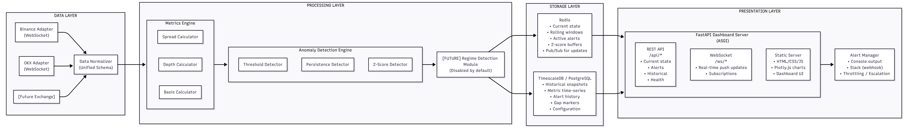

# Crypto Derivatives Market Quality & Pricing Surveillance System

## Product Requirements Document (PRD)
**Version**: 2.1  
**Status**: Final Draft  
**Last Updated**: February 2025

---

## 1. Executive Summary

### 1.1 Problem Statement

Crypto derivatives markets operate 24/7 with fragmented liquidity across venues. Exchanges face critical operational challenges:

- **Spread instability**: Bid-ask spreads widen unpredictably during volatility
- **Depth degradation**: Order book thins before major moves, often undetected
- **Basis drift**: Perpetual futures prices diverge from spot, creating liquidation risk
- **Cross-exchange arbitrage**: Pricing inefficiencies signal market stress or manipulation
- **Delayed detection**: Manual monitoring misses anomalies until they become incidents

Without systematic surveillance, exchanges cannot maintain pricing integrity or protect users from poor execution quality.

### 1.2 Solution

Build a **quantitative surveillance system** that:

1. Continuously monitors market quality metrics (spreads, depth, imbalance)
2. Tracks derivatives pricing integrity (basis, mark price, funding rates)
3. Detects anomalies using threshold + z-score dual conditions
4. Provides real-time dashboards and alerts
5. Supports post-event analysis and attribution

### 1.3 Perspective

> **This system is designed for exchange market operations, not trading.**

The user is an exchange's Market Operations team, not a trader. The goal is market stability, pricing correctness, and liquidity quality—not PnL.

---

## 2. Scope

### 2.1 Phase 1 Scope (Current)

| Dimension | Scope |
|-----------|-------|
| **Exchanges** | Binance, OKX |
| **Instruments** | BTC-USDT Perpetual, BTC-USDT Spot |
| **Data Source** | WebSocket (primary), REST polling (fallback) |
| **Storage** | Redis (real-time state), TimescaleDB/PostgreSQL (historical) |
| **Dashboard** | FastAPI + Plotly.js (ASGI, async-native) |
| **Deployment** | Docker Compose |

### 2.2 Modularity Requirements

The system MUST be designed for easy extension:

- Adding a new exchange should require only:
  - New exchange adapter class implementing `ExchangeAdapter` interface
  - Configuration entry in `exchanges.yaml`
  - No changes to metrics engine, anomaly detection, or dashboard

- Adding a new instrument should require only:
  - Configuration entry in `instruments.yaml`
  - Threshold configuration in `alerts.yaml`
  - No code changes

- Future modules (regime detection, backfill) should be:
  - Enabled/disabled via configuration flags
  - Pluggable without modifying core logic

### 2.3 Non-Goals

- Executing trades or sending orders
- Building trading strategies or signals for trading
- Smart contract or DeFi protocol development
- Sub-millisecond latency (target is sub-second)
- Options market monitoring (future phase)

---

## 3. Target Users

| User | Needs |
|------|-------|
| **Market Operations** | Real-time alerts, dashboards, incident response |
| **Quantitative Analysts** | Historical data, metric definitions, statistical analysis |
| **Market Making Team** | Spread/depth benchmarks, parameter tuning data |
| **Engineering** | System health, data pipeline status, API metrics |

---

## 4. Data Contracts

### 4.1 Order Book Snapshot Schema

This is the **normalized internal schema**. Each exchange adapter converts raw data to this format.

```python
@dataclass
class OrderBookSnapshot:
    """Normalized order book snapshot from any exchange."""
    
    # Identification
    exchange: str              # "binance" | "okx"
    instrument: str            # Normalized: "BTC-USDT-PERP" | "BTC-USDT-SPOT"
    timestamp: datetime        # Exchange timestamp (UTC)
    local_timestamp: datetime  # When we received it (UTC)
    
    # Sequence tracking (exchange-specific, for gap detection)
    sequence_id: int           # Binance: lastUpdateId, OKX: seqId
    
    # Order book data
    bids: List[PriceLevel]     # Sorted best (highest) to worst
    asks: List[PriceLevel]     # Sorted best (lowest) to worst
    
    # Metadata
    depth_levels: int          # Number of levels received (default: 20)


@dataclass
class PriceLevel:
    """Single price level in order book."""
    price: Decimal             # Use Decimal for precision
    quantity: Decimal          # Base asset quantity
    
    @property
    def notional(self) -> Decimal:
        """USD notional value at this level."""
        return self.price * self.quantity
```

### 4.2 Exchange-Specific Mappings

#### Binance

| Raw Field | Normalized Field | Notes |
|-----------|------------------|-------|
| `lastUpdateId` | `sequence_id` | For gap detection |
| `E` | `timestamp` | Event time (ms) |
| `bids` | `bids` | Array of [price, qty] |
| `asks` | `asks` | Array of [price, qty] |

**WebSocket Endpoint**: `wss://fstream.binance.com/stream`  
**Spot**: `btcusdt@depth20@100ms`  
**Perp**: `btcusdt@depth20@100ms` (on fstream)

#### OKX

| Raw Field | Normalized Field | Notes |
|-----------|------------------|-------|
| `seqId` | `sequence_id` | For gap detection |
| `ts` | `timestamp` | Timestamp (ms) |
| `bids` | `bids` | Array of [price, qty, _, num_orders] |
| `asks` | `asks` | Array of [price, qty, _, num_orders] |

**WebSocket Endpoint**: `wss://ws.okx.com:8443/ws/v5/public`  
**Spot**: `{"channel": "books5", "instId": "BTC-USDT"}`  
**Perp**: `{"channel": "books5", "instId": "BTC-USDT-SWAP"}`

### 4.3 Snapshot Frequency

| Mode | Frequency | Use Case |
|------|-----------|----------|
| **Real-time** | 100ms | Live monitoring, alerts |
| **Historical** | 1 second | Storage, backtesting |
| **Polling fallback** | 1 second | When WebSocket fails |

### 4.4 Depth Levels

**Decision**: Capture **top 20 levels** from each exchange (static).

**Rationale**:
- Sufficient for spread, top-of-book liquidity, and 25 bps depth calculations
- Covers 80%+ of actionable liquidity for BTC-USDT
- Reasonable message size and storage overhead
- Available on both Binance and OKX

**Future consideration**: Regime-aware depth capture (50-100 levels when market structure is stable and extractable) can be added as a module. For surveillance purposes, 20 levels is sufficient.

### 4.5 Ticker/Mark Price Schema

```python
@dataclass
class TickerSnapshot:
    """Ticker data for an instrument."""
    
    exchange: str
    instrument: str
    timestamp: datetime
    
    # Prices
    last_price: Decimal
    mark_price: Decimal        # For perps only
    index_price: Decimal       # For perps only
    
    # 24h stats
    volume_24h: Decimal        # Base asset
    volume_24h_usd: Decimal    # USD notional
    high_24h: Decimal
    low_24h: Decimal
    
    # Funding (perps only)
    funding_rate: Decimal      # Current funding rate
    next_funding_time: datetime


@dataclass
class TradeSnapshot:
    """Recent trade data."""
    
    exchange: str
    instrument: str
    timestamp: datetime
    
    price: Decimal
    quantity: Decimal
    side: str                  # "buy" | "sell"
    trade_id: str
```

### 4.6 Gap Marker Schema

When data gaps are detected (WebSocket disconnection), insert gap markers instead of interpolating.

```python
@dataclass
class GapMarker:
    """Marks a period of missing data."""
    
    exchange: str
    instrument: str
    gap_start: datetime        # Last good timestamp
    gap_end: datetime          # First timestamp after reconnection
    duration_seconds: float
    reason: str                # "websocket_disconnect", "exchange_maintenance", etc.
    sequence_id_before: int    # Last known sequence
    sequence_id_after: int     # First sequence after gap
```

---

## 5. Metrics Definitions

### 5.1 Market Quality Metrics

#### 5.1.1 Spread Metrics

| Metric | Formula | Unit | Storage |
|--------|---------|------|---------|
| **Best Bid-Ask Spread (Absolute)** | `best_ask - best_bid` | USD | Both |
| **Best Bid-Ask Spread (BPS)** | `(best_ask - best_bid) / mid_price * 10000` | bps | Both |
| **Mid Price** | `(best_bid + best_ask) / 2` | USD | Both |
| **Time-Weighted Average Spread (TWAS)** | `Σ(spread_i * duration_i) / total_duration` | bps | PostgreSQL |
| **Spread Volatility** | `std(spread_bps)` over rolling window | bps | PostgreSQL |
| **Spread Z-Score** | `(spread - rolling_mean) / rolling_std` | σ | Redis |

#### 5.1.2 Depth Metrics

| Metric | Formula | Unit | Storage |
|--------|---------|------|---------|
| **Depth at N bps (Bid)** | Sum of bid notional within N bps of mid | USD | Both |
| **Depth at N bps (Ask)** | Sum of ask notional within N bps of mid | USD | Both |
| **Depth at N bps (Total)** | Bid depth + Ask depth at N bps | USD | Both |
| **Depth Imbalance** | `(bid_depth - ask_depth) / (bid_depth + ask_depth)` | ratio [-1, 1] | Both |
| **Depth Change %** | `(current_depth - prev_depth) / prev_depth * 100` | % | Redis |

**Configurable depth levels**: 5 bps, 10 bps, 25 bps

#### 5.1.3 Order Book Imbalance

| Metric | Formula | Unit |
|--------|---------|------|
| **Top-of-Book Imbalance** | `(best_bid_qty - best_ask_qty) / (best_bid_qty + best_ask_qty)` | ratio [-1, 1] |
| **Weighted Imbalance (N levels)** | Volume-weighted imbalance across top N levels | ratio [-1, 1] |

### 5.2 Derivatives Pricing Metrics

#### 5.2.1 Basis Metrics

| Metric | Formula | Unit | Storage |
|--------|---------|------|---------|
| **Basis (Absolute)** | `perp_mid - spot_mid` | USD | Both |
| **Basis (BPS)** | `(perp_mid - spot_mid) / spot_mid * 10000` | bps | Both |
| **Basis Z-Score** | `(basis - rolling_mean) / rolling_std` | σ | Redis |
| **Basis Persistence** | Duration basis exceeds threshold | seconds | Redis |

**Note**: Basis is stored in both absolute ($) and relative (bps) terms. BPS is the primary metric for cross-instrument comparison. Z-scores are used to evaluate whether a basis is anomalous relative to the asset's own historical distribution.

#### 5.2.2 Mark Price Metrics

| Metric | Formula | Unit |
|--------|---------|------|
| **Mark-Index Deviation** | `(mark_price - index_price) / index_price * 10000` | bps |
| **Mark-Mid Deviation** | `(mark_price - mid_price) / mid_price * 10000` | bps |

#### 5.2.3 Funding Metrics

| Metric | Formula | Unit |
|--------|---------|------|
| **Current Funding Rate** | Direct from exchange | % (8h) |
| **Annualized Funding** | `funding_rate * 3 * 365` | % (annual) |
| **Funding-Basis Divergence** | When funding direction != basis direction | flag |

### 5.3 Cross-Exchange Metrics

| Metric | Formula | Unit |
|--------|---------|------|
| **Cross-Exchange Spread** | `max(best_bids) - min(best_asks)` across exchanges | USD |
| **Price Divergence** | `(price_A - price_B) / avg(price_A, price_B) * 10000` | bps |
| **Arbitrage Signal** | Cross-exchange spread > threshold | flag |

---

## 6. Alert System

### 6.1 Alert Philosophy

Alerts use **dual conditions**: raw metric threshold AND z-score threshold (where applicable). This prevents:
- False positives from absolute thresholds during volatile regimes
- Missed anomalies when absolute values are normal but statistically unusual

### 6.2 Alert Priority Framework

| Priority | Name | Description | Channels | Escalation |
|----------|------|-------------|----------|------------|
| **P1** | Critical | Immediate action required | Console, Slack | N/A |
| **P2** | Warning | Investigate soon | Console, Slack | → P1 after 5 min |
| **P3** | Info | Awareness only | Console | N/A |

### 6.3 Alert Types

#### Spread Alerts

| Alert Type | Metric | Condition | Requires Z-Score |
|------------|--------|-----------|------------------|
| `spread_warning` | `spread_bps` | > threshold | Yes |
| `spread_critical` | `spread_bps` | > threshold | Yes |

#### Basis Alerts

| Alert Type | Metric | Condition | Requires Z-Score | Persistence |
|------------|--------|-----------|------------------|-------------|
| `basis_warning` | `basis_bps` | abs > threshold | Yes | 2 min |
| `basis_critical` | `basis_bps` | abs > threshold | Yes | 1 min |

#### Depth Alerts

| Alert Type | Metric | Condition | Requires Z-Score |
|------------|--------|-----------|------------------|
| `depth_warning` | `depth_10bps_total` | < threshold | No |
| `depth_critical` | `depth_10bps_total` | < threshold | No |
| `depth_drop` | `depth_10bps_change_pct` | < threshold | No |

#### Mark Price Alerts

| Alert Type | Metric | Condition | Requires Z-Score |
|------------|--------|-----------|------------------|
| `mark_deviation_warning` | `mark_index_deviation_bps` | abs > threshold | Yes |
| `mark_deviation_critical` | `mark_index_deviation_bps` | abs > threshold | Yes |

#### Cross-Exchange Alerts

| Alert Type | Metric | Condition | Persistence |
|------------|--------|-----------|-------------|
| `cross_exchange_divergence` | `cross_exchange_spread_bps` | abs > threshold | 10 sec |

### 6.4 Asset-Specific Thresholds

**Decision**: Thresholds are asset-specific, not universal. Different assets have different volatility and liquidity profiles.

#### BTC-USDT-PERP

| Alert | Warning Threshold | Warning Z-Score | Critical Threshold | Critical Z-Score |
|-------|-------------------|-----------------|-------------------|------------------|
| Spread | 3.0 bps | 2.0σ | 5.0 bps | 3.0σ |
| Basis | 10.0 bps | 2.0σ | 20.0 bps | 3.0σ |
| Depth (10 bps) | < $500K | - | < $200K | - |
| Depth Drop | -30% | - | -50% | - |
| Mark Deviation | 15.0 bps | 2.0σ | 30.0 bps | 3.0σ |

#### BTC-USDT-SPOT

| Alert | Warning Threshold | Warning Z-Score | Critical Threshold | Critical Z-Score |
|-------|-------------------|-----------------|-------------------|------------------|
| Spread | 2.0 bps | 2.0σ | 4.0 bps | 3.0σ |
| Depth (10 bps) | < $300K | - | < $100K | - |

#### ETH-USDT-PERP (Future)

| Alert | Warning Threshold | Warning Z-Score | Critical Threshold | Critical Z-Score |
|-------|-------------------|-----------------|-------------------|------------------|
| Spread | 5.0 bps | 2.0σ | 10.0 bps | 3.0σ |
| Basis | 15.0 bps | 2.0σ | 30.0 bps | 3.0σ |
| Depth (10 bps) | < $200K | - | < $75K | - |

#### Default Fallback (New Instruments)

| Alert | Warning Threshold | Warning Z-Score | Critical Threshold | Critical Z-Score |
|-------|-------------------|-----------------|-------------------|------------------|
| Spread | 10.0 bps | 2.0σ | 20.0 bps | 3.0σ |
| Basis | 25.0 bps | 2.0σ | 50.0 bps | 3.0σ |
| Depth (10 bps) | < $100K | - | < $50K | - |

### 6.5 Alert Behavior

```python
@dataclass
class AlertBehavior:
    """Alert behavior configuration."""
    
    # Throttling
    throttle_seconds: int = 60          # Min time between same alert type
    dedup_window_seconds: int = 300     # Group related alerts
    
    # Lifecycle
    auto_resolve: bool = True           # Resolve when condition clears
    
    # Escalation
    escalation_enabled: bool = True
    escalation_seconds: int = 300       # P2 → P1 after this duration
```

### 6.6 Alert Evaluation Logic

```python
def should_alert(
    metric_value: Decimal,
    threshold: Decimal,
    condition: str,  # 'gt', 'lt', 'abs_gt', 'abs_lt'
    zscore_value: Optional[Decimal],
    zscore_threshold: Optional[Decimal],
    persistence_required: Optional[int],
    persistence_start: Optional[datetime]
) -> bool:
    """
    Dual-condition alert evaluation.
    
    Alert fires only if:
    1. Primary condition met (metric vs threshold)
    2. Z-score condition met (if required)
    3. Persistence condition met (if required)
    """
    
    # Check primary condition
    if condition == 'gt' and metric_value <= threshold:
        return False
    if condition == 'lt' and metric_value >= threshold:
        return False
    if condition == 'abs_gt' and abs(metric_value) <= threshold:
        return False
        
    # Check z-score if required
    if zscore_threshold is not None:
        if zscore_value is None or abs(zscore_value) < zscore_threshold:
            return False
            
    # Check persistence if required
    if persistence_required is not None:
        if persistence_start is None:
            return False
        elapsed = (datetime.utcnow() - persistence_start).total_seconds()
        if elapsed < persistence_required:
            return False
            
    return True
```

### 6.7 Z-Score Safety Guards

Z-score based alerts require sufficient historical data to be meaningful. The system implements safety guards to prevent false signals during warmup or after data gaps.

#### Warmup Behavior

```
┌─────────────────────────────────────────────────────────────────────────────┐
│                           Z-SCORE WARMUP TIMELINE                            │
│                                                                              │
│   System Start                                                               │
│       │                                                                      │
│       ▼                                                                      │
│   ┌───────────────────────────────────────────────────────────────────┐     │
│   │  WARMUP PHASE (samples < min_samples)                             │     │
│   │                                                                    │     │
│   │  • Z-score = NULL (not computed)                                  │     │
│   │  • Alerts requiring z-score = SKIPPED                             │     │
│   │  • Dashboard shows "Warming up..." indicator                      │     │
│   │  • Log: "Z-score warmup: 15/30 samples for spread_bps"           │     │
│   └───────────────────────────────────────────────────────────────────┘     │
│       │                                                                      │
│       │  min_samples reached (e.g., 30 samples)                             │
│       ▼                                                                      │
│   ┌───────────────────────────────────────────────────────────────────┐     │
│   │  ACTIVE PHASE (samples >= min_samples)                            │     │
│   │                                                                    │     │
│   │  • Z-score computed normally                                      │     │
│   │  • Alerts evaluated with dual conditions                          │     │
│   │  • Dashboard shows live z-score values                            │     │
│   │  • Log: "Z-score active for spread_bps"                          │     │
│   └───────────────────────────────────────────────────────────────────┘     │
│                                                                              │
└─────────────────────────────────────────────────────────────────────────────┘
```

#### Safety Conditions

| Condition | Behavior | Rationale |
|-----------|----------|-----------|
| `sample_count < min_samples` | Skip z-score alerts, log warmup | Not enough data for meaningful statistics |
| `std_deviation < min_std` | Skip z-score alerts, log warning | Near-zero std causes extreme/infinite z-scores |
| `gap_detected` | Reset warmup counter | Post-gap data may have different distribution |
| `regime_change` (future) | Optional: reset warmup | New regime = new baseline |

#### Implementation

```python
from collections import deque
from dataclasses import dataclass
from decimal import Decimal
from datetime import datetime
from typing import Optional
import statistics
import logging

logger = logging.getLogger(__name__)


@dataclass
class ZScoreCalculator:
    """Z-score calculator with safety guards."""
    
    metric_name: str
    instrument: str
    window_size: int = 300          # Rolling window size
    min_samples: int = 30           # Minimum for valid z-score
    min_std: float = 0.0001         # Minimum std to avoid divide-by-zero
    warmup_log_interval: int = 10   # Log warmup status every N seconds
    
    def __post_init__(self):
        self.buffer: deque = deque(maxlen=self.window_size)
        self.last_warmup_log: Optional[datetime] = None
        self.is_warmed_up: bool = False
    
    def add_sample(self, value: Decimal, timestamp: datetime) -> Optional[Decimal]:
        """
        Add sample and return z-score if valid, None if warming up.
        
        Returns:
            Decimal: Z-score if sufficient samples and valid std
            None: If warming up or std too low
        """
        self.buffer.append(float(value))
        sample_count = len(self.buffer)
        
        # Check warmup condition
        if sample_count < self.min_samples:
            self._log_warmup(sample_count, timestamp)
            return None
        
        # Calculate statistics
        mean = statistics.mean(self.buffer)
        std = statistics.stdev(self.buffer)
        
        # Check std guard
        if std < self.min_std:
            logger.warning(
                f"Z-score skipped for {self.metric_name}:{self.instrument}: "
                f"std ({std:.6f}) below min_std ({self.min_std})"
            )
            return None
        
        # Mark as warmed up (first time)
        if not self.is_warmed_up:
            self.is_warmed_up = True
            logger.info(
                f"Z-score now active for {self.metric_name}:{self.instrument} "
                f"with {sample_count} samples"
            )
        
        # Compute z-score
        zscore = (float(value) - mean) / std
        return Decimal(str(round(zscore, 4)))
    
    def _log_warmup(self, sample_count: int, timestamp: datetime) -> None:
        """Log warmup status at intervals to avoid log spam."""
        if (self.last_warmup_log is None or 
            (timestamp - self.last_warmup_log).total_seconds() >= self.warmup_log_interval):
            logger.info(
                f"Z-score warmup for {self.metric_name}:{self.instrument}: "
                f"{sample_count}/{self.min_samples} samples"
            )
            self.last_warmup_log = timestamp
    
    def reset(self, reason: str) -> None:
        """Reset buffer (e.g., after gap or regime change)."""
        self.buffer.clear()
        self.is_warmed_up = False
        self.last_warmup_log = None
        logger.info(
            f"Z-score buffer reset for {self.metric_name}:{self.instrument}: {reason}"
        )
    
    @property
    def status(self) -> dict:
        """Return current status for dashboard/monitoring."""
        return {
            "metric": self.metric_name,
            "instrument": self.instrument,
            "is_warmed_up": self.is_warmed_up,
            "sample_count": len(self.buffer),
            "min_samples": self.min_samples,
            "progress_pct": min(100, len(self.buffer) / self.min_samples * 100)
        }
```

#### Alert Evaluation with Warmup Guard

```python
@dataclass
class AlertResult:
    """Result of alert evaluation."""
    triggered: bool
    skip_reason: Optional[str] = None
    message: Optional[str] = None


def evaluate_alert(
    alert_def: AlertDefinition,
    metric_value: Decimal,
    zscore_value: Optional[Decimal],  # None if warming up
    threshold: Decimal,
    zscore_threshold: Optional[Decimal],
    persistence_start: Optional[datetime] = None
) -> AlertResult:
    """
    Evaluate alert with warmup safety guard.
    
    Key behavior:
    - If z-score is required but not available (warmup), skip the alert
    - Log the skip reason for debugging
    - Never fire alerts based on insufficient data
    """
    
    # Check primary condition first
    primary_met = check_condition(metric_value, threshold, alert_def.condition)
    
    if not primary_met:
        return AlertResult(triggered=False)
    
    # If z-score required but not available (warmup), skip alert
    if alert_def.requires_zscore:
        if zscore_value is None:
            return AlertResult(
                triggered=False,
                skip_reason="zscore_warmup",
                message=f"Alert skipped: z-score warming up for {alert_def.metric}"
            )
        
        if abs(zscore_value) < zscore_threshold:
            return AlertResult(triggered=False)
    
    # Check persistence if required
    if alert_def.persistence_seconds is not None:
        if persistence_start is None:
            return AlertResult(triggered=False)
        elapsed = (datetime.utcnow() - persistence_start).total_seconds()
        if elapsed < alert_def.persistence_seconds:
            return AlertResult(triggered=False)
    
    # All conditions met
    return AlertResult(triggered=True)
```

#### Dashboard Warmup Indicator

```
┌─────────────────────────┐
│   CURRENT STATE         │
│                         │
│  Spread:  2.1 bps  🟢   │
│  Z-Score: ⏳ warming up │  ← Shows during warmup
│           (15/30)       │  ← Sample progress
│                         │
│  Basis:   5.2 bps  🟢   │
│  Z-Score: 1.2σ         │  ← Shows when active
│                         │
│  Depth:   $1.2M    🟢   │
│  Z-Score: N/A          │  ← Depth alerts don't use z-score
└─────────────────────────┘
```

#### Post-Gap Reset Behavior

When a data gap is detected, z-score buffers must be reset because the statistical properties of the market may have changed:

```python
class GapHandler:
    """Handles data gap detection and z-score buffer reset."""
    
    def __init__(
        self, 
        zscore_calculators: Dict[str, ZScoreCalculator],
        reset_threshold_seconds: float = 5.0
    ):
        self.zscore_calculators = zscore_calculators
        self.reset_threshold_seconds = reset_threshold_seconds
    
    def handle_gap(self, gap: GapMarker) -> None:
        """
        Handle detected data gap.
        
        Only reset z-score buffers if gap exceeds threshold.
        Short gaps (< 5s) may just be network blips.
        """
        if gap.duration_seconds < self.reset_threshold_seconds:
            logger.debug(
                f"Gap ({gap.duration_seconds:.1f}s) below reset threshold, "
                f"keeping z-score buffers"
            )
            return
        
        # Reset z-score calculators for affected instrument
        key_suffix = f"{gap.exchange}:{gap.instrument}"
        reset_count = 0
        
        for metric in ["spread_bps", "basis_bps", "mark_deviation_bps"]:
            key = f"{metric}:{key_suffix}"
            calculator = self.zscore_calculators.get(key)
            if calculator:
                calculator.reset(
                    reason=f"data gap detected ({gap.duration_seconds:.1f}s)"
                )
                reset_count += 1
        
        logger.info(
            f"Reset {reset_count} z-score buffers for {gap.instrument} "
            f"due to {gap.duration_seconds:.1f}s gap"
        )
```

#### Logging Examples

```
# Startup warmup
2025-01-25 12:00:05 INFO  Z-score warmup for spread_bps:BTC-USDT-PERP: 5/30 samples
2025-01-25 12:00:15 INFO  Z-score warmup for spread_bps:BTC-USDT-PERP: 15/30 samples
2025-01-25 12:00:25 INFO  Z-score warmup for spread_bps:BTC-USDT-PERP: 25/30 samples
2025-01-25 12:00:30 INFO  Z-score now active for spread_bps:BTC-USDT-PERP with 30 samples

# Alert skipped during warmup
2025-01-25 12:00:20 DEBUG Alert skipped: z-score warming up for spread_bps

# Std too low (flat market)
2025-01-25 14:30:00 WARN  Z-score skipped for spread_bps:BTC-USDT-PERP: std (0.000012) below min_std (0.0001)

# Gap detected, buffer reset
2025-01-25 15:45:30 INFO  Gap detected: 45.2s for binance:BTC-USDT-PERP
2025-01-25 15:45:30 INFO  Z-score buffer reset for spread_bps:binance:BTC-USDT-PERP: data gap detected (45.2s)
2025-01-25 15:45:30 INFO  Z-score buffer reset for basis_bps:binance:BTC-USDT-PERP: data gap detected (45.2s)
2025-01-25 15:45:30 INFO  Reset 2 z-score buffers for BTC-USDT-PERP due to 45.2s gap

# Re-warmup after gap
2025-01-25 15:45:40 INFO  Z-score warmup for spread_bps:BTC-USDT-PERP: 10/30 samples
```

#### Configuration

```yaml
# config/features.yaml
zscore:
  enabled: true
  window_size: 300              # 5 minutes at 1 sample/sec
  min_samples: 30               # ~30 seconds to warm up
  min_std: 0.0001               # Avoid divide-by-zero on flat markets
  warmup_log_interval: 10       # Log progress every 10 seconds
  reset_on_gap: true            # Reset buffer when gap detected
  reset_on_gap_threshold: 5     # Only reset if gap > 5 seconds
```

---

## 7. System Architecture

### 7.1 High-Level Components



### 7.2 Data Flow

```
1. Exchange WebSocket → Raw JSON message
2. Exchange Adapter → Validates, parses, detects gaps
3. Data Normalizer → Converts to unified schema
4. Redis → Stores current state, publishes update
5. Metrics Engine → Subscribes, calculates metrics + z-scores
6. Anomaly Detector → Evaluates dual conditions, generates alerts
7. TimescaleDB → Persists metrics at 1s intervals
8. FastAPI Dashboard:
   a. REST API serves current state, alerts, history on HTTP request
   b. WebSocket pushes real-time updates to connected browsers
   c. Browser renders Plotly.js charts from JSON data
```

### 7.3 Exchange Adapter Interface

```python
from abc import ABC, abstractmethod
from typing import AsyncIterator, Optional

class ExchangeAdapter(ABC):
    """Interface all exchange adapters must implement."""
    
    @abstractmethod
    async def connect(self) -> None:
        """Establish WebSocket connection."""
        pass
    
    @abstractmethod
    async def disconnect(self) -> None:
        """Gracefully close connection."""
        pass
    
    @abstractmethod
    async def subscribe(self, instruments: List[str]) -> None:
        """Subscribe to order book streams."""
        pass
    
    @abstractmethod
    async def stream_order_books(self) -> AsyncIterator[OrderBookSnapshot]:
        """Yield normalized order book snapshots."""
        pass
    
    @abstractmethod
    async def stream_tickers(self) -> AsyncIterator[TickerSnapshot]:
        """Yield normalized ticker snapshots."""
        pass
    
    @abstractmethod
    async def get_order_book_rest(self, instrument: str) -> OrderBookSnapshot:
        """REST fallback for order book."""
        pass
    
    @abstractmethod
    async def health_check(self) -> bool:
        """Check connection health."""
        pass
    
    @abstractmethod
    def detect_gap(self, prev_seq: int, curr_seq: int) -> Optional[GapMarker]:
        """Detect sequence gaps in data."""
        pass
    
    @property
    @abstractmethod
    def exchange_name(self) -> str:
        """Return exchange identifier."""
        pass
```

---

## 8. Storage Design

### 8.1 Storage Philosophy

| Storage | Purpose | Data Characteristics |
|---------|---------|---------------------|
| **Redis** | Real-time state, dashboard display, deduplication | Hot data, overwritten, lost on restart (acceptable) |
| **TimescaleDB** | Historical persistence, analysis, audit trail | Append-only, survives restarts, complex queries |

### 8.2 Why TimescaleDB?

TimescaleDB = PostgreSQL + time-series optimizations (as an extension).

| Feature | Vanilla PostgreSQL | TimescaleDB |
|---------|-------------------|-------------|
| Partitioning | Manual (`CREATE TABLE ... PARTITION`) | Automatic chunking |
| Time-series queries | `GROUP BY date_trunc()` | `time_bucket()` - optimized |
| Compression | Standard | 90%+ for time-series |
| Indexes | Standard B-tree | Time-optimized |
| Compatibility | N/A | 100% PostgreSQL compatible |

**Setup**:
```sql
-- Convert table to hypertable (one line)
SELECT create_hypertable('order_book_snapshots', 'created_at');
SELECT create_hypertable('metrics', 'created_at');
```

### 8.3 Redis Schema

```
# Current order book state (hash)
orderbook:{exchange}:{instrument}
  - timestamp: ISO8601
  - best_bid: decimal
  - best_ask: decimal
  - mid_price: decimal
  - spread_bps: decimal
  - depth_5bps_total: decimal
  - depth_10bps_total: decimal
  - depth_25bps_total: decimal
  - imbalance: decimal

# Z-score rolling buffers (list - FIFO)
zscore:{metric}:{exchange}:{instrument}
  - [value1, value2, ..., valueN]  # Last N values for std calculation
  - LTRIM to maintain size

# Current z-scores (hash)
zscore:current:{exchange}:{instrument}
  - spread_bps: decimal
  - basis_bps: decimal
  - mark_deviation_bps: decimal

# Active alerts (hash per alert)
alerts:active:{alert_id}
  - alert_type: string
  - priority: string
  - exchange: string
  - instrument: string
  - trigger_metric: string
  - trigger_value: decimal
  - trigger_threshold: decimal
  - zscore_value: decimal
  - zscore_threshold: decimal
  - triggered_at: ISO8601
  - last_seen_at: ISO8601
  - duration_seconds: int
  - status: string
  - context: JSON

# Alert indexes (sets)
alerts:by_instrument:{instrument}     → Set of alert_ids
alerts:by_priority:{P1|P2|P3}         → Set of alert_ids
alerts:by_type:{alert_type}           → Set of alert_ids

# Alert deduplication (string with TTL)
alerts:dedup:{alert_type}:{exchange}:{instrument}
  - value: last_alert_id
  - TTL: 60 seconds

# Alert throttling counter (string with TTL)
alerts:count:{alert_type}:{exchange}:{instrument}:{hour}
  - value: count
  - TTL: 2 hours

# System health (hash)
health:{exchange}
  - connected: bool
  - last_message: ISO8601
  - message_count: int
  - lag_ms: int
  - reconnect_count: int

# Gap tracking (list)
gaps:{exchange}:{instrument}
  - [gap_marker_json, ...]
```

### 8.4 TimescaleDB Schema

```sql
-- ============================================================
-- ORDER BOOK SNAPSHOTS
-- ============================================================
CREATE TABLE order_book_snapshots (
    id BIGSERIAL,
    exchange VARCHAR(20) NOT NULL,
    instrument VARCHAR(30) NOT NULL,
    timestamp TIMESTAMPTZ NOT NULL,
    local_timestamp TIMESTAMPTZ NOT NULL,
    sequence_id BIGINT,
    
    -- Prices
    best_bid DECIMAL(20, 8),
    best_ask DECIMAL(20, 8),
    mid_price DECIMAL(20, 8),
    
    -- Computed metrics
    spread_abs DECIMAL(20, 8),
    spread_bps DECIMAL(10, 4),
    depth_5bps_bid DECIMAL(20, 2),
    depth_5bps_ask DECIMAL(20, 2),
    depth_5bps_total DECIMAL(20, 2),
    depth_10bps_bid DECIMAL(20, 2),
    depth_10bps_ask DECIMAL(20, 2),
    depth_10bps_total DECIMAL(20, 2),
    depth_25bps_bid DECIMAL(20, 2),
    depth_25bps_ask DECIMAL(20, 2),
    depth_25bps_total DECIMAL(20, 2),
    imbalance DECIMAL(5, 4),
    
    -- Raw data for replay
    bids_json JSONB,
    asks_json JSONB,
    
    created_at TIMESTAMPTZ DEFAULT NOW(),
    
    PRIMARY KEY (id, created_at)
);

-- Convert to hypertable
SELECT create_hypertable('order_book_snapshots', 'created_at');

-- Indexes
CREATE INDEX idx_obs_exchange_instrument_time 
    ON order_book_snapshots (exchange, instrument, timestamp DESC);


-- ============================================================
-- METRICS TIME-SERIES
-- ============================================================
CREATE TABLE metrics (
    id BIGSERIAL,
    metric_name VARCHAR(50) NOT NULL,
    exchange VARCHAR(20) NOT NULL,
    instrument VARCHAR(30) NOT NULL,
    timestamp TIMESTAMPTZ NOT NULL,
    value DECIMAL(20, 8) NOT NULL,
    zscore DECIMAL(10, 4),
    
    created_at TIMESTAMPTZ DEFAULT NOW(),
    
    PRIMARY KEY (id, created_at)
);

SELECT create_hypertable('metrics', 'created_at');

CREATE INDEX idx_metrics_name_instrument_time 
    ON metrics (metric_name, instrument, timestamp DESC);


-- ============================================================
-- GAP MARKERS
-- ============================================================
CREATE TABLE data_gaps (
    id BIGSERIAL PRIMARY KEY,
    exchange VARCHAR(20) NOT NULL,
    instrument VARCHAR(30) NOT NULL,
    gap_start TIMESTAMPTZ NOT NULL,
    gap_end TIMESTAMPTZ NOT NULL,
    duration_seconds DECIMAL(10, 3) NOT NULL,
    reason VARCHAR(50) NOT NULL,
    sequence_id_before BIGINT,
    sequence_id_after BIGINT,
    
    created_at TIMESTAMPTZ DEFAULT NOW()
);

CREATE INDEX idx_gaps_exchange_instrument_time 
    ON data_gaps (exchange, instrument, gap_start DESC);


-- ============================================================
-- ALERTS
-- ============================================================
CREATE TABLE alerts (
    id BIGSERIAL PRIMARY KEY,
    alert_id VARCHAR(100) UNIQUE NOT NULL,
    
    -- Classification
    alert_type VARCHAR(50) NOT NULL,
    priority VARCHAR(5) NOT NULL,
    severity VARCHAR(10) NOT NULL,
    
    -- Location
    exchange VARCHAR(20),
    instrument VARCHAR(30),
    
    -- Primary trigger
    trigger_metric VARCHAR(50) NOT NULL,
    trigger_value DECIMAL(20, 8) NOT NULL,
    trigger_threshold DECIMAL(20, 8) NOT NULL,
    trigger_condition VARCHAR(10) NOT NULL,
    
    -- Z-score trigger
    zscore_value DECIMAL(10, 4),
    zscore_threshold DECIMAL(10, 4),
    
    -- Lifecycle
    triggered_at TIMESTAMPTZ NOT NULL,
    acknowledged_at TIMESTAMPTZ,
    resolved_at TIMESTAMPTZ,
    duration_seconds INT,
    
    -- Peak tracking
    peak_value DECIMAL(20, 8),
    peak_at TIMESTAMPTZ,
    
    -- Escalation
    escalated BOOLEAN DEFAULT FALSE,
    escalated_at TIMESTAMPTZ,
    original_priority VARCHAR(5),
    
    -- Context
    context JSONB,
    
    -- Resolution
    resolution_type VARCHAR(20),
    resolution_value DECIMAL(20, 8),
    
    created_at TIMESTAMPTZ DEFAULT NOW(),
    updated_at TIMESTAMPTZ DEFAULT NOW()
);

CREATE INDEX idx_alerts_active ON alerts (resolved_at) WHERE resolved_at IS NULL;
CREATE INDEX idx_alerts_instrument_time ON alerts (instrument, triggered_at DESC);
CREATE INDEX idx_alerts_type_time ON alerts (alert_type, triggered_at DESC);
CREATE INDEX idx_alerts_priority ON alerts (priority, triggered_at DESC);


-- ============================================================
-- ALERT DEFINITIONS (Configuration)
-- ============================================================
CREATE TABLE alert_definitions (
    id SERIAL PRIMARY KEY,
    alert_type VARCHAR(50) UNIQUE NOT NULL,
    name VARCHAR(100) NOT NULL,
    description TEXT,
    metric_name VARCHAR(50) NOT NULL,
    default_priority VARCHAR(5) NOT NULL,
    default_severity VARCHAR(10) NOT NULL,
    condition VARCHAR(10) NOT NULL,
    requires_zscore BOOLEAN DEFAULT FALSE,
    persistence_seconds INT,
    throttle_seconds INT DEFAULT 60,
    escalation_seconds INT,
    escalates_to VARCHAR(50),
    enabled BOOLEAN DEFAULT TRUE,
    
    created_at TIMESTAMPTZ DEFAULT NOW(),
    updated_at TIMESTAMPTZ DEFAULT NOW()
);


-- ============================================================
-- ALERT THRESHOLDS (Per-Instrument)
-- ============================================================
CREATE TABLE alert_thresholds (
    id SERIAL PRIMARY KEY,
    alert_type VARCHAR(50) NOT NULL REFERENCES alert_definitions(alert_type),
    instrument VARCHAR(30) NOT NULL,  -- '*' for default
    
    warning_threshold DECIMAL(20, 8),
    critical_threshold DECIMAL(20, 8),
    zscore_warning DECIMAL(10, 4),
    zscore_critical DECIMAL(10, 4),
    
    priority_override VARCHAR(5),
    enabled BOOLEAN DEFAULT TRUE,
    
    created_at TIMESTAMPTZ DEFAULT NOW(),
    updated_at TIMESTAMPTZ DEFAULT NOW(),
    
    UNIQUE(alert_type, instrument)
);
```

---

## 9. Configuration

### 9.1 Configuration Files

#### `config/exchanges.yaml`

```yaml
exchanges:
  binance:
    enabled: true
    websocket_url: "wss://fstream.binance.com/stream"
    websocket_url_spot: "wss://stream.binance.com:9443/ws"
    rest_url: "https://fapi.binance.com"
    rest_url_spot: "https://api.binance.com"
    rate_limit_per_second: 10
    reconnect_delay_seconds: 5
    max_reconnect_attempts: 10
    
  okx:
    enabled: true
    websocket_url: "wss://ws.okx.com:8443/ws/v5/public"
    rest_url: "https://www.okx.com"
    rate_limit_per_second: 10
    reconnect_delay_seconds: 5
    max_reconnect_attempts: 10
```

#### `config/instruments.yaml`

```yaml
instruments:
  - id: "BTC-USDT-PERP"
    type: "perpetual"
    base: "BTC"
    quote: "USDT"
    exchange_symbols:
      binance: "btcusdt"
      okx: "BTC-USDT-SWAP"
    depth_levels: 20
    
  - id: "BTC-USDT-SPOT"
    type: "spot"
    base: "BTC"
    quote: "USDT"
    exchange_symbols:
      binance: "btcusdt"
      okx: "BTC-USDT"
    depth_levels: 20
    
  # Future instruments
  # - id: "ETH-USDT-PERP"
  #   type: "perpetual"
  #   base: "ETH"
  #   quote: "USDT"
  #   exchange_symbols:
  #     binance: "ethusdt"
  #     okx: "ETH-USDT-SWAP"
  #   depth_levels: 20
```

#### `config/alerts.yaml`

```yaml
alerts:
  # Global settings
  global:
    throttle_seconds: 60
    dedup_window_seconds: 300
    auto_resolve: true
    
  # Priority definitions
  priorities:
    P1:
      name: "Critical"
      description: "Immediate action required"
      channels: ["console", "slack"]
      
    P2:
      name: "Warning"
      description: "Investigate soon"
      channels: ["console", "slack"]
      escalation_to_P1_seconds: 300
      
    P3:
      name: "Info"
      description: "Awareness only"
      channels: ["console"]

  # Alert type definitions
  definitions:
    spread_warning:
      name: "Spread Warning"
      metric: "spread_bps"
      default_priority: "P2"
      default_severity: "warning"
      condition: "gt"
      requires_zscore: true
      escalates_to: "spread_critical"
      throttle_seconds: 60
      
    spread_critical:
      name: "Spread Critical"
      metric: "spread_bps"
      default_priority: "P1"
      default_severity: "critical"
      condition: "gt"
      requires_zscore: true
      throttle_seconds: 30
      
    basis_warning:
      name: "Basis Warning"
      metric: "basis_bps"
      default_priority: "P2"
      default_severity: "warning"
      condition: "abs_gt"
      requires_zscore: true
      persistence_seconds: 120
      escalates_to: "basis_critical"
      
    basis_critical:
      name: "Basis Critical"
      metric: "basis_bps"
      default_priority: "P1"
      default_severity: "critical"
      condition: "abs_gt"
      requires_zscore: true
      persistence_seconds: 60
      
    depth_warning:
      name: "Depth Warning"
      metric: "depth_10bps_total"
      default_priority: "P2"
      default_severity: "warning"
      condition: "lt"
      requires_zscore: false
      
    depth_critical:
      name: "Depth Critical"
      metric: "depth_10bps_total"
      default_priority: "P1"
      default_severity: "critical"
      condition: "lt"
      requires_zscore: false
      
    depth_drop:
      name: "Depth Drop"
      metric: "depth_10bps_change_pct"
      default_priority: "P2"
      default_severity: "warning"
      condition: "lt"
      requires_zscore: false
      
    mark_deviation_warning:
      name: "Mark Price Deviation Warning"
      metric: "mark_index_deviation_bps"
      default_priority: "P2"
      default_severity: "warning"
      condition: "abs_gt"
      requires_zscore: true
      
    mark_deviation_critical:
      name: "Mark Price Deviation Critical"
      metric: "mark_index_deviation_bps"
      default_priority: "P1"
      default_severity: "critical"
      condition: "abs_gt"
      requires_zscore: true
      
    cross_exchange_divergence:
      name: "Cross-Exchange Price Divergence"
      metric: "cross_exchange_spread_bps"
      default_priority: "P2"
      default_severity: "warning"
      condition: "abs_gt"
      requires_zscore: false
      persistence_seconds: 10

  # Per-instrument thresholds
  thresholds:
    BTC-USDT-PERP:
      spread_warning:
        threshold: 3.0
        zscore: 2.0
      spread_critical:
        threshold: 5.0
        zscore: 3.0
      basis_warning:
        threshold: 10.0
        zscore: 2.0
      basis_critical:
        threshold: 20.0
        zscore: 3.0
      depth_warning:
        threshold: 500000
      depth_critical:
        threshold: 200000
      depth_drop:
        threshold: -30
      mark_deviation_warning:
        threshold: 15.0
        zscore: 2.0
      mark_deviation_critical:
        threshold: 30.0
        zscore: 3.0
        
    BTC-USDT-SPOT:
      spread_warning:
        threshold: 2.0
        zscore: 2.0
      spread_critical:
        threshold: 4.0
        zscore: 3.0
      depth_warning:
        threshold: 300000
      depth_critical:
        threshold: 100000
        
    # ETH thresholds (for future)
    ETH-USDT-PERP:
      spread_warning:
        threshold: 5.0
        zscore: 2.0
      spread_critical:
        threshold: 10.0
        zscore: 3.0
      basis_warning:
        threshold: 15.0
        zscore: 2.0
      basis_critical:
        threshold: 30.0
        zscore: 3.0
      depth_warning:
        threshold: 200000
      depth_critical:
        threshold: 75000
        
    # Default fallback
    "*":
      spread_warning:
        threshold: 10.0
        zscore: 2.0
      spread_critical:
        threshold: 20.0
        zscore: 3.0
      basis_warning:
        threshold: 25.0
        zscore: 2.0
      basis_critical:
        threshold: 50.0
        zscore: 3.0
      depth_warning:
        threshold: 100000
      depth_critical:
        threshold: 50000
```

#### `config/features.yaml`

```yaml
# Feature flags for modular components

features:
  # Regime detection (future)
  regime_detection:
    enabled: false
    # When enabled, thresholds are multiplied based on detected regime
    # regimes:
    #   volatile:
    #     trigger_metric: "spread_volatility_5m"
    #     trigger_threshold: 2.0
    #     threshold_multiplier: 2.0
    #   funding_settlement:
    #     trigger_type: "time_window"
    #     windows: ["23:45-00:15", "07:45-08:15", "15:45-16:15"]
    #     threshold_multiplier: 3.0
    
  # Backfill (future)
  backfill:
    enabled: false
    # When enabled, attempts to backfill trades/funding on reconnection
    # backfill_trades: true
    # backfill_funding: true
    # max_gap_seconds: 300
    
  # Gap handling
  gap_handling:
    mark_gaps: true              # Insert gap markers in database
    interpolate: false           # Never interpolate (fabricated data)
    alert_on_gap: true           # Generate P3 alert for gaps
    gap_threshold_seconds: 5     # Minimum gap to record

  # Z-score calculation
  zscore:
    enabled: true
    window_size: 300              # 5 minutes at 1 sample/sec
    min_samples: 30               # ~30 seconds to warm up
    min_std: 0.0001               # Avoid divide-by-zero on flat markets
    warmup_log_interval: 10       # Log progress every 10 seconds
    reset_on_gap: true            # Reset buffer when gap detected
    reset_on_gap_threshold: 5     # Only reset if gap > 5 seconds
```

---

## 10. Docker Deployment

### 10.1 Docker Compose Architecture

```yaml
# docker-compose.yml
version: '3.8'

services:
  # ============== INFRASTRUCTURE ==============
  redis:
    image: redis:7-alpine
    container_name: surveillance-redis
    ports:
      - "6379:6379"
    volumes:
      - redis_data:/data
    command: redis-server --appendonly yes
    healthcheck:
      test: ["CMD", "redis-cli", "ping"]
      interval: 10s
      timeout: 5s
      retries: 5
    restart: unless-stopped

  timescaledb:
    image: timescale/timescaledb:latest-pg15
    container_name: surveillance-db
    environment:
      POSTGRES_DB: surveillance
      POSTGRES_USER: surveillance
      POSTGRES_PASSWORD: ${DB_PASSWORD:-surveillance_dev}
    ports:
      - "5432:5432"
    volumes:
      - postgres_data:/var/lib/postgresql/data
      - ./db/init.sql:/docker-entrypoint-initdb.d/01-init.sql
      - ./db/seed.sql:/docker-entrypoint-initdb.d/02-seed.sql
    healthcheck:
      test: ["CMD-SHELL", "pg_isready -U surveillance"]
      interval: 10s
      timeout: 5s
      retries: 5
    restart: unless-stopped

  # ============== APPLICATION ==============
  data-ingestion:
    build:
      context: .
      dockerfile: ./services/data-ingestion/Dockerfile
    container_name: surveillance-ingestion
    depends_on:
      redis:
        condition: service_healthy
    environment:
      - REDIS_URL=redis://redis:6379
      - CONFIG_PATH=/app/config
      - LOG_LEVEL=INFO
    volumes:
      - ./config:/app/config:ro
    restart: unless-stopped

  metrics-engine:
    build:
      context: .
      dockerfile: ./services/metrics-engine/Dockerfile
    container_name: surveillance-metrics
    depends_on:
      redis:
        condition: service_healthy
      timescaledb:
        condition: service_healthy
    environment:
      - REDIS_URL=redis://redis:6379
      - DATABASE_URL=postgresql://surveillance:${DB_PASSWORD:-surveillance_dev}@timescaledb:5432/surveillance
      - CONFIG_PATH=/app/config
      - LOG_LEVEL=INFO
    volumes:
      - ./config:/app/config:ro
    restart: unless-stopped

  anomaly-detector:
    build:
      context: .
      dockerfile: ./services/anomaly-detector/Dockerfile
    container_name: surveillance-anomaly
    depends_on:
      redis:
        condition: service_healthy
      timescaledb:
        condition: service_healthy
      metrics-engine:
        condition: service_started
    environment:
      - REDIS_URL=redis://redis:6379
      - DATABASE_URL=postgresql://surveillance:${DB_PASSWORD:-surveillance_dev}@timescaledb:5432/surveillance
      - CONFIG_PATH=/app/config
      - LOG_LEVEL=INFO
    volumes:
      - ./config:/app/config:ro
    restart: unless-stopped

  dashboard:
    build:
      context: .
      dockerfile: ./services/dashboard/Dockerfile
    container_name: surveillance-dashboard
    depends_on:
      redis:
        condition: service_healthy
      timescaledb:
        condition: service_healthy
    ports:
      - "8050:8050"
    environment:
      - REDIS_URL=redis://redis:6379
      - DATABASE_URL=postgresql://surveillance:${DB_PASSWORD:-surveillance_dev}@timescaledb:5432/surveillance
      - CONFIG_PATH=/app/config
      - LOG_LEVEL=INFO
    volumes:
      - ./config:/app/config:ro
    restart: unless-stopped

volumes:
  redis_data:
  postgres_data:

networks:
  default:
    name: surveillance-network
```

### 10.2 Service Dockerfiles

```dockerfile
# services/data-ingestion/Dockerfile
FROM python:3.11-slim

WORKDIR /app

COPY requirements.txt .
RUN pip install --no-cache-dir -r requirements.txt

COPY src/ ./src/
COPY services/data-ingestion/ ./services/data-ingestion/

CMD ["python", "-m", "services.data_ingestion.main"]
```

### 10.3 Resource Requirements

| Service | CPU | Memory | Notes |
|---------|-----|--------|-------|
| Redis | 0.5 core | 512 MB | Sufficient for hot data |
| TimescaleDB | 1 core | 1 GB | More for complex queries |
| Data Ingestion | 0.5 core | 256 MB | I/O bound (WebSocket) |
| Metrics Engine | 1 core | 512 MB | Numpy/Pandas calculations |
| Anomaly Detector | 0.5 core | 256 MB | Light computation |
| Dashboard API | 0.5 core | 256 MB | FastAPI + Uvicorn (lighter than Dash) |
| **Total** | ~4 cores | ~2.8 GB | Runs on laptop |

---

## 11. Dashboard Specifications

### 11.1 Architecture Overview

The dashboard uses a **decoupled API-first architecture**:

```
┌─────────────────────────────────────────────────────────────────────────────┐
│                      DASHBOARD ARCHITECTURE                                 │
│                                                                             │
│   ┌─────────────────────────────────────────────────────────────────────┐   │
│   │                    BROWSER (Client-Side)                            │   │
│   │                                                                     │   │
│   │   ┌──────────────┐  ┌──────────────┐  ┌──────────────┐              │   │
│   │   │  Plotly.js   │  │  WebSocket   │  │    Fetch     │              │   │
│   │   │  (charts)    │  │  (real-time) │  │  (REST API)  │              │   │
│   │   └──────────────┘  └──────────────┘  └──────────────┘              │   │
│   └─────────────────────────────────────────────────────────────────────┘   │
│                    ▲              ▲              ▲                          │
│                    │   WebSocket  │    HTTP      │                          │
│                    │   (push)     │   (request)  │                          │
│                    ▼              ▼              ▼                          │
│   ┌─────────────────────────────────────────────────────────────────────┐   │
│   │                    FastAPI Server (ASGI)                            │   │
│   │                                                                     │   │
│   │   ┌──────────────┐  ┌──────────────┐  ┌──────────────┐              │   │
│   │   │ /ws/updates  │  │  /api/*      │  │ / (static)   │              │   │
│   │   │  WebSocket   │  │  REST API    │  │  HTML/JS/CSS │              │   │
│   │   └──────┬───────┘  └──────┬───────┘  └──────────────┘              │   │
│   │          │                 │                                        │   │
│   │          ▼                 ▼                                        │   │
│   │   ┌──────────────────────────────────────────────────────────────┐  │   │
│   │   │            Async Database Clients (no event loop issues)     │  │   │
│   │   │      redis.asyncio (real-time)    asyncpg (historical)       │  │   │
│   │   └──────────────────────────────────────────────────────────────┘  │   │
│   └─────────────────────────────────────────────────────────────────────┘   │
│                                                                             │
│       Async-native: No event loop conflicts (unlike Dash/Flask)             │
│       Real-time: WebSocket push, not polling                                │
│       Scalable: Stateless API, multiple instances possible                  │
│       Documented: Auto-generated OpenAPI/Swagger                            │
│                                                                             │
└─────────────────────────────────────────────────────────────────────────────┘
```

### 11.2 Technology Stack

| Component | Technology | Rationale |
|-----------|------------|-----------|
| Backend | FastAPI | Async-native ASGI, auto OpenAPI docs, WebSocket support |
| Server | Uvicorn | High-performance ASGI server |
| Charting | Plotly.js | Same charts as Dash, runs in browser |
| Real-time | WebSocket | Native FastAPI support, true server push |
| Styling | CSS (dark theme) | Professional monitoring aesthetic |
| Redis | redis.asyncio | Async client, no event loop conflicts |
| PostgreSQL | asyncpg | Async client, high performance |

### 11.3 Dashboard Layout

```
┌─────────────────────────────────────────────────────────────────────────────┐
│  CRYPTO MARKET MICROSTRUCTURE              [Binance] [OKX] [Both]           │
│  BTC-USDT-PERP                            [5m|15m|1h|4h|24h]   12:34:56 UTC │
├─────────────────────────────────────────────────────────────────────────────┤
│                                                                             │
│  ┌─────────────────────────┐  ┌─────────────────────────────────────────┐   │
│  │   CURRENT STATE         │  │   ACTIVE ALERTS (2)                     │   │
│  │                         │  │                                         │   │
│  │  Spread:  2.1 bps  🟢  │   │  🟡 P2: Basis Warning                  │   │
│  │  Z-Score: 0.8σ          │  │     BTC-USDT-PERP | 12.3 bps | 2.3σ     │   │
│  │  Depth:   $1.2M    🟢  │  │     Duration: 2m 15s                     │   │
│  │  Basis:   12.3 bps 🟡  │  │                                          │   │
│  │  Z-Score: 2.3σ    ⚠️   │  │  🟢 No P1 (Critical) alerts             │   │
│  │  Imbalance: 0.12   🟢  │  │                                          │   │
│  └─────────────────────────┘  └─────────────────────────────────────────┘   │
│                                                                             │
│  ┌───────────────────────────────────────────────────────────────────────┐  │
│  │   SPREAD TIME SERIES                                                  │  │
│  │   [Plotly.js line chart - Binance (blue) + OKX (orange)]              │  │
│  │   [Warning threshold (yellow dashed) + Critical (red dashed)]         │  │
│  └───────────────────────────────────────────────────────────────────────┘  │
│                                                                             │
│  ┌───────────────────────────────────────────────────────────────────────┐  │
│  │   BASIS TIME SERIES                                                   │  │
│  │   [Plotly.js line chart - Basis in bps]                               │  │
│  │   [ Show Z-Score Overlay]                                             │  │
│  └───────────────────────────────────────────────────────────────────────┘  │
│                                                                             │
│  ┌─────────────────────────────┐  ┌─────────────────────────────────────┐   │
│  │   ORDER BOOK DEPTH          │  │   CROSS-EXCHANGE COMPARISON         │   │
│  │   [Bar: 5/10/25 bps levels] │  │   Binance: $100,234.56              │   │
│  │   [Bid green | Ask red]     │  │   OKX:     $100,231.23              │   │
│  │   Imbalance: 0.12           │  │   Divergence: 3.3 bps               │   │
│  └─────────────────────────────┘  └─────────────────────────────────────┘   │
│                                                                             │
│  ┌───────────────────────────────────────────────────────────────────────┐  │
│  │   SYSTEM HEALTH                                                       │  │
│  │   Binance: 🟢 Connected | Lag: 23ms | Rate: 1,234/min | Gaps: 0      │  │
│  │   OKX:     🟢 Connected | Lag: 18ms | Rate: 1,189/min | Gaps: 0      │  │
│  │   Redis: 🟢 | PostgreSQL: 🟢 | Uptime: 4h 23m                        │  │
│  └───────────────────────────────────────────────────────────────────────┘  │
│                                                                             │
└─────────────────────────────────────────────────────────────────────────────┘
```

### 11.4 REST API Specification

**Base URL**: `http://localhost:8050/api`

#### Current State

```http
GET /api/state/{exchange}/{instrument}

Response 200:
{
  "exchange": "binance",
  "instrument": "BTC-USDT-PERP",
  "timestamp": "2025-01-26T12:34:56.789Z",
  "spread_bps": "2.1",
  "spread_zscore": "0.8",
  "spread_zscore_status": "active",
  "spread_warmup_progress": "30/30",
  "mid_price": "100234.56",
  "depth_5bps": "523000",
  "depth_10bps": "1234000", 
  "depth_25bps": "3456000",
  "imbalance": "0.12",
  "basis_bps": "12.3",
  "basis_zscore": "2.3"
}
```

#### Active Alerts

```http
GET /api/alerts?status=active&priority=P1,P2

Response 200:
{
  "alerts": [
    {
      "alert_id": "alert_abc123",
      "type": "basis_warning",
      "priority": "P2",
      "exchange": "binance",
      "instrument": "BTC-USDT-PERP",
      "metric": "basis_bps",
      "value": "12.3",
      "threshold": "10.0",
      "zscore": "2.3",
      "triggered_at": "2025-01-26T12:32:41Z",
      "duration_seconds": 135
    }
  ],
  "counts": { "P1": 0, "P2": 1, "P3": 0, "total": 1 }
}
```

#### Historical Metrics

```http
GET /api/metrics/{metric_type}/{exchange}/{instrument}
    ?start=2025-01-26T11:00:00Z
    &end=2025-01-26T12:00:00Z
    &interval=1m

metric_type: spread | basis | depth

Response 200:
{
  "metric": "spread",
  "exchange": "binance", 
  "instrument": "BTC-USDT-PERP",
  "interval": "1m",
  "data": [
    { "timestamp": "2025-01-26T11:00:00Z", "value": "2.1", "zscore": "0.8" },
    { "timestamp": "2025-01-26T11:01:00Z", "value": "2.3", "zscore": "1.1" },
    ...
  ]
}
```

#### System Health

```http
GET /api/health

Response 200:
{
  "exchanges": {
    "binance": {
      "status": "connected",
      "lag_ms": 23,
      "message_rate": 1234,
      "gaps_1h": 0,
      "last_message": "2025-01-26T12:34:56Z"
    },
    "okx": { ... }
  },
  "infrastructure": {
    "redis": "connected",
    "postgres": "connected"
  },
  "uptime_seconds": 15780
}
```

### 11.5 WebSocket Protocol

**Endpoint**: `ws://localhost:8050/ws/updates`

#### Subscribe (Client → Server)

```json
{
  "action": "subscribe",
  "channels": ["state", "alerts", "health"],
  "exchanges": ["binance", "okx"],
  "instruments": ["BTC-USDT-PERP"]
}
```

#### State Update (Server → Client)

```json
{
  "channel": "state",
  "exchange": "binance",
  "instrument": "BTC-USDT-PERP",
  "timestamp": "2025-01-26T12:34:56.789Z",
  "data": {
    "spread_bps": "2.1",
    "spread_zscore": "0.8",
    "mid_price": "100234.56",
    "depth_10bps": "1234000",
    "imbalance": "0.12"
  }
}
```

#### Alert Update (Server → Client)

```json
{
  "channel": "alerts",
  "event": "triggered",
  "alert": {
    "alert_id": "alert_abc123",
    "type": "basis_warning",
    "priority": "P2",
    ...
  }
}
```

#### Health Update (Server → Client)

```json
{
  "channel": "health",
  "timestamp": "2025-01-26T12:34:57Z",
  "exchanges": {
    "binance": { "status": "connected", "lag_ms": 23 },
    "okx": { "status": "connected", "lag_ms": 18 }
  }
}
```

### 11.6 Update Mechanisms

| Data | Source | Mechanism | Frequency |
|------|--------|-----------|-----------|
| Current state | Redis | WebSocket push | ~100ms (real-time) |
| Active alerts | Redis | WebSocket push | On change |
| Health status | Redis | WebSocket push | 1 second |
| Chart history | PostgreSQL | REST poll | 5 seconds |
| Initial page load | Both | REST fetch | Once |

### 11.7 Warmup Indicator Display

**During warmup:**

```html
<div class="metric-row">
  <span class="label">Spread:</span>
  <span class="value">2.1 bps</span>
  <span class="status ok">🟢</span>
</div>
<div class="zscore warming">
  ⏳ Z-Score warming up (15/30)
</div>
```

**After warmup:**

```html
<div class="metric-row">
  <span class="label">Spread:</span>
  <span class="value">2.1 bps</span>
  <span class="status ok">🟢</span>
</div>
<div class="zscore active">
  Z-Score: 0.8σ
</div>
```

### 11.8 File Structure

```
services/dashboard/
├── main.py                 # Entry point, Uvicorn runner
├── app.py                  # FastAPI app factory
├── api/
│   ├── __init__.py
│   ├── state.py            # GET /api/state/*
│   ├── alerts.py           # GET /api/alerts
│   ├── metrics.py          # GET /api/metrics/*
│   └── health.py           # GET /api/health
├── websocket/
│   ├── __init__.py
│   └── updates.py          # WebSocket /ws/updates handler
├── clients/
│   ├── __init__.py
│   ├── redis_client.py     # Async Redis client
│   └── postgres_client.py  # Async PostgreSQL client
├── static/
│   ├── index.html          # Dashboard HTML
│   ├── css/
│   │   └── dashboard.css   # Dark theme styles
│   └── js/
│       ├── app.js          # Main controller
│       ├── websocket.js    # WebSocket client
│       ├── charts.js       # Plotly.js charts
│       └── api.js          # REST API client
└── Dockerfile
```

### 11.9 Dashboard Views

| View | Description | Data Source |
|------|-------------|-------------|
| **Overview** | Current state + active alerts | Redis (via WebSocket) |
| **Per-Instrument** | Deep dive into single instrument | Redis + TimescaleDB |
| **Comparison** | Side-by-side normalized metrics | TimescaleDB |
| **Alert History** | Historical alerts with filters | TimescaleDB |
| **System Health** | Pipeline status, gaps, latency | Redis (via WebSocket) |

### 11.10 Interactivity

- Time range selector: 5m, 15m, 1h, 4h, 24h
- Exchange filter: Binance, OKX, Both
- Instrument selector
- Alert severity filter
- Z-score overlay toggle
- Export data to CSV

---

## 12. System Health & Observability

### 12.1 Health Metrics

| Metric | Description | Alert Threshold |
|--------|-------------|-----------------|
| `ws_connected` | WebSocket connection status | != true |
| `ws_last_message_age_ms` | Time since last message | > 5000 ms |
| `ws_message_rate` | Messages per minute | < 100 or > 10000 |
| `ws_reconnect_count` | Reconnections in last hour | > 10 |
| `processing_lag_ms` | Time from receive to process | > 500 ms |
| `db_write_lag_ms` | TimescaleDB write latency | > 1000 ms |
| `redis_latency_ms` | Redis operation latency | > 50 ms |
| `gap_count_1h` | Data gaps in last hour | > 5 |

### 12.2 Logging

```python
# Structured logging format (JSON)
{
    "timestamp": "2025-01-20T12:34:56.789Z",
    "level": "INFO",
    "service": "data-ingestion",
    "component": "binance_adapter",
    "event": "order_book_received",
    "exchange": "binance",
    "instrument": "BTC-USDT-PERP",
    "sequence_id": 12345678,
    "processing_time_ms": 2.3,
    "spread_bps": 2.1
}
```

### 12.3 Fallback Behavior

When WebSocket fails:

1. Log warning with reason
2. Attempt reconnect (exponential backoff, max 10 attempts)
3. If reconnect fails after 30s, switch to REST polling at 1s intervals
4. Insert gap marker in database
5. Generate P3 alert: "Exchange X degraded to polling mode"
6. Continue attempting WebSocket reconnect in background
7. When WebSocket recovers, switch back and log recovery

---

## 13. Success Metrics (KPIs)

### 13.1 System Performance

| KPI | Target | Measurement |
|-----|--------|-------------|
| Data freshness | < 500ms | local_timestamp - exchange_timestamp |
| Processing latency | < 100ms | Time to compute all metrics |
| Alert latency | < 2s | Time from anomaly to alert |
| Dashboard refresh | < 1s | Visible update lag |
| System uptime | > 99.9% | Excluding exchange outages |

### 13.2 Detection Quality

| KPI | Target | Measurement |
|-----|--------|-------------|
| Anomaly detection rate | > 95% | Manual review of missed events |
| False positive rate | < 10% | Alerts without actual issue |
| Mean time to detect | < 30s | From anomaly start to alert |

---

## 14. Risk & Edge Cases

### 14.1 Data Risks

| Risk | Mitigation |
|------|------------|
| Exchange API outage | Automatic fallback to REST polling |
| Data latency spikes | Track lag, alert if > threshold |
| Sequence gaps | Detect via sequence_id, insert gap marker |
| Price anomalies (flash crash) | Z-score based detection, don't alert on single tick |
| Spoofing/wash trading | Volume consistency checks, cross-exchange validation |

### 14.2 System Risks

| Risk | Mitigation |
|------|------------|
| Redis failure | In-memory fallback for current state |
| TimescaleDB failure | Buffer writes, retry with backoff |
| Dashboard crash | Separate process, auto-restart via Docker |
| Memory leak | Bounded rolling windows, periodic cleanup |

### 14.3 Edge Cases

| Scenario | Handling |
|----------|----------|
| Exchange maintenance | Detect via API/status page, suppress alerts, log event |
| Extreme volatility | Z-score prevents false positives (future: regime-aware thresholds) |
| Funding settlement | Expected basis spike (future: time-window regime) |
| New listing volatility | Use default fallback thresholds |

---

## 15. Development Phases

### Phase 1: Foundation (Current)
- [ ] Project structure and Docker setup
- [ ] Data contracts and schemas
- [ ] Exchange adapters (Binance, OKX)
- [ ] Basic metrics engine
- [ ] Redis integration
- [ ] Console alerts

### Phase 2: Core Features
- [ ] Full metrics implementation with z-scores
- [ ] Anomaly detection engine (dual conditions)
- [ ] TimescaleDB storage
- [ ] Gap detection and marking
- [ ] FastAPI REST API endpoints
- [ ] WebSocket real-time handler
- [ ] Basic Plotly.js dashboard HTML/JS

### Phase 3: Production Ready
- [ ] Dashboard styling and responsiveness
- [ ] OpenAPI documentation review
- [ ] Alert throttling and escalation
- [ ] System health monitoring
- [ ] Configuration management
- [ ] Documentation

### Phase 4: Extensions (Future)
- [ ] Regime detection module
- [ ] REST backfill module
- [ ] Additional exchanges
- [ ] Additional instruments (ETH)
- [ ] Options market monitoring

---

## 16. Decisions Log

| Decision | Choice | Rationale |
|----------|--------|-----------|
| Database | TimescaleDB | PostgreSQL compatibility + time-series optimization |
| Depth levels | Static 20 | Sufficient for surveillance, low complexity |
| Regime detection | Disabled (future module) | Keep Phase 1 simple, design for extensibility |
| Backfill | Mark gaps only | REST can't backfill order books; trades/funding backfill is future work |
| Thresholds | Asset-specific | Different volatility profiles require different thresholds |
| Basis storage | Both $ and bps | $ for absolute, bps for cross-instrument comparison |
| Alert evaluation | Threshold + Z-score | Reduces false positives in volatile regimes |
| Z-score warmup | min_samples guard | Prevent false alerts on startup or after gaps |
| Z-score min_std | 0.0001 threshold | Avoid infinite z-scores in flat markets |
| Dashboard | FastAPI + Plotly.js | Async-native (no event loop conflicts), WebSocket real-time, auto OpenAPI docs, better separation of API and UI |
| Deployment | Docker Compose | Portable, reproducible, service isolation |

---

## Appendix A: Glossary

| Term | Definition |
|------|------------|
| **Basis** | Difference between perpetual/futures price and spot price |
| **BPS** | Basis points (1 bps = 0.01%) |
| **Depth** | Total order size available at price levels |
| **Funding Rate** | Periodic payment between long/short positions to anchor perp to spot |
| **Gap Marker** | Database record indicating missing data period |
| **Hypertable** | TimescaleDB auto-partitioned table optimized for time-series |
| **Imbalance** | Ratio of bid vs ask liquidity |
| **Index Price** | Composite price from multiple spot exchanges |
| **Mark Price** | Fair value used for liquidations (index + premium) |
| **Mid Price** | Average of best bid and best ask |
| **Perpetual (Perp)** | Futures contract with no expiry |
| **Regime** | Market state (normal, volatile, settlement) affecting expected behavior |
| **Spread** | Difference between best ask and best bid |
| **TWAS** | Time-Weighted Average Spread |
| **Z-Score** | Number of standard deviations from mean |

---

## Appendix B: Exchange API References

- **Binance Futures**: https://binance-docs.github.io/apidocs/futures/en/
- **Binance Spot**: https://binance-docs.github.io/apidocs/spot/en/
- **OKX**: https://www.okx.com/docs-v5/en/

---

## Appendix C: Alert Configuration Reference

See `config/alerts.yaml` for full configuration. Key points:

- All thresholds are config-driven, no hardcoded values
- Z-score thresholds are per-alert-type, per-instrument
- Persistence requirements prevent noisy alerts
- Escalation rules promote long-running warnings to critical
- Throttling prevents alert storms

---

## Appendix D: Dashboard API Reference

The dashboard provides a self-documenting REST API.

| Documentation | URL |
|--------------|-----|
| Swagger UI | http://localhost:8050/docs |
| ReDoc | http://localhost:8050/redoc |
| OpenAPI JSON | http://localhost:8050/openapi.json |

### API Endpoints Summary

| Method | Endpoint | Description |
|--------|----------|-------------|
| GET | /api/state/{exchange}/{instrument} | Current metrics |
| GET | /api/alerts | Active alerts with filters |
| GET | /api/metrics/{type}/{exchange}/{instrument} | Historical data |
| GET | /api/health | System health status |
| WS | /ws/updates | Real-time push updates |

All endpoints return JSON. No authentication in Phase 1.

---

*End of PRD v2.1*
